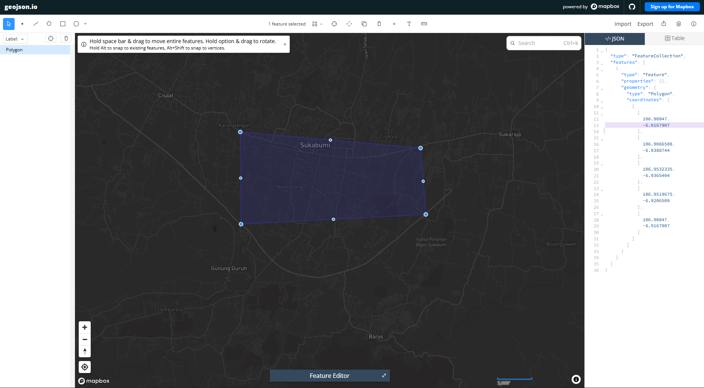
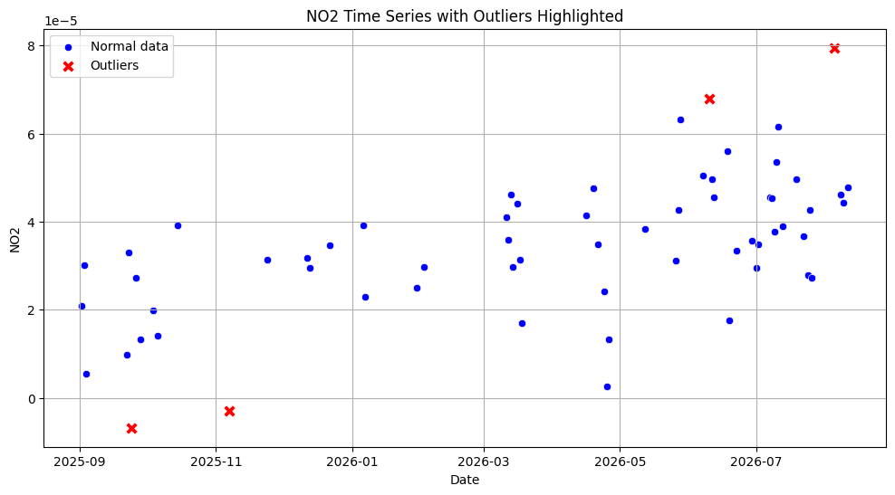
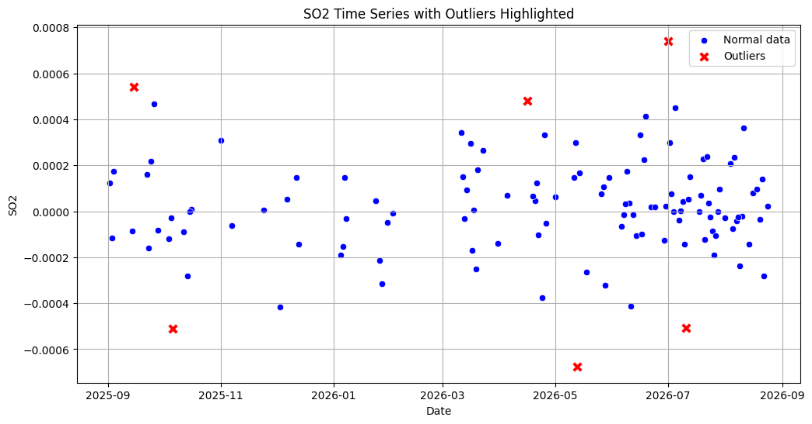
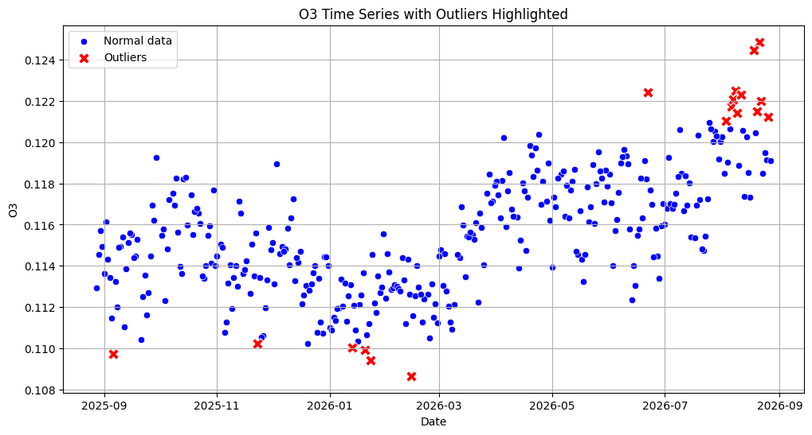
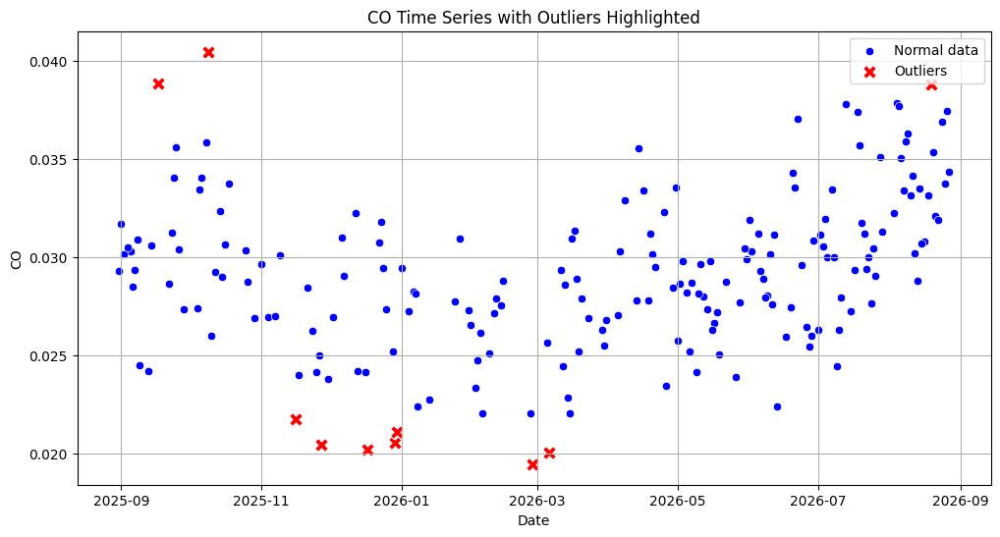

# Data Understanding

Pada tahap **Data Understanding** ini, kita berfokus pada pengumpulan dan pemahaman karakteristik data historis polutan udara (NO₂, SO₂, O₃, dan CO). Data yang kita gunakan berformat deret waktu (*time series*) harian, yang bersumber langsung dari instrumen satelit Sentinel-5P melalui portal [Copernicus Data Space Ecosystem (CDSE)](https://dataspace.copernicus.eu/).

Sebagai gambaran awal, berikut adalah penjelasan singkat mengenai masing-masing gas polutan yang akan kita analisis:
- **NO₂ (Nitrogen Dioksida)**: Gas beracun yang umumnya dihasilkan dari sisa pembakaran mesin kendaraan bermotor dan aktivitas industri.
- **SO₂ (Sulfur Dioksida)**: Gas dengan bau menyengat yang berasal dari pembakaran bahan bakar fosil (seperti batu bara atau minyak bumi). Konsentrasi SO₂ yang tinggi berisiko memicu terjadinya hujan asam.
- **O₃ (Ozon Permukaan)**: Berbeda dengan ozon pelindung bumi di atmosfer, ozon di tingkat permukaan tanah sangat berbahaya bagi sistem pernapasan manusia. Gas ini terbentuk dari reaksi kimia polutan lain yang terkena sinar matahari terik.
- **CO (Karbon Monoksida)**: Gas tidak berwarna dan tidak berbau yang bersumber dari proses pembakaran tidak sempurna. Gas ini sangat berbahaya karena dapat mengikat dan mengurangi pasokan oksigen dalam aliran darah manusia.

## 1. Instalasi Library
Sebagai langkah pertama, kita perlu menginstal pustaka Python pendukung. Library `openeo` kita gunakan untuk terhubung secara langsung ke API Copernicus, sehingga tahapan pemrosesan data dapat dilakukan di *cloud* tanpa keharusan mengunduh data citra satelit mentah yang berukuran sangat besar. Selanjutnya, `netCDF4` diperlukan untuk mendeskripsi format data bawaan satelit agar dapat diekstrak dengan rapi menjadi format tabel.


```python
!pip install openeo
!pip install netCDF4
```

## 2. Autentikasi dan Koneksi API

Sebelum tahap penarikan data dimulai, kita diwajibkan untuk melakukan proses autentikasi sistem menggunakan metode OpenID Connect (OIDC) ke peladen Copernicus. Melalui tahapan otorisasi ini, kita akan menerima token akses yang mengizinkan eksekusi komputasi secara langsung di infrastruktur *cloud* mereka.


```python
import openeo
connection = openeo.connect("openeo.dataspace.copernicus.eu").authenticate_oidc()
```


Visit <a href="https://identity.dataspace.copernicus.eu/auth/realms/CDSE/device?user_code=ZVMY-GMQK" title="Authenticate at https://identity.dataspace.copernicus.eu/auth/realms/CDSE/device?user_code=ZVMY-GMQK" target="_blank" rel="noopener noreferrer">https://identity.dataspace.copernicus.eu/auth/realms/CDSE/device?user_code=ZVMY-GMQK</a> <a href="#" onclick="navigator.clipboard.writeText('https://identity.dataspace.copernicus.eu/auth/realms/CDSE/device?user_code=ZVMY-GMQK');return false;" title="Copy authentication URL to clipboard">&#128203;</a> to authenticate.


✅ Authorized successfully


    Authenticated using device code flow.
    

## 3. Definisi Area (AOI) dan Pengambilan Data Polutan

Selanjutnya, kita mendefinisikan batas wilayah operasional (*Area of Interest*) dari target observasi Kota Sukabumi menggunakan rumusan koordinat berformat **Polygon GeoJSON**.



Berdasarkan batasan poligon tersebut, instrumen satelit akan mengekstrak data pemantauan kualitas udara yang spesifik berada dalam yurisdiksi Sukabumi. Sistem pada *backend* kemudian langsung melakukan dua tahap komputasi otomatis: **agregasi spasial** (menghitung nilai kalkulasi rata-rata dari seluruh radius piksel cakupan area Sukabumi) dan **agregasi temporal harian** (menghitung nilai penyederhanaan agregat rata-rata harian).

### 1. Pengambilan Data NO₂

```python
aoi = {
    "type": "Polygon",
    # Paste koordinat yang didapat
    "coordinates": [
        [
            [106.90847, -6.9167907],
            [106.9086508, -6.9388744],
            [106.9532335, -6.9365404],
            [106.9519675, -6.9206509],
            [106.90847, -6.9167907],
        ]
    ]
}

s5post = connection.load_collection(
    "SENTINEL_5P_L2",
    temporal_extent=["2025-08-28", "2026-08-28"],
    spatial_extent={
        "west": 106.90847,
        "south": -6.9388744,
        "east": 106.9532335,
        "north": -6.9167907
    },
    # Disesuaikan dengan data yang dibutuhkan
    bands=["NO2"],
)

# Agregasi harian agar tidak ada lebih dari satu data per hari
s5p_no2_daily = s5post.aggregate_temporal_period(reducer="mean", period="day")

# Agregasi spasial untuk menghasilkan rata-rata time series per AOI
s5p_no2_aoi = s5p_no2_daily.aggregate_spatial(reducer="mean", geometries=aoi)

# Simpan hasil sebagai CSV
result = s5p_no2_aoi.save_result(format="CSV")

# Jalankan job
job = result.create_job(title="s5p_no2_timeseries")
job.start_and_wait()

# Download
job.get_results().download_files("output_no2")
```

    0:00:00 Job 'j-2608301553194782b4b6f3d983fd9da1': send 'start'
    0:00:03 Job 'j-2608301553194782b4b6f3d983fd9da1': queued (progress 0%)
    0:00:08 Job 'j-2608301553194782b4b6f3d983fd9da1': queued (progress 0%)
    0:00:15 Job 'j-2608301553194782b4b6f3d983fd9da1': queued (progress 0%)
    0:00:23 Job 'j-2608301553194782b4b6f3d983fd9da1': queued (progress 0%)
    0:00:33 Job 'j-2608301553194782b4b6f3d983fd9da1': queued (progress 0%)
    0:00:45 Job 'j-2608301553194782b4b6f3d983fd9da1': queued (progress 0%)
    0:01:01 Job 'j-2608301553194782b4b6f3d983fd9da1': running (progress N/A)
    0:01:21 Job 'j-2608301553194782b4b6f3d983fd9da1': running (progress N/A)
    0:01:45 Job 'j-2608301553194782b4b6f3d983fd9da1': running (progress N/A)
    0:02:15 Job 'j-2608301553194782b4b6f3d983fd9da1': running (progress N/A)
    0:02:52 Job 'j-2608301553194782b4b6f3d983fd9da1': running (progress N/A)
    0:03:39 Job 'j-2608301553194782b4b6f3d983fd9da1': finished (progress 100%)
    


    [PosixPath('output_no2/timeseries.csv'),
     PosixPath('output_no2/job-results.json')]


### 2. Pengambilan Data SO₂

```python
aoi = {
    "type": "Polygon",
    # Paste koordinat yang didapat
    "coordinates": [
        [
            [106.90847, -6.9167907],
            [106.9086508, -6.9388744],
            [106.9532335, -6.9365404],
            [106.9519675, -6.9206509],
            [106.90847, -6.9167907],
        ]
    ]
}

s5post = connection.load_collection(
    "SENTINEL_5P_L2",
    temporal_extent=["2025-08-28", "2026-08-28"],
    spatial_extent={
        "west": 106.90847,
        "south": -6.9388744,
        "east": 106.9532335,
        "north": -6.9167907
    },
    # Disesuaikan dengan data yang dibutuhkan
    bands=["SO2"],
)

# Agregasi harian agar tidak ada lebih dari satu data per hari
s5p_so2_daily = s5post.aggregate_temporal_period(reducer="mean", period="day")

# Agregasi spasial untuk menghasilkan rata-rata time series per AOI
s5p_so2_aoi = s5p_so2_daily.aggregate_spatial(reducer="mean", geometries=aoi)

# Simpan hasil sebagai CSV
result = s5p_so2_aoi.save_result(format="CSV")

# Jalankan job
job = result.create_job(title="s5p_so2_timeseries")
job.start_and_wait()

# Download
job.get_results().download_files("output_so2")
```

    0:00:00 Job 'j-26083015591542dbb70b9e0f11da6e88': send 'start'
    0:00:02 Job 'j-26083015591542dbb70b9e0f11da6e88': created (progress 0%)
    0:00:08 Job 'j-26083015591542dbb70b9e0f11da6e88': queued (progress 0%)
    0:00:14 Job 'j-26083015591542dbb70b9e0f11da6e88': queued (progress 0%)
    0:00:23 Job 'j-26083015591542dbb70b9e0f11da6e88': running (progress N/A)
    0:00:33 Job 'j-26083015591542dbb70b9e0f11da6e88': running (progress N/A)
    0:00:45 Job 'j-26083015591542dbb70b9e0f11da6e88': running (progress N/A)
    0:01:01 Job 'j-26083015591542dbb70b9e0f11da6e88': running (progress N/A)
    0:01:20 Job 'j-26083015591542dbb70b9e0f11da6e88': running (progress N/A)
    0:01:45 Job 'j-26083015591542dbb70b9e0f11da6e88': running (progress N/A)
    0:02:15 Job 'j-26083015591542dbb70b9e0f11da6e88': running (progress N/A)
    0:02:52 Job 'j-26083015591542dbb70b9e0f11da6e88': running (progress N/A)
    0:03:39 Job 'j-26083015591542dbb70b9e0f11da6e88': finished (progress 100%)
    


    [PosixPath('output_so2/timeseries.csv'),
     PosixPath('output_so2/job-results.json')]


### 3. Pengambilan Data O₃

```python
aoi = {
    "type": "Polygon",
    # Paste koordinat yang didapat
    "coordinates": [
        [
            [106.90847, -6.9167907],
            [106.9086508, -6.9388744],
            [106.9532335, -6.9365404],
            [106.9519675, -6.9206509],
            [106.90847, -6.9167907],
        ]
    ]
}

s5post = connection.load_collection(
    "SENTINEL_5P_L2",
    temporal_extent=["2025-08-28", "2026-08-28"],
    spatial_extent={
        "west": 106.90847,
        "south": -6.9388744,
        "east": 106.9532335,
        "north": -6.9167907
    },
    # Disesuaikan dengan data yang dibutuhkan
    bands=["O3"],
)

# Agregasi harian agar tidak ada lebih dari satu data per hari
s5p_o3_daily = s5post.aggregate_temporal_period(reducer="mean", period="day")

# Agregasi spasial untuk menghasilkan rata-rata time series per AOI
s5p_o3_aoi = s5p_o3_daily.aggregate_spatial(reducer="mean", geometries=aoi)

# Simpan hasil sebagai CSV
result = s5p_o3_aoi.save_result(format="CSV")

# Jalankan job
job = result.create_job(title="s5p_o3_timeseries")
job.start_and_wait()

# Download
job.get_results().download_files("output_o3")
```

    0:00:00 Job 'j-26083016051940d4bb68991ca6a88694': send 'start'
    0:00:02 Job 'j-26083016051940d4bb68991ca6a88694': queued (progress 0%)
    0:00:08 Job 'j-26083016051940d4bb68991ca6a88694': queued (progress 0%)
    0:00:14 Job 'j-26083016051940d4bb68991ca6a88694': queued (progress 0%)
    0:00:22 Job 'j-26083016051940d4bb68991ca6a88694': queued (progress 0%)
    0:00:32 Job 'j-26083016051940d4bb68991ca6a88694': queued (progress 0%)
    0:00:45 Job 'j-26083016051940d4bb68991ca6a88694': queued (progress 0%)
    0:01:01 Job 'j-26083016051940d4bb68991ca6a88694': queued (progress 0%)
    0:01:20 Job 'j-26083016051940d4bb68991ca6a88694': running (progress N/A)
    0:01:44 Job 'j-26083016051940d4bb68991ca6a88694': running (progress N/A)
    0:02:14 Job 'j-26083016051940d4bb68991ca6a88694': running (progress N/A)
    0:02:52 Job 'j-26083016051940d4bb68991ca6a88694': running (progress N/A)
    0:03:39 Job 'j-26083016051940d4bb68991ca6a88694': finished (progress 100%)
    


    [PosixPath('output_o3/timeseries.csv'),
     PosixPath('output_o3/job-results.json')]


### 4. Pengambilan Data CO

```python
aoi = {
    "type": "Polygon",
    # Paste koordinat yang didapat
    "coordinates": [
        [
            [106.90847, -6.9167907],
            [106.9086508, -6.9388744],
            [106.9532335, -6.9365404],
            [106.9519675, -6.9206509],
            [106.90847, -6.9167907],
        ]
    ]
}

s5post = connection.load_collection(
    "SENTINEL_5P_L2",
    temporal_extent=["2025-08-28", "2026-08-28"],
    spatial_extent={
        "west": 106.90847,
        "south": -6.9388744,
        "east": 106.9532335,
        "north": -6.9167907
    },
    # Disesuaikan dengan data yang dibutuhkan
    bands=["CO"],
)

# Agregasi harian agar tidak ada lebih dari satu data per hari
s5p_co_daily = s5post.aggregate_temporal_period(reducer="mean", period="day")

# Agregasi spasial untuk menghasilkan rata-rata time series per AOI
s5p_co_aoi = s5p_co_daily.aggregate_spatial(reducer="mean", geometries=aoi)

# Simpan hasil sebagai CSV
result = s5p_co_aoi.save_result(format="CSV")

# Jalankan job
job = result.create_job(title="s5p_co_timeseries")
job.start_and_wait()

# Download
job.get_results().download_files("output_co")
```

    0:00:00 Job 'j-2608301612374567bae7c44eea48efdc': send 'start'
    0:00:02 Job 'j-2608301612374567bae7c44eea48efdc': queued (progress 0%)
    0:00:07 Job 'j-2608301612374567bae7c44eea48efdc': queued (progress 0%)
    0:00:14 Job 'j-2608301612374567bae7c44eea48efdc': queued (progress 0%)
    0:00:22 Job 'j-2608301612374567bae7c44eea48efdc': queued (progress 0%)
    0:00:32 Job 'j-2608301612374567bae7c44eea48efdc': queued (progress 0%)
    0:00:44 Job 'j-2608301612374567bae7c44eea48efdc': running (progress N/A)
    0:01:00 Job 'j-2608301612374567bae7c44eea48efdc': running (progress N/A)
    0:01:19 Job 'j-2608301612374567bae7c44eea48efdc': running (progress N/A)
    0:01:43 Job 'j-2608301612374567bae7c44eea48efdc': running (progress N/A)
    0:02:14 Job 'j-2608301612374567bae7c44eea48efdc': running (progress N/A)
    0:02:51 Job 'j-2608301612374567bae7c44eea48efdc': running (progress N/A)
    0:03:38 Job 'j-2608301612374567bae7c44eea48efdc': finished (progress 100%)
    


    [PosixPath('output_co/timeseries.csv'),
     PosixPath('output_co/job-results.json')]


## 4. Pratinjau Data (Hasil CSV)

Setelah serangkaian pengolahan data di infrastruktur *cloud* selesai berjalan, output akhirnya segera diunduh dalam format standar CSV (*Comma-Separated Values*). Berikut di bawah ini adalah pratinjau awal bentuk representasi struktur data yang kita kumpulkan. Apabila terdapat rentetan baris observasi kosong (*Not a Number*/NaN), anomali hal semacam ini merupakan insiden wajar dalam rekam jejak observasi satelit penginderaan jauh, umumnya diakibatkan gangguan sensor cuaca ekstrem maupun kepekatan ketebalan halangan partikel awan pada periode bersangkutan.

### 1. Data NO2

```python
import pandas as pd
import numpy as np
df = pd.read_csv("output_no2/timeseries.csv")
df.head(10)
```


| index | date | feature_index | NO2 |
|---|---|---|---|
| 0 | 2026-01-23T00:00:00.000Z | 0 | NaN |
| 1 | 2026-01-25T00:00:00.000Z | 0 | NaN |
| 2 | 2026-01-19T00:00:00.000Z | 0 | NaN |
| 3 | 2026-01-21T00:00:00.000Z | 0 | NaN |
| 4 | 2026-01-22T00:00:00.000Z | 0 | NaN |
| 5 | 2026-01-26T00:00:00.000Z | 0 | NaN |
| 6 | 2026-01-20T00:00:00.000Z | 0 | NaN |
| 7 | 2026-01-24T00:00:00.000Z | 0 | NaN |
| 8 | 2026-04-16T00:00:00.000Z | 0 | 0.000041 |
| 9 | 2026-04-13T00:00:00.000Z | 0 | NaN |


### 2. Data SO2


```python
import pandas as pd
import numpy as np
df = pd.read_csv("output_so2/timeseries.csv")
df.head(10)
```


  
| index | date | feature_index | SO2 |
|---|---|---|---|
| 0 | 2026-02-03T00:00:00.000Z | 0 | NaN |
| 1 | 2026-02-01T00:00:00.000Z | 0 | NaN |
| 2 | 2026-01-31T00:00:00.000Z | 0 | NaN |
| 3 | 2026-01-28T00:00:00.000Z | 0 | NaN |
| 4 | 2026-01-29T00:00:00.000Z | 0 | NaN |
| 5 | 2026-02-02T00:00:00.000Z | 0 | -0.000007 |
| 6 | 2026-01-27T00:00:00.000Z | 0 | -0.000314 |
| 7 | 2026-01-30T00:00:00.000Z | 0 | -0.000049 |
| 8 | 2026-05-21T00:00:00.000Z | 0 | NaN |
| 9 | 2026-05-19T00:00:00.000Z | 0 | NaN |


### 3. Data O3


```python
import pandas as pd
import numpy as np
df = pd.read_csv("output_o3/timeseries.csv")
df.head(10)
```


  
| index | date | feature_index | O3 |
|---|---|---|---|
| 0 | 2025-10-11T00:00:00.000Z | 0 | 0.115637 |
| 1 | 2025-10-12T00:00:00.000Z | 0 | 0.113963 |
| 2 | 2025-10-14T00:00:00.000Z | 0 | 0.118218 |
| 3 | 2025-10-09T00:00:00.000Z | 0 | 0.116938 |
| 4 | 2025-10-13T00:00:00.000Z | 0 | 0.113634 |
| 5 | 2025-10-10T00:00:00.000Z | 0 | 0.118247 |
| 6 | 2025-10-07T00:00:00.000Z | 0 | NaN |
| 7 | 2025-10-08T00:00:00.000Z | 0 | 0.117534 |
| 8 | 2025-12-04T00:00:00.000Z | 0 | NaN |
| 9 | 2025-12-05T00:00:00.000Z | 0 | 0.114589 |


### 4. Data CO


```python
import pandas as pd
import numpy as np
df = pd.read_csv("output_co/timeseries.csv")
df.head(10)
```


  
| index | date | feature_index | CO |
|---|---|---|---|
| 0 | 2025-09-20T00:00:00.000Z | 0 | NaN |
| 1 | 2025-09-16T00:00:00.000Z | 0 | NaN |
| 2 | 2025-09-18T00:00:00.000Z | 0 | NaN |
| 3 | 2025-09-15T00:00:00.000Z | 0 | NaN |
| 4 | 2025-09-14T00:00:00.000Z | 0 | 0.030594 |
| 5 | 2025-09-19T00:00:00.000Z | 0 | NaN |
| 6 | 2025-09-13T00:00:00.000Z | 0 | 0.024208 |
| 7 | 2025-09-17T00:00:00.000Z | 0 | 0.038842 |
| 8 | 2025-10-27T00:00:00.000Z | 0 | NaN |
| 9 | 2025-10-23T00:00:00.000Z | 0 | NaN |


## 5. Normalisasi Tanggal

Secara harfiah, format penanda waktu pencatatan turunan asli penginderaan satelit tersusun cukup padat kompleks (misalnya: `2026-01-23T00:00:00.000Z`). Agar dapat melancarkan proses transisi analisis korelasi silang algoritma pemodelan di tahapan tahap selanjutnya, format elemen tabel urutan `date` wajib dimodifikasi menjadi standardisasi penulisan generik tanggal kalender `YYYY-MM-DD`. Tabel basis data yang kolom penunjuk waktunya telah diperbaiki kemudian disalin menjadi lembar simpanan log data baru (misalnya bernama berkas dokumen `NO2_Timeseries.csv`).

### 1. Normalisasi Tanggal NO2

```python
import pandas as pd

df = pd.read_csv("output_no2/timeseries.csv")

# pastikan kolom tanggal valid
df["date"] = pd.to_datetime(df["date"], errors="coerce")

# ambil hanya bulan dan tahun
df["date"] = df["date"].dt.strftime("%Y-%m-%d")

new_df = pd.DataFrame({
    "date": df['date'],
    "NO2": df['NO2']
})

new_df.to_csv("NO2_Timeseries.csv", index=False)
```
### 2. Normalisasi Tanggal SO2

```python
import pandas as pd

df = pd.read_csv("output_so2/timeseries.csv")

# pastikan kolom tanggal valid
df["date"] = pd.to_datetime(df["date"], errors="coerce")

# ambil hanya bulan dan tahun
df["date"] = df["date"].dt.strftime("%Y-%m-%d")

new_df = pd.DataFrame({
    "date": df['date'],
    "SO2": df['SO2']
})

new_df.to_csv("SO2_Timeseries.csv", index=False)
```
### 3. Normalisasi Tanggal O3

```python
import pandas as pd

df = pd.read_csv("output_o3/timeseries.csv")

# pastikan kolom tanggal valid
df["date"] = pd.to_datetime(df["date"], errors="coerce")

# ambil hanya bulan dan tahun
df["date"] = df["date"].dt.strftime("%Y-%m-%d")

new_df = pd.DataFrame({
    "date": df['date'],
    "O3": df['O3']
})

new_df.to_csv("O3_Timeseries.csv", index=False)
```
### 4. Normalisasi Tanggal CO

```python
import pandas as pd

df = pd.read_csv("output_co/timeseries.csv")

# pastikan kolom tanggal valid
df["date"] = pd.to_datetime(df["date"], errors="coerce")

# ambil hanya bulan dan tahun
df["date"] = df["date"].dt.strftime("%Y-%m-%d")

new_df = pd.DataFrame({
    "date": df['date'],
    "CO": df['CO']
})

new_df.to_csv("CO_Timeseries.csv", index=False)
```
### 1. Preview Data NO2

```python
import pandas as pd
import numpy as np
df = pd.read_csv("NO2_Timeseries.csv")
df.head(10)
```


  
| index | date | NO2 |
|---|---|---|
| 0 | 2026-01-23 | NaN |
| 1 | 2026-01-25 | NaN |
| 2 | 2026-01-19 | NaN |
| 3 | 2026-01-21 | NaN |
| 4 | 2026-01-22 | NaN |
| 5 | 2026-01-26 | NaN |
| 6 | 2026-01-20 | NaN |
| 7 | 2026-01-24 | NaN |
| 8 | 2026-04-16 | 0.000041 |
| 9 | 2026-04-13 | NaN |


### 2. Preview Data SO2


```python
import pandas as pd
import numpy as np
df = pd.read_csv("SO2_Timeseries.csv")
df.head(10)
```


  
| index | date | SO2 |
|---|---|---|
| 0 | 2026-02-03 | NaN |
| 1 | 2026-02-01 | NaN |
| 2 | 2026-01-31 | NaN |
| 3 | 2026-01-28 | NaN |
| 4 | 2026-01-29 | NaN |
| 5 | 2026-02-02 | -0.000007 |
| 6 | 2026-01-27 | -0.000314 |
| 7 | 2026-01-30 | -0.000049 |
| 8 | 2026-05-21 | NaN |
| 9 | 2026-05-19 | NaN |


### 3. Preview Data O3


```python
import pandas as pd
import numpy as np
df = pd.read_csv("O3_Timeseries.csv")
df.head(10)
```


  
| index | date | O3 |
|---|---|---|
| 0 | 2025-10-11 | 0.115637 |
| 1 | 2025-10-12 | 0.113963 |
| 2 | 2025-10-14 | 0.118218 |
| 3 | 2025-10-09 | 0.116938 |
| 4 | 2025-10-13 | 0.113634 |
| 5 | 2025-10-10 | 0.118247 |
| 6 | 2025-10-07 | NaN |
| 7 | 2025-10-08 | 0.117534 |
| 8 | 2025-12-04 | NaN |
| 9 | 2025-12-05 | 0.114589 |


### 4. Preview Data CO


```python
import pandas as pd
import numpy as np
df = pd.read_csv("CO_Timeseries.csv")
df.head(10)
```


  
| index | date | CO |
|---|---|---|
| 0 | 2025-09-20 | NaN |
| 1 | 2025-09-16 | NaN |
| 2 | 2025-09-18 | NaN |
| 3 | 2025-09-15 | NaN |
| 4 | 2025-09-14 | 0.030594 |
| 5 | 2025-09-19 | NaN |
| 6 | 2025-09-13 | 0.024208 |
| 7 | 2025-09-17 | 0.038842 |
| 8 | 2025-10-27 | NaN |
| 9 | 2025-10-23 | NaN |


## 6. Identifikasi Kualitas Data (Missing Values)

Dalam kerangka kajian kelancaran analisis tren sekuensial deret waktu (*time series*), tingkat kepastian kontinuitas perolehan rekam log parameter pengawasan kualitas wajib divalidasi ketersediaan riilnya. Di lapangan satelit tidak konstan memiliki rasio pantauan keberhasilan pengambilan visual data penuh secara berturut-turut tiap kalender periodiknya. Pengecekan rasio kualitas observasi ini dibagi menjadi dua prosedur investigasi:


### A. Pengecekan Tanggal yang Hilang (Missing Dates)

Pertama-tama, investigasi diorientasikan pada rekapitulasi pencarian riwayat urutan barisan tanggal waktu pengamatan hari demi hari yang lenyap absensi secara drastis utuh hilang tercabut dari dokumen tabel rekaman asli. Hal semacam itu mudah dilakukan melalui sinkronisasi perbandingan indeks parameter interval linear deret sekuen (dari linimasa 28 Agustus 2025 s.d. 28 Agustus 2026) dengan kumpulan keberadaan kepingan indeks parameter jejak nyata di inventarisasi set data.

### 1. Cek Missing Date NO2

```python
import pandas as pd

df = pd.read_csv("NO2_Timeseries.csv")
df['date'] = pd.to_datetime(df['date'])

# Buat rentang tanggal lengkap
start_date = "2025-08-28"
end_date   = "2026-08-28"
full_range = pd.date_range(start=start_date, end=end_date, freq='D')

# Cek tanggal yang hilang
missing_dates = full_range.difference(df['date'])

print(f"Jumlah hari missing: {len(missing_dates)}")
print("Daftar tanggal missing:")
print(missing_dates)
```

    Jumlah hari missing: 1
    Daftar tanggal missing:
    DatetimeIndex(['2026-08-28'], dtype='datetime64[ns]', freq='D')
    
### 2. Cek Missing Date SO2

```python
import pandas as pd

df = pd.read_csv("SO2_Timeseries.csv")
df['date'] = pd.to_datetime(df['date'])

# Buat rentang tanggal lengkap
start_date = "2025-08-28"
end_date   = "2026-08-28"
full_range = pd.date_range(start=start_date, end=end_date, freq='D')

# Cek tanggal yang hilang
missing_dates = full_range.difference(df['date'])

print(f"Jumlah hari missing: {len(missing_dates)}")
print("Daftar tanggal missing:")
print(missing_dates)
```

    Jumlah hari missing: 1
    Daftar tanggal missing:
    DatetimeIndex(['2026-08-28'], dtype='datetime64[ns]', freq='D')
    
### 3. Cek Missing Date O3

```python
import pandas as pd

df = pd.read_csv("O3_Timeseries.csv")
df['date'] = pd.to_datetime(df['date'])

# Buat rentang tanggal lengkap
start_date = "2025-08-28"
end_date   = "2026-08-28"
full_range = pd.date_range(start=start_date, end=end_date, freq='D')

# Cek tanggal yang hilang
missing_dates = full_range.difference(df['date'])

print(f"Jumlah hari missing: {len(missing_dates)}")
print("Daftar tanggal missing:")
print(missing_dates)
```

    Jumlah hari missing: 1
    Daftar tanggal missing:
    DatetimeIndex(['2026-08-28'], dtype='datetime64[ns]', freq='D')
    
### 4. Cek Missing Date CO

```python
import pandas as pd

df = pd.read_csv("CO_Timeseries.csv")
df['date'] = pd.to_datetime(df['date'])

# Buat rentang tanggal lengkap
start_date = "2025-08-28"
end_date   = "2026-08-28"
full_range = pd.date_range(start=start_date, end=end_date, freq='D')

# Cek tanggal yang hilang
missing_dates = full_range.difference(df['date'])

print(f"Jumlah hari missing: {len(missing_dates)}")
print("Daftar tanggal missing:")
print(missing_dates)
```

    Jumlah hari missing: 1
    Daftar tanggal missing:
    DatetimeIndex(['2026-08-28'], dtype='datetime64[ns]', freq='D')
    

### B. Pengecekan Nilai Kosong (Null/NaN)

Di samping itu, prosedur identifikasi juga memuat pengecekan mendetail tentang kondisi sel matriks angka pengukuran kosong *Not a Number* (NaN) pada matriks eksistensi suatu deretan indeks garis baris waktu terdaftar. Kelompongan pencatatan nilai numerik di suatu blok memori khusus di rentang waktu aktif tersebut normalnya ditengarai karena indikator algoritma kontrol internal di fase pengolahan satelit menolak mendistribusikan citra sensorik tak menentu dengan validasi verifikasi di bawah kriteria limit kualifikasi batas baku (QA).

### 1. Cek Missing Value NO2

```python
df = pd.read_csv("NO2_Timeseries.csv")
missing_value = df['NO2'].isna().sum()
print(missing_value)
```

    304
    
### 2. Cek Missing Value SO2

```python
df = pd.read_csv("SO2_Timeseries.csv")
missing_value = df['SO2'].isna().sum()
print(missing_value)
```

    247
    
### 3. Cek Missing Value O3

```python
df = pd.read_csv("O3_Timeseries.csv")
missing_value = df['O3'].isna().sum()
print(missing_value)
```

    17
    
### 4. Cek Missing Value CO

```python
df = pd.read_csv("CO_Timeseries.csv")
missing_value = df['CO'].isna().sum()
print(missing_value)
```

    168
    

## 7. Deteksi Anomali (Outliers)

Eksplorasi langkah akhir yang sangat direkomendasikan adalah melakukan uji saring keberadaan komponen rilis data anomali atau pencilan ekstrem (*outliers*). Catatan rekaman fluktuasi indeks densitas volume polutan tak jarang mencatat volatilitas penyimpangan deviasi mencolok lonjakan aneh tidak terkendali yang dapat didorong kuat efek temporer distorsi insiden pencemaran lokal berskala masif tertentu maupun faktor teknis kegagalan mekanisme pembacaan internal perangkat *hardware* alat ukur terkait.

Dalam mendeteksi jangkauan deviasi observasi ini di tahap teknisnya, kita menerapkan kapabilitas pengklasifikasian heuristik algoritma otomatis kecerdasan komputasi *Machine Learning* yaitu kerangka model deteksi pengamatan **Isolation Forest**. Prinsipnya yakni berupaya mendeteksi komponen-komponen poin pindaian asing acak diskrit yang sebaran lokasinya terlempar secara independen jauh terisolasi ekstrem dari himpunan parameter klaster mayoritas wajar. Melalui mekanisme inisiasi parameter rasio sensitivitas toleransi anomali (*contamination constraint*) di rentang 0.05, kerangka skenario kalkulasi mesin berasumsi mengelompokkan 5% kuantitas rekam fluktuasi paling tak proporsional sepanjang rentang tahun studi sebagai klaster pencilan observasi tak baku.

### 1. Outlier Analysis for NO2


```python
import pandas as pd
import matplotlib.pyplot as plt
import seaborn as sns
from sklearn.ensemble import IsolationForest

df_no2 = pd.read_csv("NO2_Timeseries.csv")
df_clean_no2 = df_no2.dropna(subset=['NO2']).copy()

model_no2 = IsolationForest(contamination=0.05, random_state=42)
pred_no2 = model_no2.fit_predict(df_clean_no2[['NO2']])

jumlah_outlier_no2 = (pred_no2 == -1).sum()
print(f"Jumlah outlier untuk NO2: {jumlah_outlier_no2}")

df_clean_no2['date'] = pd.to_datetime(df_clean_no2['date'])
df_outliers_no2 = df_clean_no2[pred_no2 == -1].copy()

plt.figure(figsize=(12, 6))
sns.scatterplot(x='date', y='NO2', data=df_clean_no2, label='Normal data', color='blue')
sns.scatterplot(x='date', y='NO2', data=df_outliers_no2, label='Outliers', color='red', marker='X', s=100)
plt.title('NO2 Time Series with Outliers Highlighted')
plt.xlabel('Date')
plt.ylabel('NO2')
plt.legend()
plt.grid(True)
plt.show()
```

    Jumlah outlier untuk NO2: 4
    


    

    


### 2. Outlier Analysis for SO2


```python
import pandas as pd
import matplotlib.pyplot as plt
import seaborn as sns
from sklearn.ensemble import IsolationForest

df_so2 = pd.read_csv("SO2_Timeseries.csv")
df_clean_so2 = df_so2.dropna(subset=['SO2']).copy()

model_so2 = IsolationForest(contamination=0.05, random_state=42)
pred_so2 = model_so2.fit_predict(df_clean_so2[['SO2']])

jumlah_outlier_so2 = (pred_so2 == -1).sum()
print(f"Jumlah outlier untuk SO2: {jumlah_outlier_so2}")

df_clean_so2['date'] = pd.to_datetime(df_clean_so2['date'])
df_outliers_so2 = df_clean_so2[pred_so2 == -1].copy()

plt.figure(figsize=(12, 6))
sns.scatterplot(x='date', y='SO2', data=df_clean_so2, label='Normal data', color='blue')
sns.scatterplot(x='date', y='SO2', data=df_outliers_so2, label='Outliers', color='red', marker='X', s=100)
plt.title('SO2 Time Series with Outliers Highlighted')
plt.xlabel('Date')
plt.ylabel('SO2')
plt.legend()
plt.grid(True)
plt.show()
```

    Jumlah outlier untuk SO2: 6
    


    

    


### 3. Outlier Analysis for O3


```python
import pandas as pd
import matplotlib.pyplot as plt
import seaborn as sns
from sklearn.ensemble import IsolationForest

df_o3 = pd.read_csv("O3_Timeseries.csv")
df_clean_o3 = df_o3.dropna(subset=['O3']).copy()

model_o3 = IsolationForest(contamination=0.05, random_state=42)
pred_o3 = model_o3.fit_predict(df_clean_o3[['O3']])

jumlah_outlier_o3 = (pred_o3 == -1).sum()
print(f"Jumlah outlier untuk O3: {jumlah_outlier_o3}")

df_clean_o3['date'] = pd.to_datetime(df_clean_o3['date'])
df_outliers_o3 = df_clean_o3[pred_o3 == -1].copy()

plt.figure(figsize=(12, 6))
sns.scatterplot(x='date', y='O3', data=df_clean_o3, label='Normal data', color='blue')
sns.scatterplot(x='date', y='O3', data=df_outliers_o3, label='Outliers', color='red', marker='X', s=100)
plt.title('O3 Time Series with Outliers Highlighted')
plt.xlabel('Date')
plt.ylabel('O3')
plt.legend()
plt.grid(True)
plt.show()
```

    Jumlah outlier untuk O3: 18
    


    

    


### 4. Outlier Analysis for CO


```python
import pandas as pd
import matplotlib.pyplot as plt
import seaborn as sns
from sklearn.ensemble import IsolationForest

df_co = pd.read_csv("CO_Timeseries.csv")
df_clean_co = df_co.dropna(subset=['CO']).copy()

model_co = IsolationForest(contamination=0.05, random_state=42)
pred_co = model_co.fit_predict(df_clean_co[['CO']])

jumlah_outlier_co = (pred_co == -1).sum()
print(f"Jumlah outlier untuk CO: {jumlah_outlier_co}")

df_clean_co['date'] = pd.to_datetime(df_clean_co['date'])
df_outliers_co = df_clean_co[pred_co == -1].copy()

plt.figure(figsize=(12, 6))
sns.scatterplot(x='date', y='CO', data=df_clean_co, label='Normal data', color='blue')
sns.scatterplot(x='date', y='CO', data=df_outliers_co, label='Outliers', color='red', marker='X', s=100)
plt.title('CO Time Series with Outliers Highlighted')
plt.xlabel('Date')
plt.ylabel('CO')
plt.legend()
plt.grid(True)
plt.show()
```

    Jumlah outlier untuk CO: 10
    


    

    


## 8. Integrasi Dataset (Merging)

Setelah masing-masing parameter polutan dibersihkan, kita menggabungkan seluruh tabel (NO₂, SO₂, O₃, CO) menjadi satu buah file CSV yang terpadu bernama `Data_Polutan_Kota-Sukabumi.csv`. File ini yang nantinya siap masuk ke tahap pemodelan (*Modeling*).


```python
import pandas as pd

df_o3 = pd.read_csv("NO2_Timeseries.csv")
df_co = pd.read_csv("SO2_Timeseries.csv")
df_no2 = pd.read_csv("O3_Timeseries.csv")
df_so2 = pd.read_csv("CO_Timeseries.csv")

dataframe_merged = pd.DataFrame({
    "date": df_o3['date'],
    "NO2": df_o3['NO2'],
    "SO2": df_co['SO2'],
    "O3": df_no2['O3'],
    "CO": df_so2['CO']
})

dataframe_merged.to_csv("Data_Polutan_Kota-Sukabumi.csv", index=False)
```


```python
df = pd.read_csv("Data_Polutan_Kota-Sukabumi.csv")
df.head(10)
```


  
| index | date | NO2 | SO2 | O3 | CO |
|---|---|---|---|---|---|
| 0 | 2026-01-23 | NaN | NaN | 0.115637 | NaN |
| 1 | 2026-01-25 | NaN | NaN | 0.113963 | NaN |
| 2 | 2026-01-19 | NaN | NaN | 0.118218 | NaN |
| 3 | 2026-01-21 | NaN | NaN | 0.116938 | NaN |
| 4 | 2026-01-22 | NaN | NaN | 0.113634 | 0.030594 |
| 5 | 2026-01-26 | NaN | -0.000007 | 0.118247 | NaN |
| 6 | 2026-01-20 | NaN | -0.000314 | NaN | 0.024208 |
| 7 | 2026-01-24 | NaN | -0.000049 | 0.117534 | 0.038842 |
| 8 | 2026-04-16 | 0.000041 | NaN | NaN | NaN |
| 9 | 2026-04-13 | NaN | NaN | 0.114589 | NaN |


