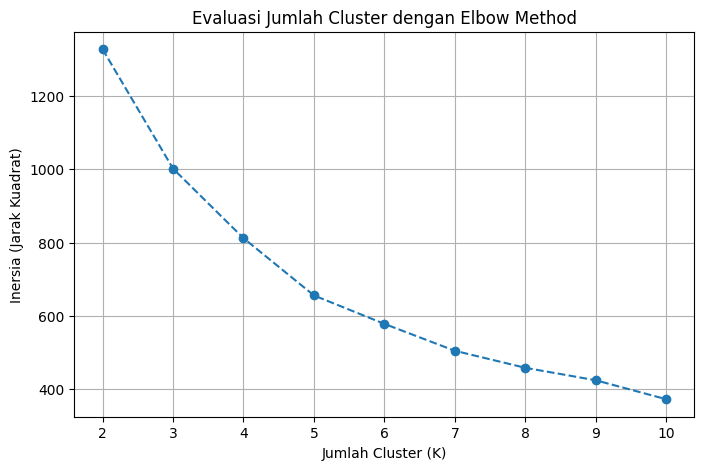
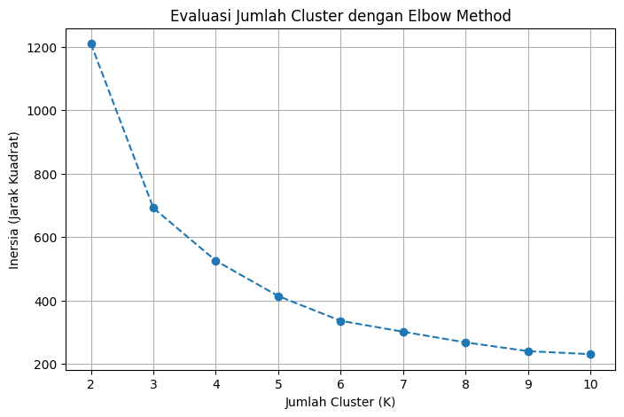
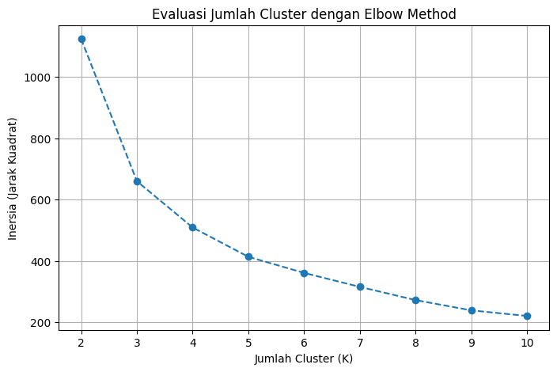
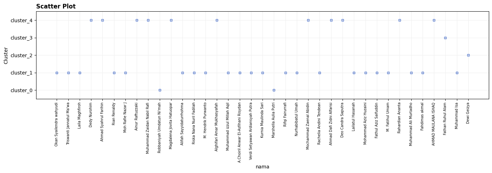
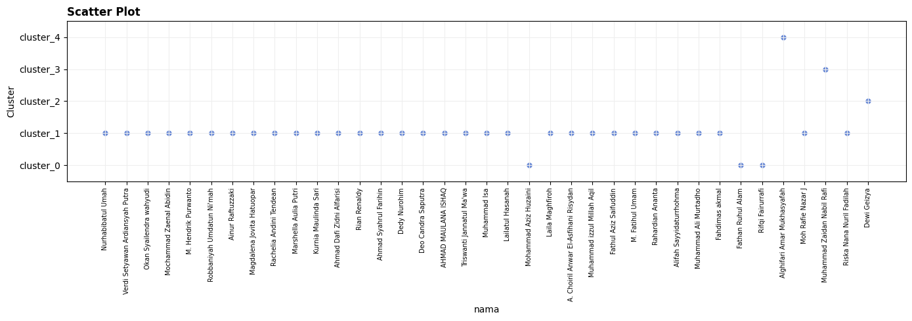
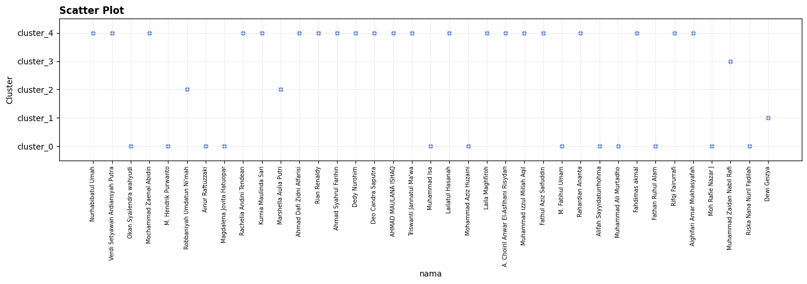
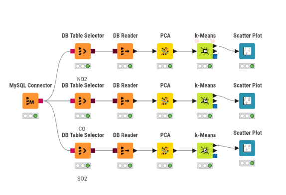
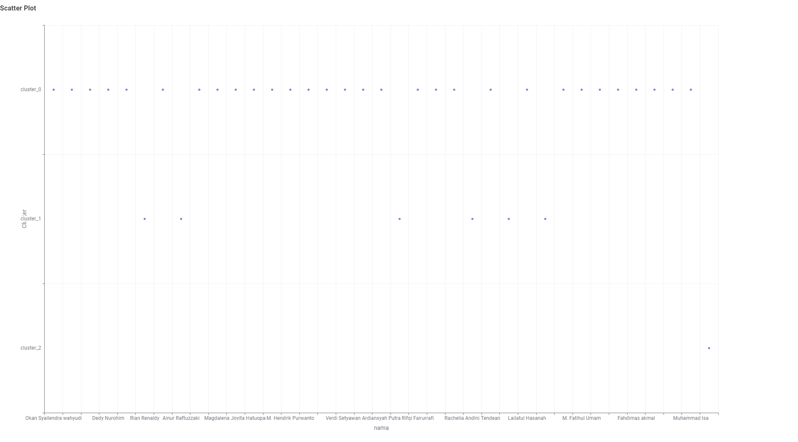
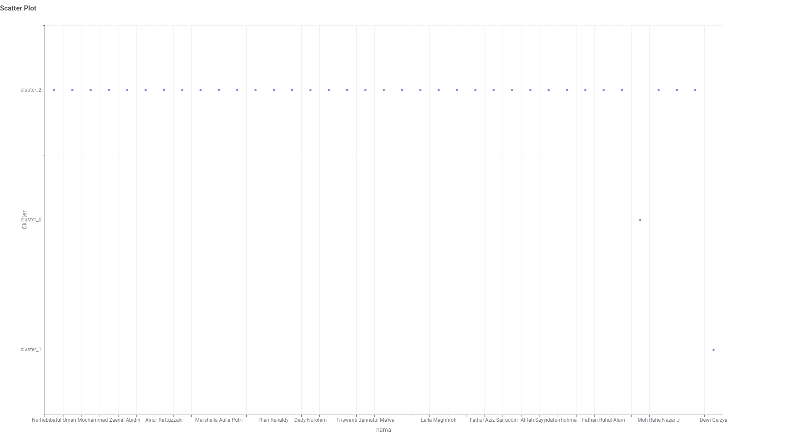

# K-Means Clustering Polutan

Dokumen ini menjelaskan proses pengelompokan (*clustering*) area berdasarkan tingkat dan karakteristik polutan (khususnya $\text{NO}_2$, $\text{SO}_2$, dan $\text{CO}$). Setelah melakukan ekstraksi fitur (menggunakan TSFEL sejumlah 68 fitur) pada data deret waktu polutan dari berbagai wilayah observasi dan menggabungkannya ke dalam satu matriks fitur, dilakukan reduksi dimensi serta pengelompokan pola.

Tujuan utama dari tahapan ini adalah untuk mengidentifikasi daerah-daerah mana saja yang memiliki karakteristik, tren fluktuasi, dan tingkat keparahan polusi udara yang serupa secara objektif.

---

## 1. Implementasi K-Means dengan Python (Scikit-Learn)

Untuk mengimplementasikan proses pengelompokan ini, kita menggunakan bahasa pemrograman Python memanfaatkan pustaka standar **Scikit-Learn** (`sklearn`). Pustaka ini menyediakan modul yang efisien dan stabil untuk pemrosesan *Machine Learning* seperti standarisasi data (`StandardScaler`), reduksi dimensi (`PCA`), serta algoritma pengelompokan (`KMeans`).

### 1.1 Evaluasi Jumlah Cluster (Elbow Method)

Guna menentukan jumlah kelompok (*cluster*) yang paling optimal, digunakan teknik **Elbow Method**. Model K-Means dilatih secara iteratif dengan memvariasikan jumlah kluster (misalnya dari $K=2$ hingga $K=10$), lalu menghitung nilai inersia (*Sum of Squared Distances* internal ke pusat kluster) pada setiap iterasi.

#### 1. NO2

```python
import pandas as pd
from sklearn.preprocessing import StandardScaler
from sklearn.decomposition import PCA
from sklearn.cluster import KMeans
import matplotlib.pyplot as plt

# 1. Memuat data ekstraksi fitur NO2
df = pd.read_csv('ekstraksi_fitur_no2.csv')
fitur = df.drop(['id', 'nama', 'daerah'], axis=1)

# 2. Standarisasi dan Reduksi Dimensi (PCA 37 Komponen)
scaler = StandardScaler()
fitur_scaled = scaler.fit_transform(fitur)
fitur_pca = PCA(n_components=37).fit_transform(fitur_scaled)

# 3. Pengujian Inersia untuk K = 2 hingga 10
inertia = []
K_range = range(2, 11)
for k in K_range:
    kmeans_temp = KMeans(n_clusters=k, random_state=42, n_init=10)
    kmeans_temp.fit(fitur_pca)
    inertia.append(kmeans_temp.inertia_)

# 4. Visualisasi Grafik Elbow
plt.figure(figsize=(8, 5))
plt.plot(K_range, inertia, marker='o', linestyle='--')
plt.title('Evaluasi Jumlah Cluster dengan Elbow Method (NO2)')
plt.xlabel('Jumlah Cluster (K)')
plt.ylabel('Inersia (Jarak Kuadrat)')
plt.grid(True)
plt.show()
```



#### 2. SO2

```python
import pandas as pd
from sklearn.preprocessing import StandardScaler
from sklearn.decomposition import PCA
from sklearn.cluster import KMeans
import matplotlib.pyplot as plt

# 1. Memuat data ekstraksi fitur SO2
df = pd.read_csv('ekstraksi_fitur_so2.csv')
fitur = df.drop(['id', 'nama', 'daerah'], axis=1)

# 2. Standarisasi dan Reduksi Dimensi (PCA 37 Komponen)
scaler = StandardScaler()
fitur_scaled = scaler.fit_transform(fitur)
fitur_pca = PCA(n_components=37).fit_transform(fitur_scaled)

# 3. Pengujian Inersia untuk K = 2 hingga 10
inertia = []
K_range = range(2, 11)
for k in K_range:
    kmeans_temp = KMeans(n_clusters=k, random_state=42, n_init=10)
    kmeans_temp.fit(fitur_pca)
    inertia.append(kmeans_temp.inertia_)

# 4. Visualisasi Grafik Elbow
plt.figure(figsize=(8, 5))
plt.plot(K_range, inertia, marker='o', linestyle='--')
plt.title('Evaluasi Jumlah Cluster dengan Elbow Method (SO2)')
plt.xlabel('Jumlah Cluster (K)')
plt.ylabel('Inersia (Jarak Kuadrat)')
plt.grid(True)
plt.show()
```



#### 3. CO

```python
import pandas as pd
from sklearn.preprocessing import StandardScaler
from sklearn.decomposition import PCA
from sklearn.cluster import KMeans
import matplotlib.pyplot as plt

# 1. Memuat data ekstraksi fitur CO
df = pd.read_csv('ekstraksi_fitur_co.csv')
fitur = df.drop(['id', 'nama', 'daerah'], axis=1)

# 2. Standarisasi dan Reduksi Dimensi (PCA 37 Komponen)
scaler = StandardScaler()
fitur_scaled = scaler.fit_transform(fitur)
fitur_pca = PCA(n_components=37).fit_transform(fitur_scaled)

# 3. Pengujian Inersia untuk K = 2 hingga 10
inertia = []
K_range = range(2, 11)
for k in K_range:
    kmeans_temp = KMeans(n_clusters=k, random_state=42, n_init=10)
    kmeans_temp.fit(fitur_pca)
    inertia.append(kmeans_temp.inertia_)

# 4. Visualisasi Grafik Elbow
plt.figure(figsize=(8, 5))
plt.plot(K_range, inertia, marker='o', linestyle='--')
plt.title('Evaluasi Jumlah Cluster dengan Elbow Method (CO)')
plt.xlabel('Jumlah Cluster (K)')
plt.ylabel('Inersia (Jarak Kuadrat)')
plt.grid(True)
plt.show()
```



> **Catatan Analisis Elbow**: Titik kelengkukan ("siku") pada kurva inersia mengindikasikan batas efisiensi penambahan jumlah kluster. Ketika landaian grafik mulai melambat secara signifikan, jumlah $K$ di titik pembelokan tersebut dipilih sebagai nilai kluster paling ideal.


---

### 1.2 Visualisasi Scatter Plot PCA dan Profiling

Setelah nilai $K$ yang optimal ditentukan, algoritma K-Means dijalankan untuk mengelompokkan sampel data ke dalam kluster final. Hasil pengelompokan kemudian dipetakan ke dalam bentuk **Scatter Plot** dan diprofilkan untuk melihat persebaran jumlah wilayah pada setiap kluster.

#### 1. NO2

```python
import pandas as pd
import matplotlib.pyplot as plt
from sklearn.cluster import KMeans
from sklearn.decomposition import PCA
from sklearn.preprocessing import StandardScaler

CSV_PATH = "ekstraksi_fitur_no2.csv"
KOLOM_NAMA = "nama"
KOLOM_FITUR = """abs_energy auc autocorr average_power calc_centroid calc_max calc_mean
calc_median calc_min calc_std calc_var dfa distance ecdf ecdf_percentile ecdf_percentile_count
ecdf_slope entropy fundamental_frequency higuchi_fractal_dimension hist_mode human_range_energy
hurst_exponent interq_range kurtosis lempel_ziv lpcc max_frequency max_power_spectrum
maximum_fractal_length mean_abs_deviation mean_abs_diff mean_diff median_abs_deviation
median_abs_diff median_diff median_frequency mfcc mse negative_turning neighbourhood_peaks
petrosian_fractal_dimension pk_pk_distance positive_turning power_bandwidth rms skewness slope
spectral_centroid spectral_decrease spectral_distance spectral_entropy spectral_kurtosis
spectral_positive_turning spectral_roll_off spectral_roll_on spectral_skewness spectral_slope
spectral_spread spectral_variation spectrogram_mean_coeff sum_abs_diff wavelet_abs_mean
wavelet_energy wavelet_entropy wavelet_std wavelet_var zero_cross""".split()
K = 5
N_DIMENSI = 37
GUNAKAN_SCALING = True

if N_DIMENSI > len(KOLOM_FITUR):
    raise ValueError(
        f"N_DIMENSI ({N_DIMENSI}) tidak boleh lebih besar dari jumlah fitur ({len(KOLOM_FITUR)})."
    )

# 1. Baca data
df = pd.read_csv(CSV_PATH)
data = df.dropna(subset=KOLOM_FITUR).copy()

# 2. Standarisasi Fitur
if GUNAKAN_SCALING:
    X = StandardScaler().fit_transform(data[KOLOM_FITUR])
else:
    X = data[KOLOM_FITUR].values

# 3. PCA
pca = PCA(n_components=N_DIMENSI, random_state=42)
X_pca = pca.fit_transform(X)

print(f"PCA: {len(KOLOM_FITUR)} fitur -> {N_DIMENSI} dimensi")

# 4. K-Means Clustering (K = 5)
kmeans = KMeans(n_clusters=K, random_state=42, n_init=10)
data["cluster"] = kmeans.fit_predict(X_pca)
data["cluster_label"] = "cluster_" + data["cluster"].astype(str)

# 5. Output Ringkasan Hasil
print(f"\nInertia: {kmeans.inertia_:.4f}")
print("\nJumlah data per cluster:")
print(data["cluster_label"].value_counts().sort_index())

# 6. Scatter plot persebaran wilayah
label_cluster = [f"cluster_{i}" for i in range(K)]
y = data["cluster"]
x = range(len(data))

plt.figure(figsize=(14, 5))
plt.scatter(x, y, s=25, color="#6b8bd6")
plt.xticks(x, data[KOLOM_NAMA], rotation=90, fontsize=7)
plt.yticks(range(K), label_cluster)
plt.ylim(-0.5, K - 0.5)
plt.title("Scatter Plot Persebaran Kluster (NO2)", loc="left", fontweight="bold")
plt.xlabel("nama")
plt.ylabel("Cluster")
plt.grid(True, color="#eeeeee")
plt.tight_layout()
plt.show()
```

```text
PCA: 68 fitur -> 37 dimensi

Inertia: 655.7898

Jumlah data per cluster:
cluster_label
cluster_0     2
cluster_1    22
cluster_2     1
cluster_3     1
cluster_4    11
Name: count, dtype: int64
```



#### 2. SO2

```python
import pandas as pd
import matplotlib.pyplot as plt
from sklearn.cluster import KMeans
from sklearn.decomposition import PCA
from sklearn.preprocessing import StandardScaler

CSV_PATH = "ekstraksi_fitur_so2.csv"
KOLOM_NAMA = "nama"
KOLOM_FITUR = """abs_energy auc autocorr average_power calc_centroid calc_max calc_mean
calc_median calc_min calc_std calc_var dfa distance ecdf ecdf_percentile ecdf_percentile_count
ecdf_slope entropy fundamental_frequency higuchi_fractal_dimension hist_mode human_range_energy
hurst_exponent interq_range kurtosis lempel_ziv lpcc max_frequency max_power_spectrum
maximum_fractal_length mean_abs_deviation mean_abs_diff mean_diff median_abs_deviation
median_abs_diff median_diff median_frequency mfcc mse negative_turning neighbourhood_peaks
petrosian_fractal_dimension pk_pk_distance positive_turning power_bandwidth rms skewness slope
spectral_centroid spectral_decrease spectral_distance spectral_entropy spectral_kurtosis
spectral_positive_turning spectral_roll_off spectral_roll_on spectral_skewness spectral_slope
spectral_spread spectral_variation spectrogram_mean_coeff sum_abs_diff wavelet_abs_mean
wavelet_energy wavelet_entropy wavelet_std wavelet_var zero_cross""".split()
K = 5
N_DIMENSI = 37
GUNAKAN_SCALING = True

if N_DIMENSI > len(KOLOM_FITUR):
    raise ValueError(
        f"N_DIMENSI ({N_DIMENSI}) tidak boleh lebih besar dari jumlah fitur ({len(KOLOM_FITUR)})."
    )

# 1. Baca data
df = pd.read_csv(CSV_PATH)
data = df.dropna(subset=KOLOM_FITUR).copy()

# 2. Standarisasi Fitur
if GUNAKAN_SCALING:
    X = StandardScaler().fit_transform(data[KOLOM_FITUR])
else:
    X = data[KOLOM_FITUR].values

# 3. PCA
pca = PCA(n_components=N_DIMENSI, random_state=42)
X_pca = pca.fit_transform(X)

print(f"PCA: {len(KOLOM_FITUR)} fitur -> {N_DIMENSI} dimensi")

# 4. K-Means Clustering (K = 5)
kmeans = KMeans(n_clusters=K, random_state=42, n_init=10)
data["cluster"] = kmeans.fit_predict(X_pca)
data["cluster_label"] = "cluster_" + data["cluster"].astype(str)

# 5. Output Ringkasan Hasil
print(f"\nInertia: {kmeans.inertia_:.4f}")
print("\nJumlah data per cluster:")
print(data["cluster_label"].value_counts().sort_index())

# 6. Scatter plot persebaran wilayah
label_cluster = [f"cluster_{i}" for i in range(K)]
y = data["cluster"]
x = range(len(data))

plt.figure(figsize=(14, 5))
plt.scatter(x, y, s=25, color="#6b8bd6")
plt.xticks(x, data[KOLOM_NAMA], rotation=90, fontsize=7)
plt.yticks(range(K), label_cluster)
plt.ylim(-0.5, K - 0.5)
plt.title("Scatter Plot Persebaran Kluster (SO2)", loc="left", fontweight="bold")
plt.xlabel("nama")
plt.ylabel("Cluster")
plt.grid(True, color="#eeeeee")
plt.tight_layout()
plt.show()
```

```text
PCA: 68 fitur -> 37 dimensi

Inertia: 413.6787

Jumlah data per cluster:
cluster_label
cluster_0     3
cluster_1    31
cluster_2     1
cluster_3     1
cluster_4     1
Name: count, dtype: int64
```



#### 3. CO

```python
import pandas as pd
import matplotlib.pyplot as plt
from sklearn.cluster import KMeans
from sklearn.decomposition import PCA
from sklearn.preprocessing import StandardScaler

CSV_PATH = "ekstraksi_fitur_co.csv"
KOLOM_NAMA = "nama"
KOLOM_FITUR = """abs_energy auc autocorr average_power calc_centroid calc_max calc_mean
calc_median calc_min calc_std calc_var dfa distance ecdf ecdf_percentile ecdf_percentile_count
ecdf_slope entropy fundamental_frequency higuchi_fractal_dimension hist_mode human_range_energy
hurst_exponent interq_range kurtosis lempel_ziv lpcc max_frequency max_power_spectrum
maximum_fractal_length mean_abs_deviation mean_abs_diff mean_diff median_abs_deviation
median_abs_diff median_diff median_frequency mfcc mse negative_turning neighbourhood_peaks
petrosian_fractal_dimension pk_pk_distance positive_turning power_bandwidth rms skewness slope
spectral_centroid spectral_decrease spectral_distance spectral_entropy spectral_kurtosis
spectral_positive_turning spectral_roll_off spectral_roll_on spectral_skewness spectral_slope
spectral_spread spectral_variation spectrogram_mean_coeff sum_abs_diff wavelet_abs_mean
wavelet_energy wavelet_entropy wavelet_std wavelet_var zero_cross""".split()
K = 5
N_DIMENSI = 37
GUNAKAN_SCALING = True

if N_DIMENSI > len(KOLOM_FITUR):
    raise ValueError(
        f"N_DIMENSI ({N_DIMENSI}) tidak boleh lebih besar dari jumlah fitur ({len(KOLOM_FITUR)})."
    )

# 1. Baca data
df = pd.read_csv(CSV_PATH)
data = df.dropna(subset=KOLOM_FITUR).copy()

# 2. Standarisasi Fitur
if GUNAKAN_SCALING:
    X = StandardScaler().fit_transform(data[KOLOM_FITUR])
else:
    X = data[KOLOM_FITUR].values

# 3. PCA
pca = PCA(n_components=N_DIMENSI, random_state=42)
X_pca = pca.fit_transform(X)

print(f"PCA: {len(KOLOM_FITUR)} fitur -> {N_DIMENSI} dimensi")

# 4. K-Means Clustering (K = 5)
kmeans = KMeans(n_clusters=K, random_state=42, n_init=10)
data["cluster"] = kmeans.fit_predict(X_pca)
data["cluster_label"] = "cluster_" + data["cluster"].astype(str)

# 5. Output Ringkasan Hasil
print(f"\nInertia: {kmeans.inertia_:.4f}")
print("\nJumlah data per cluster:")
print(data["cluster_label"].value_counts().sort_index())

# 6. Scatter plot persebaran wilayah
label_cluster = [f"cluster_{i}" for i in range(K)]
y = data["cluster"]
x = range(len(data))

plt.figure(figsize=(14, 5))
plt.scatter(x, y, s=25, color="#6b8bd6")
plt.xticks(x, data[KOLOM_NAMA], rotation=90, fontsize=7)
plt.yticks(range(K), label_cluster)
plt.ylim(-0.5, K - 0.5)
plt.title("Scatter Plot Persebaran Kluster (CO)", loc="left", fontweight="bold")
plt.xlabel("nama")
plt.ylabel("Cluster")
plt.grid(True, color="#eeeeee")
plt.tight_layout()
plt.show()
```

```text
PCA: 68 fitur -> 37 dimensi

Inertia: 413.8895

Jumlah data per cluster:
cluster_label
cluster_0    12
cluster_1     1
cluster_2     2
cluster_3     1
cluster_4    21
Name: count, dtype: int64
```




---

## 2. Alur Kerja (Workflow) Clustering KNIME

Selain eksekusi berbasis skrip Python, pengolahan *clustering* juga dirancang secara visual menggunakan perangkat lunak **KNIME Analytics Platform** untuk memastikan transparansi alur kerja pemrosesan data.

<!-- Gambar Screenshot Workflow KNIME (Ubah path/nama file gambar di bawah ini jika sesuai) -->


Berdasarkan struktur diagram *workflow* KNIME yang dibangun, berikut adalah uraian fungsional dari setiap komponen node utama:

1. **PostgreSQL Connector $\rightarrow$ DB Table Selector $\rightarrow$ DB Reader**:
   Rangkaian node ini bertindak sebagai pintu masuk data (*ingestion*). Node ini menginisialisasi koneksi aman ke basis data PostgreSQL, memilih tabel tempat penyimpanan fitur-fitur deret waktu hasil ekstraksi TSFEL, dan membaca dataset secara efisien ke dalam lingkungan kerja KNIME.

2. **PCA (Principal Component Analysis)**:
   Karena proses ekstraksi deret waktu menghasilkan puluhan kolom fitur statistik, temporal, dan spektral (dimensi tinggi), node PCA bertugas menyederhanakan ruang fitur. PCA memproyeksikan kombinasi linier dari fitur-fitur asli ke dalam komponen utama (*Principal Components*) dengan mempertahankan tingkat varians maksimum. Hal ini mencegah efek kendala dimensi (*Curse of Dimensionality*) serta mempercepat komputasi pengelompokan.

3. **k-Means**:
   Merupakan inti algoritma *Unsupervised Learning* yang bertugas mengelompokkan observasi wilayah. Node ini menghitung kedekatan jarak Euclidean pada ruang komponen PCA, membagi wilayah-wilayah ke dalam $K$ kelompok berdasarkan pola kesamaan polusi.

4. **Scatter Plot**:
   Node visualisasi interaktif untuk menampilkan titik-titik persebaran wilayah terhadap kluster yang ditetapkan, mempermudah inspeksi spasial dan analisis komparatif antar-daerah.

---

## 3. Interpretasi Hasil Clustering (Scatter Plot KNIME)

Berikut adalah sajian visualisasi *Scatter Plot* hasil *Clustering K-Means* dari platform KNIME beserta analisis interpretatif untuk masing-masing polutan ($\text{NO}_2$, $\text{CO}$, dan $\text{SO}_2$).

### 3.1 Polutan NO2 (K = 6)

<!-- Gambar Screenshot Scatter Plot NO2 dari KNIME -->


Berdasarkan pemetaan grafik scatter untuk polutan **$\text{NO}_2$**, pembagian kluster memisahkan data ke dalam 6 kelompok (`cluster_0` hingga `cluster_5`). Beberapa temuan penting dari distribusi pola ini antara lain:

- **Persebaran Multipel pada Satu Daerah**: Beberapa titik observasi dalam satu wilayah terdistribusi di lebih dari satu kluster. Hal ini mengindikasikan adanya dinamika perubahan pola emisi $\text{NO}_2$ antartertentu (misalnya perbedaan antar-minggu atau antar-bulan) sehingga karakteristiknya bergeser mengikuti profil kelompok yang berbeda.
- **Dominasi Kluster Utama (`cluster_4`)**: Mayoritas wilayah observasi berkumpul secara signifikan pada `cluster_4`. Hal ini menunjukkan adanya profil baseline umum dari konsentrasi $\text{NO}_2$ yang dialami sebagian besar kawasan perkotaan.
- **Anomali Wilayah Terisolasi (`cluster_5`)**: `cluster_5` tampak terpisah secara ekstrem dan hanya ditempati oleh sampel dari titik observasi spesifik (seperti area Kamal/Banyuajuh). Kondisi ini menandakan keberadaan aktivitas sumber emisi lokal yang sangat unik dan berbeda dari wilayah lainnya.
- **Kedekatan Pola Minor (`cluster_3`)**: Wilayah seperti Cerme dan Widodaren memperlihatkan tren pencemaran $\text{NO}_2$ yang serupa sehingga konsisten dikelompokkan ke dalam `cluster_3`.

---

### 3.2 Polutan CO (K = 4)

<!-- Gambar Screenshot Scatter Plot CO dari KNIME -->


Hasil pengelompokan untuk polutan **$\text{CO}$** menghasilkan $K=4$ kluster optimal (`cluster_0` hingga `cluster_3`). Jumlah kluster yang lebih sedikit menunjukkan bahwa variasi penyebaran emisi Karbon Monoksida antar-wilayah cenderung lebih homogen dibandingkan $\text{NO}_2$.

- **Dominasi Kluster Standar (`cluster_0`)**: Sebagian besar wilayah pengamatan terkelompokkan dalam `cluster_0`. Tren fluktuasi gas $\text{CO}$ pada kawasan ini mencerminkan kondisi paparan emisi udara harian yang relatif teratur dan stabil.
- **Karakteristik Spesifik Wilayah Industri/Pelabuhan**: Titik observasi kawasan pelabuhan/pesisir (seperti Kamal, Banyuajuh, Bangkalan) terpisah ke dalam kelompok tersendiri (`cluster_1` dan `cluster_2`). Temuan ini memperkuat dugaan tingginya emisi spesifik dari aktivitas transportasi laut maupun kawasan industri setempat.
- **Pengelompokan Wilayah Marginal (`cluster_3`)**: Kawasan seperti Cerme, Wonoayu, dan Kalianget menunjukkan kemiripan pola fluktuasi minor $\text{CO}$ sehingga menempati kelompok `cluster_3`.

---

### 3.3 Polutan SO2 (K = 6)

<!-- Gambar Screenshot Scatter Plot SO2 dari KNIME -->


Untuk polutan **$\text{SO}_2$**, algoritma K-Means membagi data menjadi 6 kelompok (`cluster_0` hingga `cluster_5`), mencerminkan kompleksitas dan variabilitas tinggi dari pencemaran Sulfur Dioksida.

- **Dua Profil Dominan (`cluster_1` & `cluster_4`)**: Distribusi wilayah terbagi utama ke dalam dua kelompok besar, yakni `cluster_1` (misalnya Asemrowo, Jombang, Nganjuk) dan `cluster_4` (Gresik Kota, Cerme, Banyuajuh). Ini menandakan adanya dua jenis pola emisi $\text{SO}_2$ latar belakang yang mendominasi kawasan observasi.
- **Isolasi Outlier Ekstrem**: Titik observasi khusus di area pelabuhan/industri terkelompok secara terpisah pada `cluster_2` dan `cluster_3`, menandakan adanya lonjakan paparan $\text{SO}_2$ periodik yang tergolong pencilan (*outlier*).
- **Anomali Tunggal Terisolasi (`cluster_5`)**: Area Wonoayu memperlihatkan kondisi unik di mana titik data berada terisolasi penuh pada `cluster_5`, mengindikasikan kejadian emisi $\text{SO}_2$ terlokalisir yang sangat tajam pada waktu pengamatan tertentu.
