# K-Means Clustering Polutan (polinomial)

Dokumentasi ini menyajikan proses pengelompokan (*clustering*) data polutan udara berbasis pemodelan **K-Means** yang diterapkan pada representasi data hasil transformasi fitur polinomial (*polynomial feature expansion*). 

Penggunaan ekspansi polinomial memungkinkan algoritma menangkap interaksi dan korelasi non-linear yang kompleks antarfaktor polusi. Akan tetapi, transformasi ini juga meningkatkan dimensionalitas data secara drastis sehingga berisiko menimbulkan *curse of dimensionality*. Oleh karena itu, dilakukan serangkaian eksperimen komparatif untuk menguji performa klasterisasi pada data asli tanpa reduksi serta data yang telah direduksi menggunakan **Principal Component Analysis (PCA)** dalam berbagai tingkat komponen, dengan menguji pembentukan klaster untuk **$k = 6$ dan $k = 7$**.

---

## 1. Arsitektur Workflow pada KNIME

Seluruh rangkaian eksperimen dijalankan menggunakan platform analitik **KNIME Analytics Platform** dengan rancangan pipeline modular seperti ditunjukkan pada visualisasi workflow berikut:

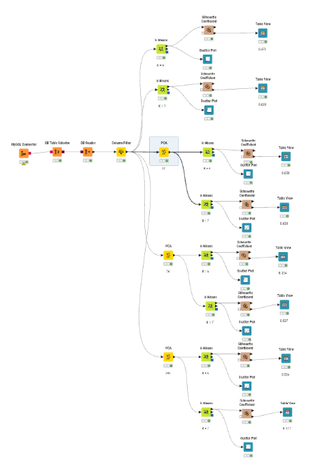

### Rincian Peranan Node

Pipeline workflow di atas terbagi ke dalam beberapa simpul (*node*) pemrosesan dengan tugas spesifik:

1. **MySQL Connector**  
   Membangun jalur komunikasi dan autentikasi aman ke peladen basis data relasional MySQL tempat tabel data fitur polinomial disimpan.

2. **DB Table Selector**  
   Menentukan dan mengarahkan kueri ke tabel target spesifik di dalam basis data yang memuat keseluruhan rekaman fitur polinomial polutan.

3. **DB Reader**  
   Mengeksekusi pengambilan data dari basis data dan mengonversinya ke dalam tabel memori internal KNIME untuk siap diproses pada tahapan analitik selanjutnya.

4. **Column Filter**  
   Melakukan pemilahan fitur masukan dengan menyingkirkan kolom identitas (*seperti kolom `id` dan nama*) yang tidak memiliki signifikansi matematis terhadap pengukuran jarak geometri antartitik.

5. **PCA (Principal Component Analysis)**  
   Mereduksi kompleksitas data berdimensi tinggi ke dalam ruang ortogonal baru yang merangkum sebagian besar variansi informasi penting. Pada pipeline ini, PCA diterapkan ke dalam tiga skenario reduksi:
   - **PCA 203 Komponen**
   - **PCA 74 Komponen**
   - **PCA 37 Komponen**

6. **k-Means**  
   Algoritma partisi berbasis *centroid* yang mengelompokkan data observasi ke dalam kelompok-kelompok homogen dengan meminimalkan variasi jarak kuadrat internal (*intra-cluster sum of squares*). Setiap skenario masukan diuji untuk konfigurasi **$k = 6$** dan **$k = 7$ klaster**.

7. **Silhouette Coefficient**  
   Simpul komputasi evaluasi untuk mengukur derajat separasi dan kepadatan klaster. Metrik ini membandingkan kedekatan data dalam satu klaster (*cohesion*) terhadap jarak ke klaster tetangga terdekat (*separation*).

8. **Table View & Scatter Plot**  
   Menyajikan hasil evaluasi secara terstruktur: *Table View* menampilkan ringkasan koefisien siluet numerik per-klaster dan global (*overall*), sedangkan *Scatter Plot* memvisualisasikan persebaran observasi pada ruang klaster yang terbentuk.

---

## 2. Hasil Evaluasi Klasterisasi per Skenario

Kualitas partisi klaster dievaluasi menggunakan metrik **Silhouette Coefficient** (berkisar antara -1 hingga +1, di mana nilai yang mendekati +1 mengindikasikan klaster yang padat dan terpisah secara optimal). Berikut adalah rincian hasil evaluasi pada keempat skenario pengujian:

### Skenario 1: Tanpa Reduksi Dimensi (PCA)

Pada skenario ini, algoritma K-Means dijalankan langsung menggunakan seluruh dimensi fitur polinomial tanpa melalui pemadatan ruang fitur.

#### A. Klastering 6 Kelas ($k = 6$)
- **Rata-rata Silhouette Coefficient (Overall)**: **0.554**
- Rincian per klaster: Cluster 0 = 0.512; Cluster 1 = 0.396; Cluster 2 = 0.604; Cluster 3 = 0.581; Cluster 4 = 0.000; Cluster 5 = 0.677.

*Tabel Silhouette Coefficient:*  

*Visualisasi Scatter Plot:*  

#### B. Klastering 7 Kelas ($k = 7$)
- **Rata-rata Silhouette Coefficient (Overall)**: **0.537**
- Rincian per klaster: Cluster 0 = 0.449; Cluster 1 = 0.396; Cluster 2 = 0.638; Cluster 3 = 0.000; Cluster 4 = 0.569; Cluster 5 = 0.589; Cluster 6 = 0.583.

*Tabel Silhouette Coefficient:*  

*Visualisasi Scatter Plot:*  
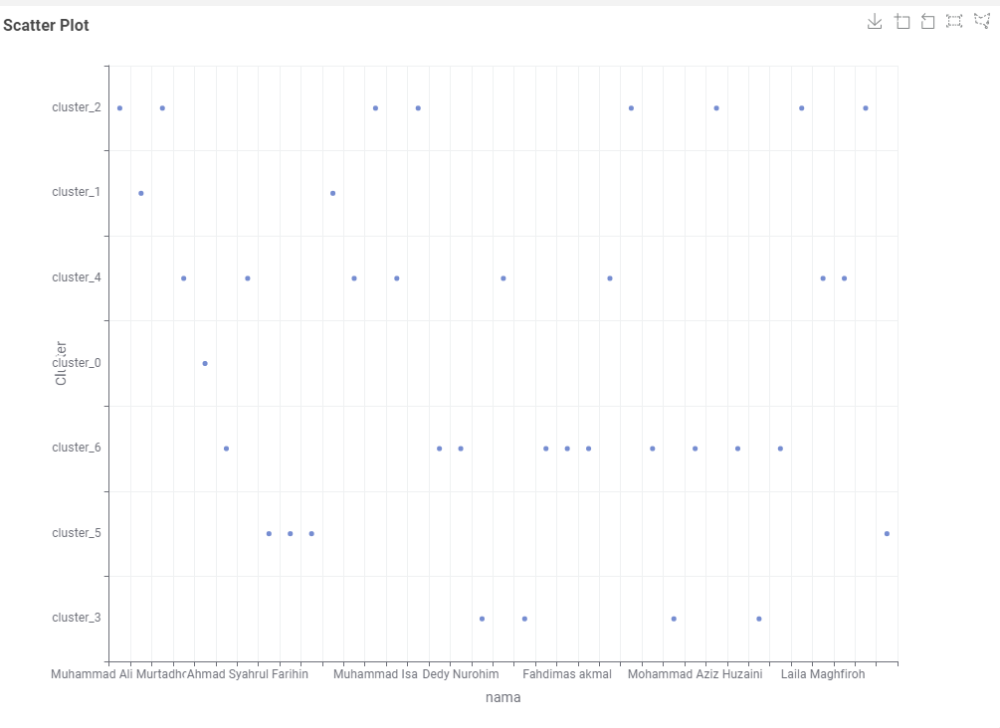

---

### Skenario 2: Reduksi Dimensi dengan PCA (203 Komponen)

Pada skenario ini, ruang fitur polinomial diproyeksikan ke dalam 203 komponen utama pertama.

#### A. Klastering 6 Kelas ($k = 6$)
- **Rata-rata Silhouette Coefficient (Overall)**: **0.554**
- Distribusi skor siluet tiap klaster tetap stabil dengan nilai tertinggi pada Cluster 5 (0.677) dan Cluster 2 (0.604).

*Tabel Silhouette Coefficient:*  
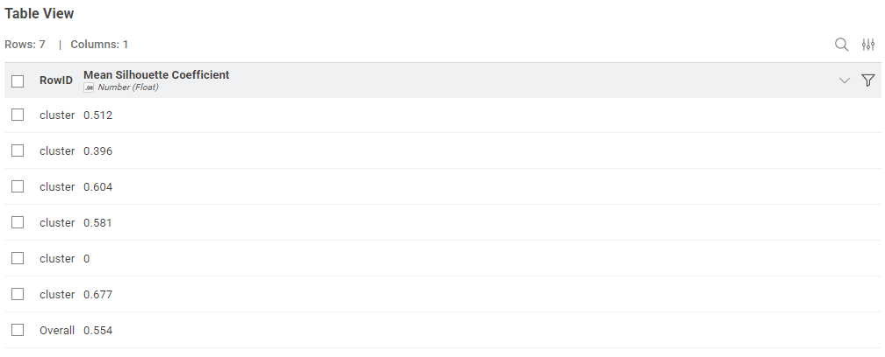

*Visualisasi Scatter Plot:*  
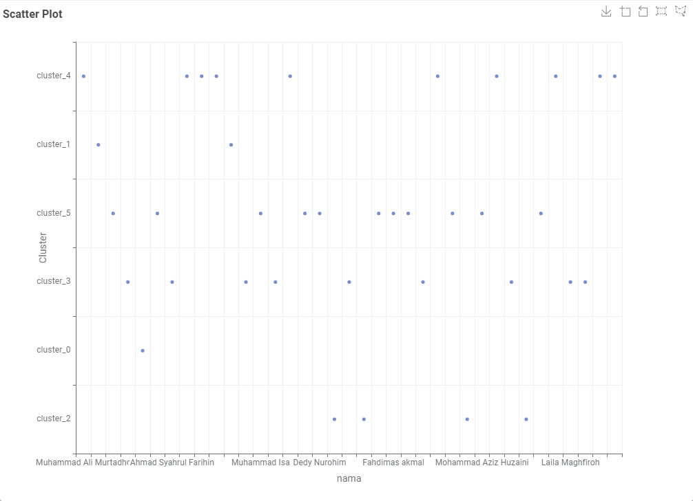

#### B. Klastering 7 Kelas ($k = 7$)
- **Rata-rata Silhouette Coefficient (Overall)**: **0.537**
- Pemisahan pada $k=7$ menghasilkan rata-rata yang lebih rendah karena pemecahan salah satu klaster menjadi lebih renggang.

*Tabel Silhouette Coefficient:*  
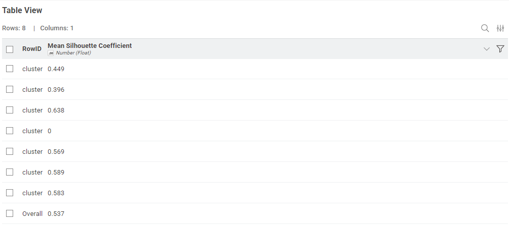

*Visualisasi Scatter Plot:*  
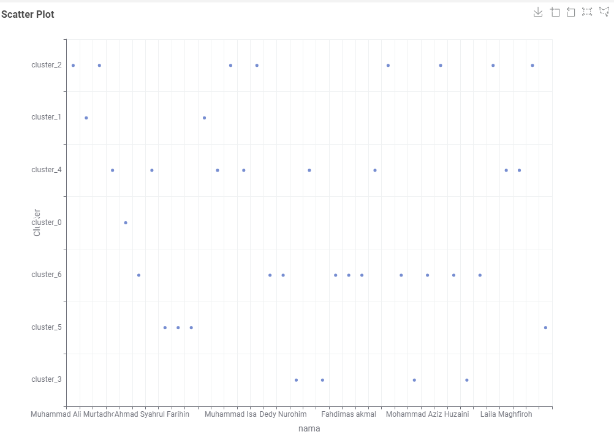

---

### Skenario 3: Reduksi Dimensi dengan PCA (74 Komponen)

Pada skenario ini, dimensionalitas dikurangi lebih lanjut menjadi 74 komponen utama (merepresentasikan sekitar 95% variansi kumulatif data).

#### A. Klastering 6 Kelas ($k = 6$)
- **Rata-rata Silhouette Coefficient (Overall)**: **0.554**
- Separasi antarkelompok tetap terjaga secara konsisten tanpa ada penurunan metrik validitas.

*Tabel Silhouette Coefficient:*  
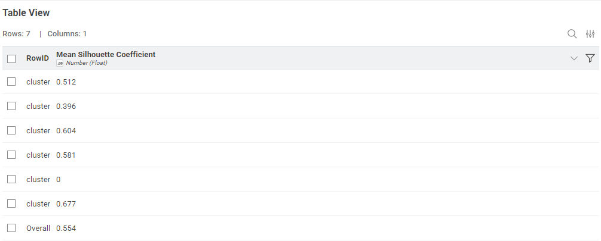

*Visualisasi Scatter Plot:*  

#### B. Klastering 7 Kelas ($k = 7$)
- **Rata-rata Silhouette Coefficient (Overall)**: **0.537**
- Kinerja klasterisasi 7 kelompok tetap konstan dan tetap berada di bawah performa 6 klaster.

*Tabel Silhouette Coefficient:*  
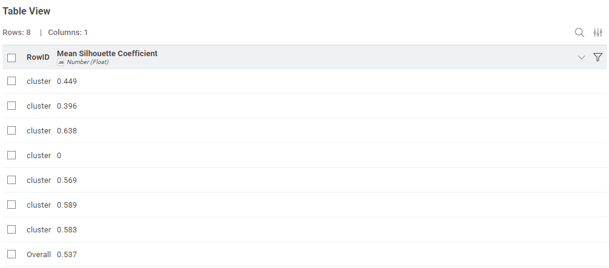

*Visualisasi Scatter Plot:*  
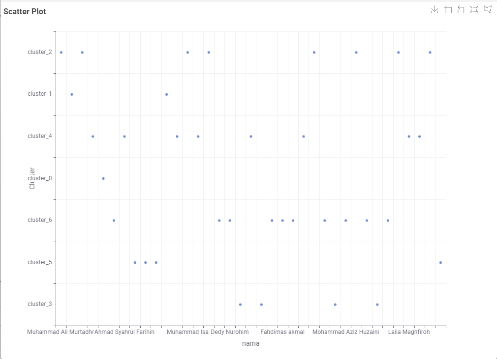

---

### Skenario 4: Reduksi Dimensi dengan PCA (37 Komponen)

Pada skenario ini, diterapkan reduksi paling agresif dengan mempertahankan 37 komponen utama (merepresentasikan sekitar 90% variansi kumulatif data).

#### A. Klastering 6 Kelas ($k = 6$)
- **Rata-rata Silhouette Coefficient (Overall)**: **0.554**
- Meskipun dimensi dipangkas drastis, koefisien siluet tetap identik dengan skenario fitur penuh.

*Tabel Silhouette Coefficient:*  
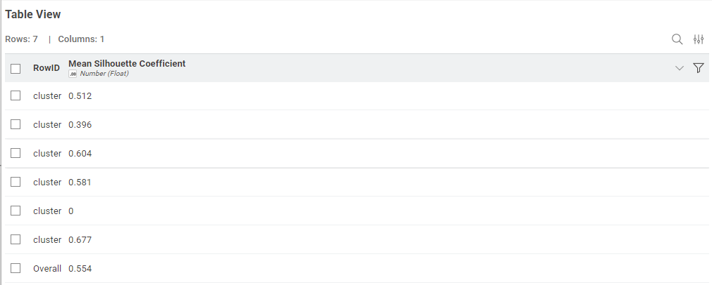

*Visualisasi Scatter Plot:*  
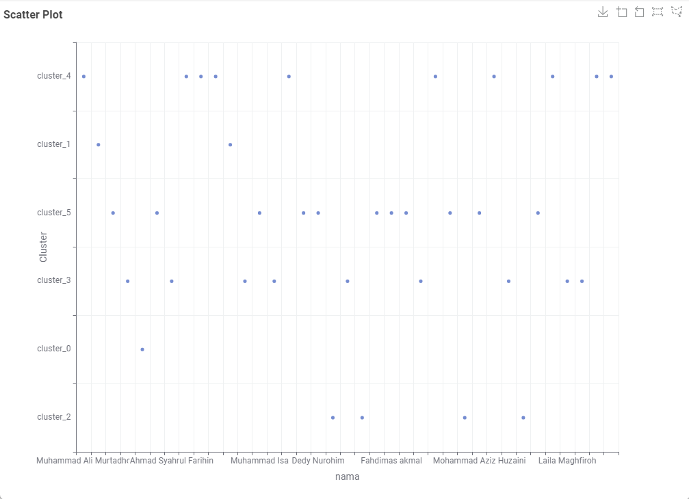

#### B. Klastering 7 Kelas ($k = 7$)
- **Rata-rata Silhouette Coefficient (Overall)**: **0.537**
- Nilai siluet tetap stabil pada angka 0.537, mempertahankan selisih yang konsisten terhadap $k=6$.

*Tabel Silhouette Coefficient:*  
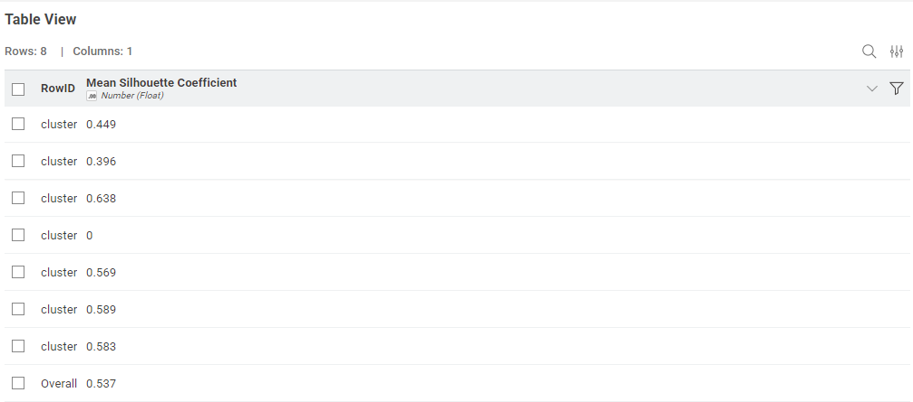

*Visualisasi Scatter Plot:*  
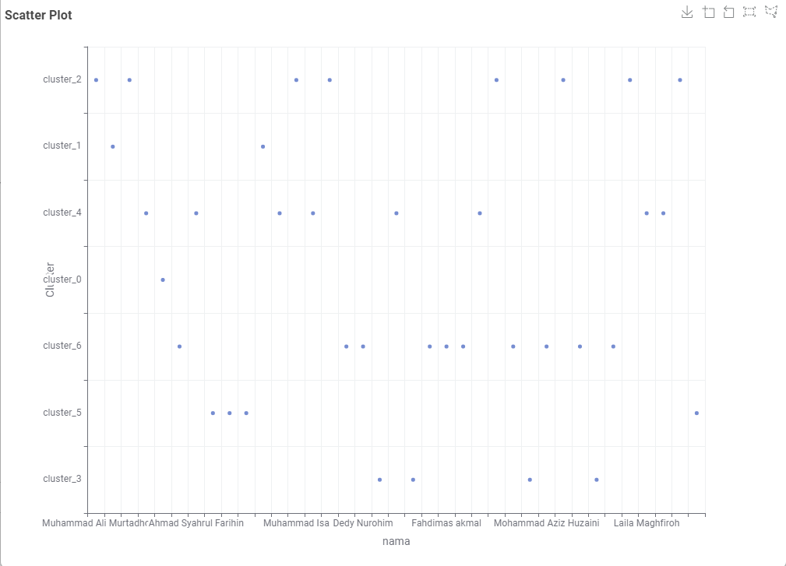

---

## 3. Rekapitulasi dan Komparasi Kinerja

Berikut adalah matriks komparasi nilai rata-rata *Silhouette Coefficient* untuk seluruh variasi perlakuan data dan jumlah klaster yang diuji:

| Skenario Pengujian Dimensi | Jumlah Fitur / Komponen | Mean Silhouette ($k = 6$) | Mean Silhouette ($k = 7$) | Konfigurasi Unggul |
| :--- | :---: | :---: | :---: | :---: |
| **Tanpa PCA** | Seluruh Fitur Polinomial | **0.554** | 0.537 | $k = 6$ |
| **PCA 203** | 203 Komponen | **0.554** | 0.537 | $k = 6$ |
| **PCA 74** | 74 Komponen | **0.554** | 0.537 | $k = 6$ |
| **PCA 37** | 37 Komponen | **0.554** | 0.537 | $k = 6$ |

---

## 4. Kesimpulan dan Pembahasan

Dari serangkaian pengujian klasterisasi K-Means dengan masukan data polinomial polutan udara pada klaster $k = 6$ dan $k = 7$, diperoleh beberapa temuan substantif:

1. **Penentuan Jumlah Klaster Terbaik ($k = 6$ vs $k = 7$):**
   - Berdasarkan hasil perhitungan kuantitatif, konfigurasi **$k = 6$ secara konsisten menghasilkan rata-rata *Silhouette Coefficient* yang lebih tinggi (0.554)** dibandingkan konfigurasi **$k = 7$ (0.537)** di seluruh variasi dimensi data.
   - Hal ini membuktikan bahwa pengelompokan ke dalam 6 klaster membentuk pemisahan batas antarkelompok (*cluster separation*) yang lebih tegas serta memiliki kohesi internal yang lebih rapat. Ketika jumlah klaster dinaikkan menjadi 7, terjadi fragmentasi pada salah satu klaster alami sehingga menciptakan sedikit tumpang tindih (*inter-cluster overlap*) yang menurunkan skor siluet keseluruhan.

2. **Dampak dan Efisiensi Reduksi Dimensi (PCA):**
   - Pemangkasan dimensi fitur dari ratusan fitur polinomial mentah ke 203, 74, hingga **37 komponen utama sama sekali tidak menurunkan kualitas klasterisasi**, di mana skor *Silhouette Coefficient* bertahan stabil pada angka **0.554** (untuk $k=6$) dan **0.537** (untuk $k=7$).
   - Fenomena stabilitas ini mengindikasikan bahwa 37 komponen utama pertama telah berhasil merangkum intisari variansi struktural data tanpa menyertakan derau (*noise*) atau redundansi matematis akibat ekspansi polinomial.
   - Dengan demikian, skenario **PCA 37 komponen dengan $k = 6$** merupakan arsitektur model paling optimal: memberikan kualitas pengelompokan terbaik sekaligus menghemat sumber daya komputasi dan memori secara signifikan (mereduksi lebih dari 80% dimensionalitas data).
