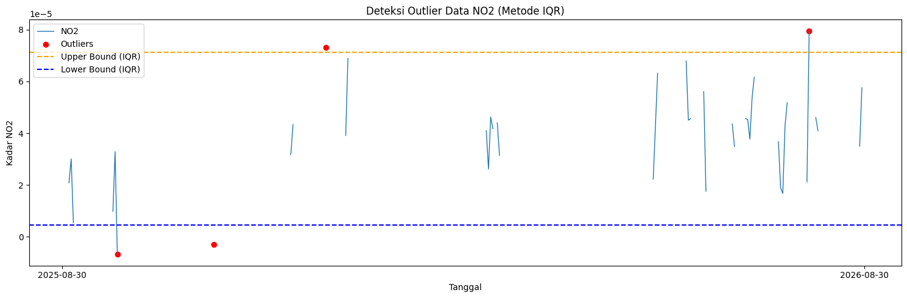
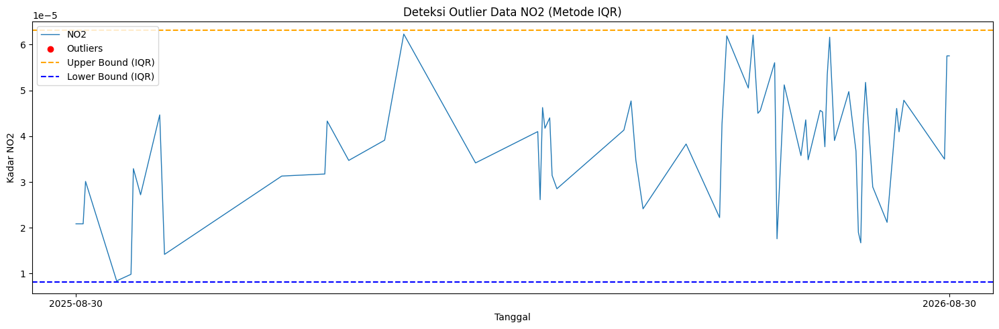

# Preprocessing dan Ekstraksi Fitur

## Preprocessing: Penanganan Outliers dan Interpolasi

Setelah melalui tahap pemahaman data awal, kita menemukan sejumlah kendala berupa hilangnya rekaman data pada tanggal tertentu (*missing values*) serta kemunculan nilai-nilai anomali (*outliers*). Sebagai upaya normalisasi agar dataset ini siap digunakan untuk ekstraksi fitur yang solid, kita akan melakukan prosedur pembersihan berlapis. Pendekatan yang dipakai adalah pemfilteran statistik menggunakan batasan *Interquartile Range* (IQR) yang kemudian diikuti dengan proses **interpolasi linier** untuk menambal data yang kosong.

### Deteksi dan Visualisasi Outlier (Metode IQR)

Teknik rentang antar-kuartil (IQR) sangat lazim diaplikasikan untuk menyaring nilai ekstrem. Secara sederhana, data yang memiliki nilai di bawah batas bawah (*lower bound*) atau melampaui batas atas (*upper bound*) akan ditandai sebagai sebuah anomali atau *outlier*.

```python
import pandas as pd
import numpy as np
import matplotlib.pyplot as plt

df = pd.read_csv("NO2_Timeseries.csv")
df['date'] = pd.to_datetime(df['date'])
df = df.sort_values('date').reset_index(drop=True)

# Hitung IQR
Q1 = df['NO2'].quantile(0.25)
Q3 = df['NO2'].quantile(0.75)
IQR = Q3 - Q1

lower_bound = Q1 - 1.5 * IQR
upper_bound = Q3 + 1.5 * IQR

# Filter outlier
outliers_iqr = df[(df['NO2'] < lower_bound) | (df['NO2'] > upper_bound)]

print("Jumlah Outlier (IQR):", len(outliers_iqr))
print(outliers_iqr[['date', 'NO2']].head())
```

```text
Jumlah Outlier (IQR): 4
          date       NO2
25  2025-09-24 -0.000007
69  2025-11-07 -0.000003
120 2025-12-28  0.000073
340 2026-08-05  0.000080
```

Untuk mempermudah identifikasi batas IQR ini, kita bisa memetakannya ke dalam sebuah plot deret waktu:

```python
plt.figure(figsize=(15,5))
plt.plot(df['date'], df['NO2'], label="NO2", linewidth=1)

plt.scatter(outliers_iqr['date'], outliers_iqr['NO2'],
            color='red', marker='o', label="Outliers")

plt.axhline(upper_bound, color='orange', linestyle='dashed', label="Upper Bound (IQR)")
plt.axhline(lower_bound, color='blue',   linestyle='dashed', label="Lower Bound (IQR)")

plt.title("Deteksi Outlier Data NO2 (Metode IQR)")
plt.xlabel("Tanggal")
plt.ylabel("Kadar NO2")
plt.legend()
plt.tight_layout()
plt.xticks(
    ticks=[df['date'].iloc[0], df['date'].iloc[-1]],
    labels=[df['date'].iloc[0].strftime('%Y-%m-%d'),
            df['date'].iloc[-1].strftime('%Y-%m-%d')]
)
plt.show()
```



### Penanganan Outlier dan Interpolasi Data

Setelah mendeteksi posisi *outlier* pada langkah di atas, nilai-nilai ekstrem tersebut dilumpuhkan atau diubah menjadi elemen kosong (`NaN`). Selanjutnya, untuk menjaga kesinambungan urutan waktu agar grafiknya tidak terputus, kekosongan data tersebut akan "dijahit" menggunakan teknik *interpolasi linier*. Adapun teknik *backward fill* (`bfill`) dan *forward fill* (`ffill`) juga ditambahkan sebagai langkah pengamanan ekstra apabila terdapat sel kosong di pangkal atau ujung data.

```python
# Tandai outlier menjadi NaN
df['NO2_cleaned'] = df['NO2'].mask(
    (df['NO2'] < lower_bound) | (df['NO2'] > upper_bound)
)

# Lakukan interpolasi linier pada NaN yang sudah dibuat
df['NO2_filled'] = df['NO2_cleaned'].interpolate(method='linear')
df['NO2_filled'] = df['NO2_filled'].bfill().ffill()

# Gunting (clip) nilai-nilai hasil interpolasi agar berada dalam batas IQR awal
df['NO2_filled'] = df['NO2_filled'].clip(lower=lower_bound, upper=upper_bound)

# Simpan data yang telah dibersihkan dan diinterpolasi ke file CSV baru
df_no2_warudoyong = pd.DataFrame({
    "date": df['date'],
    "NO2": df['NO2_filled']
})
df_no2_warudoyong.to_csv("NO2_Warudoyong_filled.csv", index=False)
```

Mari kita periksa ulang penyaringan anomali (IQR) pada data yang sudah diinterpolasi untuk memastikan bahwa data telah benar-benar bersih dari pencilan ekstrem:

```python
import pandas as pd
import numpy as np
import matplotlib.pyplot as plt

df = pd.read_csv("NO2_Warudoyong_filled.csv")
df['date'] = pd.to_datetime(df['date'])
df = df.sort_values('date').reset_index(drop=True)

# Menggunakan batas bawah dan atas yang dihitung dari data asli (sebelum interpolasi)
# Nilai-nilai ini diambil dari hasil eksekusi sel EOzD5RDTPA9k sebelumnya.
lower_bound = 8.223020942097288e-06  # lower_bound dari NO2_Timeseries.csv
upper_bound = 6.312939019522183e-05  # upper_bound dari NO2_Timeseries.csv

# Filter outlier menggunakan batas yang sama
outliers_iqr = df[(df['NO2'] < lower_bound) | (df['NO2'] > upper_bound)]

print("Jumlah Outlier (IQR) berdasarkan batas awal:", len(outliers_iqr))
print(outliers_iqr[['date', 'NO2']].head())
```

```text
Jumlah Outlier (IQR) berdasarkan batas awal: 0
Empty DataFrame
Columns: [date, NO2]
Index: []
```

Plot visualisasi distribusi data sesudah ditangani dan dibersihkan dari *outlier*:

```python
plt.figure(figsize=(15,5))
plt.plot(df['date'], df['NO2'], label="NO2", linewidth=1)

plt.scatter(outliers_iqr['date'], outliers_iqr['NO2'],
            color='red', marker='o', label="Outliers")

plt.axhline(upper_bound, color='orange', linestyle='dashed', label="Upper Bound (IQR)")
plt.axhline(lower_bound, color='blue',   linestyle='dashed', label="Lower Bound (IQR)")

plt.title("Deteksi Outlier Data NO2 (Metode IQR)")
plt.xlabel("Tanggal")
plt.ylabel("Kadar NO2")
plt.legend()
plt.tight_layout()
plt.xticks(
    ticks=[df['date'].iloc[0], df['date'].iloc[-1]],
    labels=[df['date'].iloc[0].strftime('%Y-%m-%d'),
            df['date'].iloc[-1].strftime('%Y-%m-%d')]
)
plt.show()
```



## Ekstraksi Fitur Deret Waktu (Time Series)

Kini kita memiliki set data deret waktu polutan udara yang sudah mulus (terbebas dari *missing values* dan *outliers*). Tahap krusial berikutnya adalah melakukan rekayasa ekstraksi fitur (*feature engineering*). Proses ini ditujukan untuk membedah karakteristik tersembunyi dari fluktuasi harian polutan menjadi ragam variabel prediktor baru yang nantinya siap ditelan oleh model algoritma *Machine Learning* / *Deep Learning*.

Untuk mempercepat kalkulasi ekstraksi massal ini, kita mengeksploitasi kapabilitas *library* Python bernama **`tsfel`** (*Time Series Feature Extraction Library*).

Di bawah ini adalah prosedur skrip untuk mengekstraksi 68 jenis fitur secara komprehensif pada variabel NO₂ (metode ini bisa diduplikasi untuk gas CO, SO₂, maupun O₃):

```python
import pandas as pd
import numpy as np
import inspect
import tsfel.feature_extraction.features as tsfel_features

# ---------- 1. Muat data yang sudah dibersihkan ----------
df = pd.read_csv('NO2_Warudoyong_filled.csv')
df['date'] = pd.to_datetime(df['date'])
df = df.sort_values('date').reset_index(drop=True)

target_pollutant = 'NO2'

# Pastikan data di-casting ke tipe numerik.
df[target_pollutant] = pd.to_numeric(df[target_pollutant], errors='coerce')

# Interpolasi terakhir untuk berjaga-jaga apabila terdapat sisa format nan
df_clean = df.set_index('date').interpolate(method='time').ffill().bfill()
fs = 1
signal_1d = df_clean[target_pollutant].astype(float).values

# ---------- 2. Inisiasi 68 Daftar Fitur TSFEL ----------
FEATURE_LIST = """abs_energy auc autocorr average_power calc_centroid calc_max calc_mean
calc_median calc_min calc_std calc_var dfa distance ecdf ecdf_percentile ecdf_percentile_count
ecdf_slope entropy fundamental_frequency higuchi_fractal_dimension hist_mode human_range_energy
hurst_exponent interq_range kurtosis lempel_ziv lpcc max_frequency max_power_spectrum
maximum_fractal_length mean_abs_deviation mean_abs_diff mean_diff median_abs_deviation
median_abs_diff median_diff median_frequency mfcc mse negative_turning neighbourhood_peaks
petrosian_fractal_dimension pk_pk_distance positive_turning power_bandwidth rms skewness slope
spectral_centroid spectral_decrease spectral_distance spectral_entropy spectral_kurtosis
spectral_positive_turning spectral_roll_off spectral_roll_on spectral_skewness spectral_slope
spectral_spread spectral_variation spectrogram_mean_coeff sum_abs_diff wavelet_abs_mean
wavelet_energy wavelet_entropy wavelet_std wavelet_var zero_cross""".split()

print("Jumlah fitur yang diminta:", len(FEATURE_LIST))

# ---------- 3. Fungsi ekstraksi dan penyeragaman output  ----------

# Fungsi bantuan (helper) merubah output multivariat TSFEL menjadi float tunggal/skalar
def to_scalar(result):
    if isinstance(result, dict) and "values" in result:
        result = result["values"]
    if isinstance(result, (list, tuple, np.ndarray)):
        arr = np.asarray(result, dtype=float)
        return float(np.nanmean(arr))
    return float(result)

# Fungsi map pemanggilan fungsi TSFEL
def extract_one(fn_name, signal, fs):
    fn = getattr(tsfel_features, fn_name)
    params = inspect.signature(fn).parameters
    if "fs" in params:
        result = fn(signal, fs)
    else:
        result = fn(signal)
    return to_scalar(result)

# Lakukan ekstraksi iteratif pada fitur
row = {}
for fn_name in FEATURE_LIST:
    row[fn_name] = extract_one(fn_name, signal_1d, fs)

extracted_features_final = pd.DataFrame([row])

print(f"Berhasil! Jumlah fitur yang diekstrak pada {target_pollutant}: {extracted_features_final.shape[1]}")

# Export hasil ke file CSV
extracted_features_final.to_csv(f'{target_pollutant}_Warudoyong_TSFEL.csv', index=False)
```

```text
Jumlah fitur yang diminta: 68
Berhasil! Jumlah fitur yang diekstrak pada NO2: 68
/usr/local/lib/python3.13/dist-packages/tsfel/feature_extraction/features_utils.py:534: RuntimeWarning: invalid value encountered in divide
  rs = np.divide(r, s)
```

Preview ringkas dimensi matriks yang dihasilkan oleh TSFEL:

```python
import pandas as pd
pd.set_option('display.max_columns', None)
df = pd.read_csv("NO2_Warudoyong_TSFEL.csv")
df.head(10)
```

<div style="overflow-x: auto;">
<table border="1" class="dataframe dataframe">
  <thead>
    <tr style="text-align: right;">
      <th></th>
      <th>abs_energy</th>
      <th>auc</th>
      <th>autocorr</th>
      <th>average_power</th>
      <th>calc_centroid</th>
      <th>calc_max</th>
      <th>calc_mean</th>
      <th>calc_median</th>
      <th>calc_min</th>
      <th>calc_std</th>
      <th>calc_var</th>
      <th>dfa</th>
      <th>distance</th>
      <th>ecdf</th>
      <th>ecdf_percentile</th>
      <th>ecdf_percentile_count</th>
      <th>ecdf_slope</th>
      <th>entropy</th>
      <th>fundamental_frequency</th>
      <th>higuchi_fractal_dimension</th>
      <th>hist_mode</th>
      <th>human_range_energy</th>
      <th>hurst_exponent</th>
      <th>interq_range</th>
      <th>kurtosis</th>
      <th>lempel_ziv</th>
      <th>lpcc</th>
      <th>max_frequency</th>
      <th>max_power_spectrum</th>
      <th>maximum_fractal_length</th>
      <th>mean_abs_deviation</th>
      <th>mean_abs_diff</th>
      <th>mean_diff</th>
      <th>median_abs_deviation</th>
      <th>median_abs_diff</th>
      <th>median_diff</th>
      <th>median_frequency</th>
      <th>mfcc</th>
      <th>mse</th>
      <th>negative_turning</th>
      <th>neighbourhood_peaks</th>
      <th>petrosian_fractal_dimension</th>
      <th>pk_pk_distance</th>
      <th>positive_turning</th>
      <th>power_bandwidth</th>
      <th>rms</th>
      <th>skewness</th>
      <th>slope</th>
      <th>spectral_centroid</th>
      <th>spectral_decrease</th>
      <th>spectral_distance</th>
      <th>spectral_entropy</th>
      <th>spectral_kurtosis</th>
      <th>spectral_positive_turning</th>
      <th>spectral_roll_off</th>
      <th>spectral_roll_on</th>
      <th>spectral_skewness</th>
      <th>spectral_slope</th>
      <th>spectral_spread</th>
      <th>spectral_variation</th>
      <th>spectrogram_mean_coeff</th>
      <th>sum_abs_diff</th>
      <th>wavelet_abs_mean</th>
      <th>wavelet_energy</th>
      <th>wavelet_entropy</th>
      <th>wavelet_std</th>
      <th>wavelet_var</th>
      <th>zero_cross</th>
    </tr>
  </thead>
  <tbody>
    <tr>
      <th>0</th>
      <td>5.120863e-07</td>
      <td>0.013004</td>
      <td>15.0</td>
      <td>1.402976e-09</td>
      <td>210.619392</td>
      <td>0.000062</td>
      <td>0.000036</td>
      <td>0.000036</td>
      <td>0.000008</td>
      <td>0.000011</td>
      <td>1.291727e-10</td>
      <td>1.258093</td>
      <td>365.0</td>
      <td>0.015027</td>
      <td>0.000035</td>
      <td>182.5</td>
      <td>38782.062755</td>
      <td>0.996792</td>
      <td>0.005464</td>
      <td>1.611949</td>
      <td>0.000038</td>
      <td>0.0</td>
      <td>0.940708</td>
      <td>0.000014</td>
      <td>-0.148139</td>
      <td>0.139344</td>
      <td>0.804566</td>
      <td>0.371585</td>
      <td>50.384905</td>
      <td>-2.94103</td>
      <td>0.000009</td>
      <td>0.000002</td>
      <td>1.005209e-07</td>
      <td>0.000007</td>
      <td>7.862599e-07</td>
      <td>2.631903e-07</td>
      <td>0.019126</td>
      <td>2.267015</td>
      <td>0.714849</td>
      <td>21.0</td>
      <td>11.0</td>
      <td>1.008021</td>
      <td>0.000054</td>
      <td>21.0</td>
      <td>0.120219</td>
      <td>0.000037</td>
      <td>0.025815</td>
      <td>5.388853e-08</td>
      <td>0.083306</td>
      <td>-3.317551</td>
      <td>-2.146363</td>
      <td>0.561411</td>
      <td>4.652587</td>
      <td>50.0</td>
      <td>0.371585</td>
      <td>0.0</td>
      <td>1.610303</td>
      <td>-0.043015</td>
      <td>0.123104</td>
      <td>0.441446</td>
      <td>1.280249e-10</td>
      <td>0.000781</td>
      <td>0.000002</td>
      <td>0.000017</td>
      <td>2.042406</td>
      <td>0.000017</td>
      <td>3.400353e-10</td>
      <td>0.0</td>
    </tr>
  </tbody>
</table>
</div>

## Penjelasan Domain TSFEL

Secara garis besar, pustaka TSFEL memecah struktur fitur deret waktu ke dalam tiga kerangka domain utama guna melihat data dari berbagai sudut pandang: **Domain Statistik (Statistical)**, **Domain Temporal (Temporal)**, dan **Domain Frekuensi (Spectral)**. 

### 1. Domain Statistical
Kumpulan fitur di dalam ranah statistik ini befokus pada pencarian ringkasan kuantitatif mengenai sebaran serta wujud distribusi keseluruhan rentang sinyal, tanpa mempedulikan kapan data tersebut terjadi secara berurutan. Area ini bermanfaat untuk memotret sentralisasi dan variasi penyimpangannya.

* **`calc_max`, `calc_min`, `calc_mean`, `calc_median`**: Menjabarkan informasi standar terkait nilai puncak tertinggi, dasar terendah, nilai pusat rata-rata, serta median titik tengah deret konsentrasi polutan.
* **`calc_std`, `calc_var`**: Deviasi dan varians yang mengukur seberapa volatil penyebaran konsentrasi polusi tersebut.
* **`ecdf`, `ecdf_percentile`, `ecdf_percentile_count`, `ecdf_slope`**: Metrik evaluasi berbasis kurva *Empirical Cumulative Distribution Function* (ECDF) guna merepresentasikan probabilitas kumulatif sinyalnya.
* **`hist_mode`**: Menangkap poin observasi yang frekuensi kemunculannya paling dominan di kurva histogram.
* **`interq_range`**: Kalkulasi lebar jarak kuartil tengah (Q3 dikurangi Q1) dari rentang penyebaran konsentrasi.
* **`kurtosis`**: Mengukur tingkat kekritisan kepuncakan suatu distribusi data dibandingkan kurva bel normal.
* **`skewness`**: Menggambarkan condong atau asimetrisnya proporsi frekuensi polutan terhadap nilai pusat.
* **`mean_abs_deviation`, `median_abs_deviation`**: Memberikan simpangan absolut terhadap nilai Mean/Median yang diklaim jauh lebih imun menghadapi sisa *outlier*.
* **`rms`**: Besaran kuadratik akar rata-rata (*Root Mean Square*) untuk mewakili muatan tenaga (energi rata-rata) sinyal sepanjang masa observasi.

### 2. Domain Temporal
Berbeda dari statistik murni, domain temporal meneliti runtutan perilaku nilai secara kronologis waktu. Ini krusial guna mengulik seberapa ruwet, acak, hingga melacak memori keterikatan korelasi masa lalu polutan dengan kondisinya yang sekarang.

* **`abs_energy`**: Total akumulasi tenaga mutlak dari seluruh frekuensi lonjakan polutan di dimensi waktu.
* **`auc`**: Luasan kurva integral total (*Area Under the Curve*) dari proyeksi deret pengamatan.
* **`autocorr`**: Skor korelasi internal (autokorelasi) untuk melacak kemiripan repetisi tren di hari kemarin dengan hari ini.
* **`average_power`**: Nilai daya harian rata-rata yang tersimpan.
* **`calc_centroid`**: Titik bobot keseimbangan pusat nilai deret ukur waktu observasi.
* **`dfa`**: *Detrended Fluctuation Analysis*, sebuah alat analisis kompleks yang mendeteksi skala panjang memori jangka panjang korelasi sinyal fraktal.
* **`distance`**: Rentang jarak perjalanan akumulatif dari titik pembacaan hari pertama ke hari terakhir.
* **`entropy`**: Metrik entropi standar guna menaksir kadar "kekacauan" (*chaos*) deret harian konsentrasi udara.
* **`higuchi_fractal_dimension`, `petrosian_fractal_dimension`**: Mengkuantifikasi keruwetan atau sifat zigzag fraktalitas secara matematis menggunakan koefisien Higuchi/Petrosian.
* **`hurst_exponent`**: Memprediksi koefisien dependensi persistensi. Bila indeks Hurst membesar, ada indikasi bahwa tren udara buruk di Warudoyong cenderung bertahan lebih lama (*long-memory*).
* **`lempel_ziv`**: Evaluasi kompresi kompleksitas untuk mengestimasi keanekaragaman wujud siklus unik deret tersebut.
* **`maximum_fractal_length`**: Skala maksimal panjang fraktal sinyal seiring berjalannya resolusi waktu.
* **`mean_abs_diff`, `mean_diff`, `median_abs_diff`, `median_diff`**: Menjabarkan tingkat diferensiasi (kenaikan/penurunan laju) rata-rata antar pengukuran harian.
* **`mse`**: Nilai rerata diferensiasi kuadrat dari prediksi *baseline* sentral rata-rata keseluruhan deret.
* **`negative_turning`, `positive_turning`**: Frekuensi total sebuah grafik berbelok drastis (baik transisi memburuk maupun membaik).
* **`neighbourhood_peaks`**: Pemetaan lokasi intensitas fluktuasi puncak polutan di jendela jarak tertentu.
* **`pk_pk_distance`**: Besaran lompatan jangkauan jarak puncak emisi tertinggi hingga palung terendah harian.
* **`slope`**: Arah kemiringan tren linear garis pandu (menurun/naik).
* **`sum_abs_diff`**: Puncak kumulasi jarak interval fluktuasi antar hari.
* **`zero_cross`**: Jumlah intersek titik di mana sinyal grafis memotong garis batas netral 0 (nol).

### 3. Domain Spectral
Peralihan fasa ke spektrum (fourier/wavelet) membantu mengintip profil daya dominan yang bersiklus secara priodik tapi tidak kasat mata secara kronologis biasa.

* **`fundamental_frequency`**: Intonasi getar siklus frekuensi utama yang paling dominan muncul selama pengamatan (misal: siklus mingguan / musiman).
* **`max_frequency`**: Kapasitas laju siklus terekstrem yang tertangkap spektrum fourier.
* **`median_frequency`**: Titik pembagi median daya amplitudo di seluruh pita frekuensi aktif.
* **`human_range_energy`**: Daya transmisi spesifik (diambil dari domain audiologis manusia, tapi bisa diadaptasi pergerakan sinyal udara).
* **`lpcc`, `mfcc`**: Ekstraksi kepstral linear dan *Mel-Frequency Cepstral* (koefisien logaritmik) yang mengemas kepadatan pola frekuensi harian menjadi *array* fitur ringkas yang solid.
* **`max_power_spectrum`**: Intensitas mutlak daya di pusat pita paling dominan.
* **`power_bandwidth`**: Limit kelebaran wilayah frekuensi di mana mayoritas kekuatan tren polusi difokuskan.
* **`spectral_centroid`**: Titik gravitasi dari keseluruhan frekuensi (menimbang apakah volatilitas polusi lebih sering berirama konstan rendah atau naik turun ekstrem di irama tinggi).
* **`spectral_decrease`, `spectral_slope`**: Kecepatan tingkat penyusutan spektrum ketika memasuki zona pita irama tinggi.
* **`spectral_distance`**: Jarak spasial antar densitas frekuensi sinyal di periode waktu beruntun.
* **`spectral_entropy`**: Kekacauan entropis dalam distribusi energi pita; sinyal polusi rutin bersiklus biasanya bernilai entropi spektral yang stabil.
* **`spectral_kurtosis`, `spectral_skewness`**: Karakteristik kurvatur dari proyeksi densitas tenaga sinyal spektrum polutan.
* **`spectral_positive_turning`**: Intensitas kurva spektrum berbalik naik dari titik frekuensi dasar.
* **`spectral_roll_off`, `spectral_roll_on`**: Ambang pembatas batas pita batas wilayah di mana (biasanya) 95% bobot sinyal terpusat, membuang bisingan frekuensi luar biasa.
* **`spectral_spread`, `spectral_variation`**: Penyebaran distribusi energi pita spektral terhadap batas *centroid*.
* **`spectrogram_mean_coeff`**: Evaluasi koefisien mutlak di tingkat densitas pemetaan 2 dimensi waktu-spektrum (Spektrogram).
* **`wavelet_abs_mean`, `wavelet_energy`, `wavelet_entropy`, `wavelet_std`, `wavelet_var`**: Rangkuman kalkulasi statistik mutlak (energi, keruwetan, hingga deviasi) memanfaatan dekomposisi pergeseran jendela transformasi *Wavelet*, yang mahir mengungkap struktur frekuensi yang durasinya sesekali muncul atau hilang (*transient features*).
