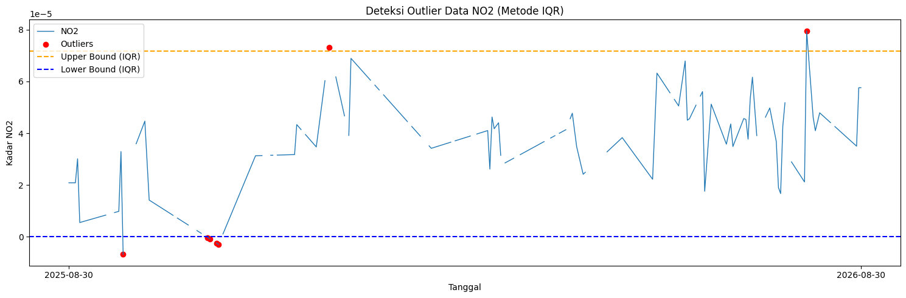
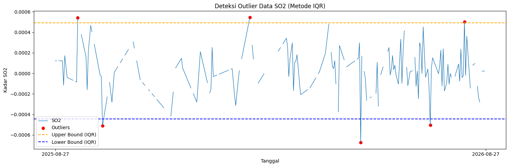
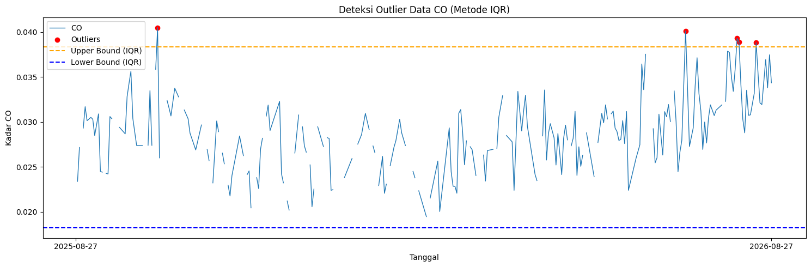
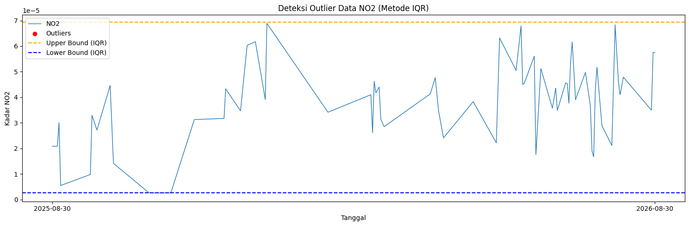
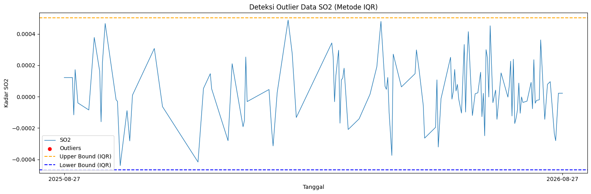
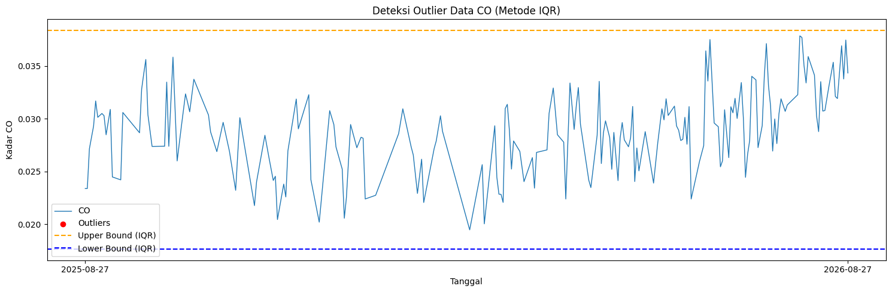
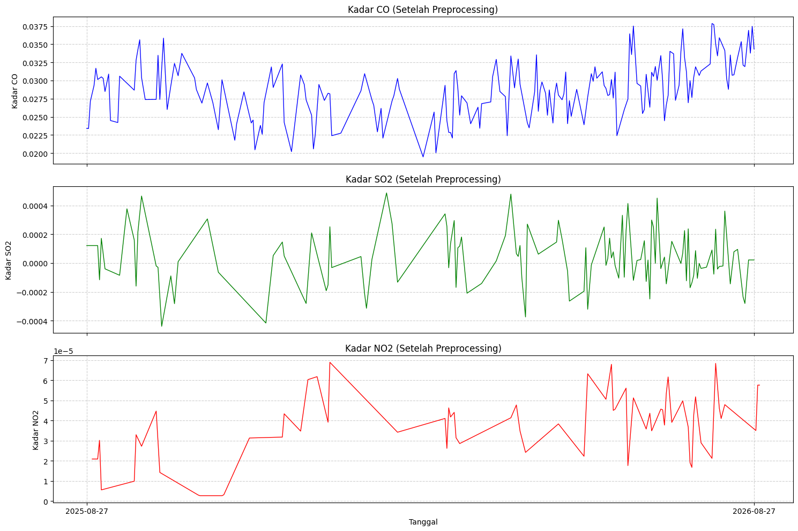

# Preprocessing dan Ekstraksi Fitur (linier)

## Preprocessing: Penanganan Outliers dan Interpolasi Linier

Setelah melalui tahap pemahaman data awal, kita menemukan sejumlah kendala berupa hilangnya rekaman data pada tanggal tertentu (*missing values*) serta kemunculan nilai-nilai anomali (*outliers*). Sebagai upaya normalisasi agar dataset ini siap digunakan untuk ekstraksi fitur yang solid, kita melakukan prosedur pembersihan berlapis. Pendekatan yang dipakai adalah pemfilteran statistik menggunakan batasan *Interquartile Range* (IQR) yang diikuti dengan algoritma **capping iteratif** dan **interpolasi linier** untuk menambal data yang kosong serta memastikan dataset bersih sempurna dari pencilan ekstrem.

### 1. Deteksi Missing Values

Sebelum melakukan penanganan anomali, kita mengevaluasi terlebih dahulu kuantitas data yang hilang (*missing values*) pada masing-masing berkas data deret waktu polutan ($\text{CO}$, $\text{NO}_2$, dan $\text{SO}_2$):

```python
import pandas as pd

df_co = pd.read_csv("CO_Timeseries.csv")
print("Missing values CO:", df_co['CO'].isna().sum())

df_no2 = pd.read_csv("NO2_Timeseries.csv")
print("Missing values NO2:", df_no2['NO2'].isna().sum())

df_so2 = pd.read_csv("SO2_Timeseries.csv")
print("Missing values SO2:", df_so2['SO2'].isna().sum())
```

```text
Missing values CO: 57
Missing values NO2: 51
Missing values SO2: 58
```

---

### 2. Deteksi dan Visualisasi Outlier (Metode IQR)

Teknik rentang antar-kuartil (IQR) diaplikasikan untuk menyaring nilai ekstrem pada masing-masing parameter polutan ($\text{NO}_2$, $\text{SO}_2$, dan $\text{CO}$). Nilai di bawah batas bawah (*lower bound*) atau melampaui batas atas (*upper bound*) ditandai sebagai anomali atau *outlier*.

$$ \text{IQR} = Q_3 - Q_1 $$
$$ \text{Lower Bound} = Q_1 - 1.5 \times \text{IQR} $$
$$ \text{Upper Bound} = Q_3 + 1.5 \times \text{IQR} $$

#### A. Deteksi Outlier NO2

```python
import pandas as pd
import numpy as np
import matplotlib.pyplot as plt

df = pd.read_csv("NO2_Timeseries.csv")
df['date'] = pd.to_datetime(df['date'])
df = df.sort_values('date').reset_index(drop=True)

# Hitung IQR
Q1 = df['NO2'].quantile(0.25)
Q3 = df['NO2'].quantile(0.75)
IQR = Q3 - Q1

lower_bound = Q1 - 1.5 * IQR
upper_bound = Q3 + 1.5 * IQR

# Filter outlier
outliers_iqr = df[(df['NO2'] < lower_bound) | (df['NO2'] > upper_bound)]

print("Jumlah Outlier (IQR):", len(outliers_iqr))
print(outliers_iqr[['date', 'NO2']].head())
```

```text
Jumlah Outlier (IQR): 7
         date           NO2
25 2025-09-24 -6.785994e-06
64 2025-11-02 -2.512900e-07
65 2025-11-03 -7.859995e-07
68 2025-11-06 -2.390128e-06
69 2025-11-07 -2.924838e-06
```

```python
plt.figure(figsize=(15,5))
plt.plot(df['date'], df['NO2'], label="NO2", linewidth=1)

plt.scatter(outliers_iqr['date'], outliers_iqr['NO2'],
            color='red', marker='o', label="Outliers")

plt.axhline(upper_bound, color='orange', linestyle='dashed', label="Upper Bound (IQR)")
plt.axhline(lower_bound, color='blue',   linestyle='dashed', label="Lower Bound (IQR)")

plt.title("Deteksi Outlier Data NO2 (Metode IQR)")
plt.xlabel("Tanggal")
plt.ylabel("Kadar NO2")
plt.legend()
plt.tight_layout()
plt.xticks(
    ticks=[df['date'].iloc[0], df['date'].iloc[-1]],
    labels=[df['date'].iloc[0].strftime('%Y-%m-%d'),
            df['date'].iloc[-1].strftime('%Y-%m-%d')]
)
plt.show()
```



#### B. Deteksi Outlier SO2

```python
import pandas as pd
import numpy as np
import matplotlib.pyplot as plt

df = pd.read_csv("SO2_Timeseries.csv")
df['date'] = pd.to_datetime(df['date'])
df = df.sort_values('date').reset_index(drop=True)

# Hitung IQR
Q1 = df['SO2'].quantile(0.25)
Q3 = df['SO2'].quantile(0.75)
IQR = Q3 - Q1

lower_bound = Q1 - 1.5 * IQR
upper_bound = Q3 + 1.5 * IQR

# Filter outlier
outliers_iqr = df[(df['SO2'] < lower_bound) | (df['SO2'] > upper_bound)]

print("Jumlah Outlier (IQR):", len(outliers_iqr))
print(outliers_iqr[['date', 'SO2']].head())
```

```text
Jumlah Outlier (IQR): 6
          date       SO2
19  2025-09-15  0.000540
40  2025-10-06 -0.000510
165 2026-02-08  0.000546
259 2026-05-13 -0.000675
318 2026-07-11 -0.000506
```

```python
plt.figure(figsize=(15,5))
plt.plot(df['date'], df['SO2'], label="SO2", linewidth=1)

plt.scatter(outliers_iqr['date'], outliers_iqr['SO2'],
            color='red', marker='o', label="Outliers")

plt.axhline(upper_bound, color='orange', linestyle='dashed', label="Upper Bound (IQR)")
plt.axhline(lower_bound, color='blue',   linestyle='dashed', label="Lower Bound (IQR)")

plt.title("Deteksi Outlier Data SO2 (Metode IQR)")
plt.xlabel("Tanggal")
plt.ylabel("Kadar SO2")
plt.legend()
plt.tight_layout()
plt.xticks(
    ticks=[df['date'].iloc[0], df['date'].iloc[-1]],
    labels=[df['date'].iloc[0].strftime('%Y-%m-%d'),
            df['date'].iloc[-1].strftime('%Y-%m-%d')]
)
plt.show()
```



#### C. Deteksi Outlier CO

```python
import pandas as pd
import numpy as np
import matplotlib.pyplot as plt

df = pd.read_csv("CO_Timeseries.csv")
df['date'] = pd.to_datetime(df['date'])
df = df.sort_values('date').reset_index(drop=True)

# Hitung IQR
Q1 = df['CO'].quantile(0.25)
Q3 = df['CO'].quantile(0.75)
IQR = Q3 - Q1

lower_bound = Q1 - 1.5 * IQR
upper_bound = Q3 + 1.5 * IQR

# Filter outlier
outliers_iqr = df[(df['CO'] < lower_bound) | (df['CO'] > upper_bound)]

print("Jumlah Outlier (IQR):", len(outliers_iqr))
print(outliers_iqr[['date', 'CO']].head())
```

```text
Jumlah Outlier (IQR): 5
          date        CO
43  2025-10-09  0.040473
320 2026-07-13  0.040105
347 2026-08-09  0.039287
348 2026-08-10  0.038860
357 2026-08-19  0.038800
```

```python
plt.figure(figsize=(15,5))
plt.plot(df['date'], df['CO'], label="CO", linewidth=1)

plt.scatter(outliers_iqr['date'], outliers_iqr['CO'],
            color='red', marker='o', label="Outliers")

plt.axhline(upper_bound, color='orange', linestyle='dashed', label="Upper Bound (IQR)")
plt.axhline(lower_bound, color='blue',   linestyle='dashed', label="Lower Bound (IQR)")

plt.title("Deteksi Outlier Data CO (Metode IQR)")
plt.xlabel("Tanggal")
plt.ylabel("Kadar CO")
plt.legend()
plt.tight_layout()
plt.xticks(
    ticks=[df['date'].iloc[0], df['date'].iloc[-1]],
    labels=[df['date'].iloc[0].strftime('%Y-%m-%d'),
            df['date'].iloc[-1].strftime('%Y-%m-%d')]
)
plt.show()
```



---

### 3. Penanganan Outlier dan Interpolasi Data Linier

Setelah posisi *outlier* terdeteksi, nilai-nilai ekstrem diubah menjadi `NaN`. Untuk menjaga kesinambungan urutan waktu, kekosongan data ditambal menggunakan **interpolasi linier**, dilanjutkan dengan *backward fill* (`bfill`) dan *forward fill* (`ffill`). Selanjutnya, digunakan **Algoritma Capping Iteratif** dengan pengaman presisi desimal ($10^{-12}$) untuk memastikan kuantitas outlier akhir mutlak 0.

#### A. Penanganan Outlier & Interpolasi NO2

```python
import pandas as pd
import numpy as np

# 1. Ambil data asli
df = pd.read_csv("NO2_Timeseries.csv")
df['date'] = pd.to_datetime(df['date'])
df = df.sort_values('date').reset_index(drop=True)

# 2. Hitung IQR awal
Q1_init = df['NO2'].quantile(0.25)
Q3_init = df['NO2'].quantile(0.75)
IQR_init = Q3_init - Q1_init
lower_init = Q1_init - 1.5 * IQR_init
upper_init = Q3_init + 1.5 * IQR_init

# 3. Ubah outlier awal menjadi NaN
df['NO2_cleaned'] = df['NO2'].mask((df['NO2'] < lower_init) | (df['NO2'] > upper_init))

# 4. Interpolasi linear
df['NO2_filled'] = df['NO2_cleaned'].interpolate(method='linear')
df['NO2_filled'] = df['NO2_filled'].bfill().ffill()

# 5. Algoritma Iteratif untuk Menghilangkan Outlier Baru dengan Pengaman Presisi Desimal
data_final = df['NO2_filled'].copy()
while True:
    Q1_curr = data_final.quantile(0.25)
    Q3_curr = data_final.quantile(0.75)
    IQR_curr = Q3_curr - Q1_curr
    lower_curr = Q1_curr - 1.5 * IQR_curr
    upper_curr = Q3_curr + 1.5 * IQR_curr

    # Deteksi outlier
    outliers = data_final[(data_final < lower_curr) | (data_final > upper_curr)]
    if len(outliers) == 0:
        break

    # Pangkas dengan margin pengaman kecil (1e-12)
    safe_lower = lower_curr + 1e-12
    safe_upper = upper_curr - 1e-12
    data_final = data_final.clip(lower=safe_lower, upper=safe_upper)

# 6. Simpan dataset final
df_no2_warudoyong = pd.DataFrame({
    "date": df['date'],
    "NO2": data_final
})
df_no2_warudoyong.to_csv("NO2_Warudoyong_filled.csv", index=False)
print("Pemrosesan selesai! Silakan jalankan sel pengecekan di bawahnya.")
```

**Verifikasi Akhir Outlier NO2:**

```python
import pandas as pd
import numpy as np

df = pd.read_csv("NO2_Warudoyong_filled.csv")
df['date'] = pd.to_datetime(df['date'])
df = df.sort_values('date').reset_index(drop=True)

Q1 = df['NO2'].quantile(0.25)
Q3 = df['NO2'].quantile(0.75)
IQR = Q3 - Q1

lower_bound = Q1 - 1.5 * IQR
upper_bound = Q3 + 1.5 * IQR

outliers_iqr = df[(df['NO2'] < lower_bound) | (df['NO2'] > upper_bound)]

print("Jumlah Outlier (IQR) Akhir setelah Capping Iteratif:", len(outliers_iqr))
print("Batas bawah:", lower_bound)
print("Batas atas:", upper_bound)
```

```text
Jumlah Outlier (IQR) Akhir setelah Capping Iteratif: 0
Batas bawah: 2.6228252636428772e-06
Batas atas: 6.936550308485798e-05
```

```python
plt.figure(figsize=(15,5))
plt.plot(df['date'], df['NO2'], label="NO2", linewidth=1)

plt.scatter(outliers_iqr['date'], outliers_iqr['NO2'],
            color='red', marker='o', label="Outliers")

plt.axhline(upper_bound, color='orange', linestyle='dashed', label="Upper Bound (IQR)")
plt.axhline(lower_bound, color='blue',   linestyle='dashed', label="Lower Bound (IQR)")

plt.title("Deteksi Outlier Data NO2 Setelah Bersih (Metode IQR)")
plt.xlabel("Tanggal")
plt.ylabel("Kadar NO2")
plt.legend()
plt.tight_layout()
plt.xticks(
    ticks=[df['date'].iloc[0], df['date'].iloc[-1]],
    labels=[df['date'].iloc[0].strftime('%Y-%m-%d'),
            df['date'].iloc[-1].strftime('%Y-%m-%d')]
)
plt.show()
```



#### B. Penanganan Outlier & Interpolasi SO2

```python
import pandas as pd
import numpy as np

# 1. Ambil data asli
df = pd.read_csv("SO2_Timeseries.csv")
df['date'] = pd.to_datetime(df['date'])
df = df.sort_values('date').reset_index(drop=True)

# 2. Hitung IQR awal
Q1_init = df['SO2'].quantile(0.25)
Q3_init = df['SO2'].quantile(0.75)
IQR_init = Q3_init - Q1_init
lower_init = Q1_init - 1.5 * IQR_init
upper_init = Q3_init + 1.5 * IQR_init

# 3. Ubah outlier awal menjadi NaN
df['SO2_cleaned'] = df['SO2'].mask((df['SO2'] < lower_init) | (df['SO2'] > upper_init))

# 4. Interpolasi linear
df['SO2_filled'] = df['SO2_cleaned'].interpolate(method='linear')
df['SO2_filled'] = df['SO2_filled'].bfill().ffill()

# 5. Algoritma Iteratif
data_final = df['SO2_filled'].copy()
while True:
    Q1_curr = data_final.quantile(0.25)
    Q3_curr = data_final.quantile(0.75)
    IQR_curr = Q3_curr - Q1_curr
    lower_curr = Q1_curr - 1.5 * IQR_curr
    upper_curr = Q3_curr + 1.5 * IQR_curr

    outliers = data_final[(data_final < lower_curr) | (data_final > upper_curr)]
    if len(outliers) == 0:
        break

    safe_lower = lower_curr + 1e-12
    safe_upper = upper_curr - 1e-12
    data_final = data_final.clip(lower=safe_lower, upper=safe_upper)

# 6. Simpan dataset final
df_SO2_warudoyong = pd.DataFrame({
    "date": df['date'],
    "SO2": data_final
})
df_SO2_warudoyong.to_csv("SO2_Warudoyong_filled.csv", index=False)
print("Pemrosesan selesai!")
```

**Verifikasi Akhir Outlier SO2:**

```python
import pandas as pd
import numpy as np

df = pd.read_csv("SO2_Warudoyong_filled.csv")
df['date'] = pd.to_datetime(df['date'])
df = df.sort_values('date').reset_index(drop=True)

Q1 = df['SO2'].quantile(0.25)
Q3 = df['SO2'].quantile(0.75)
IQR = Q3 - Q1

lower_bound = Q1 - 1.5 * IQR
upper_bound = Q3 + 1.5 * IQR

outliers_iqr = df[(df['SO2'] < lower_bound) | (df['SO2'] > upper_bound)]

print("Jumlah Outlier (IQR) Akhir setelah Capping Iteratif:", len(outliers_iqr))
print("Batas bawah:", lower_bound)
print("Batas atas:", upper_bound)
```

```text
Jumlah Outlier (IQR) Akhir setelah Capping Iteratif: 0
Batas bawah: -0.00046624713750967496
Batas atas: 0.0005028181208357249
```

```python
plt.figure(figsize=(15,5))
plt.plot(df['date'], df['SO2'], label="SO2", linewidth=1)

plt.scatter(outliers_iqr['date'], outliers_iqr['SO2'],
            color='red', marker='o', label="Outliers")

plt.axhline(upper_bound, color='orange', linestyle='dashed', label="Upper Bound (IQR)")
plt.axhline(lower_bound, color='blue',   linestyle='dashed', label="Lower Bound (IQR)")

plt.title("Deteksi Outlier Data SO2 Setelah Bersih (Metode IQR)")
plt.xlabel("Tanggal")
plt.ylabel("Kadar SO2")
plt.legend()
plt.tight_layout()
plt.xticks(
    ticks=[df['date'].iloc[0], df['date'].iloc[-1]],
    labels=[df['date'].iloc[0].strftime('%Y-%m-%d'),
            df['date'].iloc[-1].strftime('%Y-%m-%d')]
)
plt.show()
```



#### C. Penanganan Outlier & Interpolasi CO

```python
import pandas as pd
import numpy as np

# 1. Ambil data asli
df = pd.read_csv("CO_Timeseries.csv")
df['date'] = pd.to_datetime(df['date'])
df = df.sort_values('date').reset_index(drop=True)

# 2. Hitung IQR awal
Q1_init = df['CO'].quantile(0.25)
Q3_init = df['CO'].quantile(0.75)
IQR_init = Q3_init - Q1_init
lower_init = Q1_init - 1.5 * IQR_init
upper_init = Q3_init + 1.5 * IQR_init

# 3. Ubah outlier awal menjadi NaN
df['CO_cleaned'] = df['CO'].mask((df['CO'] < lower_init) | (df['CO'] > upper_init))

# 4. Interpolasi linear
df['CO_filled'] = df['CO_cleaned'].interpolate(method='linear')
df['CO_filled'] = df['CO_filled'].bfill().ffill()

# 5. Algoritma Iteratif
data_final = df['CO_filled'].copy()
while True:
    Q1_curr = data_final.quantile(0.25)
    Q3_curr = data_final.quantile(0.75)
    IQR_curr = Q3_curr - Q1_curr
    lower_curr = Q1_curr - 1.5 * IQR_curr
    upper_curr = Q3_curr + 1.5 * IQR_curr

    outliers = data_final[(data_final < lower_curr) | (data_final > upper_curr)]
    if len(outliers) == 0:
        break

    safe_lower = lower_curr + 1e-12
    safe_upper = upper_curr - 1e-12
    data_final = data_final.clip(lower=safe_lower, upper=safe_upper)

# 6. Simpan dataset final
df_CO_warudoyong = pd.DataFrame({
    "date": df['date'],
    "CO": data_final
})
df_CO_warudoyong.to_csv("CO_Warudoyong_filled.csv", index=False)
print("Pemrosesan selesai!")
```

**Verifikasi Akhir Outlier CO:**

```python
import pandas as pd
import numpy as np

df = pd.read_csv("CO_Warudoyong_filled.csv")
df['date'] = pd.to_datetime(df['date'])
df = df.sort_values('date').reset_index(drop=True)

Q1 = df['CO'].quantile(0.25)
Q3 = df['CO'].quantile(0.75)
IQR = Q3 - Q1

lower_bound = Q1 - 1.5 * IQR
upper_bound = Q3 + 1.5 * IQR

outliers_iqr = df[(df['CO'] < lower_bound) | (df['CO'] > upper_bound)]

print("Jumlah Outlier (IQR) Akhir setelah Capping Iteratif:", len(outliers_iqr))
print("Batas bawah:", lower_bound)
print("Batas atas:", upper_bound)
```

```text
Jumlah Outlier (IQR) Akhir setelah Capping Iteratif: 0
Batas bawah: 0.017772719236160533
Batas atas: 0.03875323956637375
```

```python
plt.figure(figsize=(15,5))
plt.plot(df['date'], df['CO'], label="CO", linewidth=1)

plt.scatter(outliers_iqr['date'], outliers_iqr['CO'],
            color='red', marker='o', label="Outliers")

plt.axhline(upper_bound, color='orange', linestyle='dashed', label="Upper Bound (IQR)")
plt.axhline(lower_bound, color='blue',   linestyle='dashed', label="Lower Bound (IQR)")

plt.title("Deteksi Outlier Data CO Setelah Bersih (Metode IQR)")
plt.xlabel("Tanggal")
plt.ylabel("Kadar CO")
plt.legend()
plt.tight_layout()
plt.xticks(
    ticks=[df['date'].iloc[0], df['date'].iloc[-1]],
    labels=[df['date'].iloc[0].strftime('%Y-%m-%d'),
            df['date'].iloc[-1].strftime('%Y-%m-%d')]
)
plt.show()
```



---

### 4. Visualisasi Gabungan Setelah Preprocessing Linier

Setelah seluruh variabel polutan melalui tahap eliminasi outlier dan interpolasi linier, kita menampilkan grafik fluktuasi gabungan untuk ketiga polutan dalam tiga subplot terpisah untuk memeriksa kesinambungan deret waktu secara keseluruhan:

```python
import pandas as pd
import matplotlib.pyplot as plt

# Memuat data yang telah diproses
df_co = pd.read_csv("CO_Warudoyong_filled.csv")
df_so2 = pd.read_csv("SO2_Warudoyong_filled.csv")
df_no2 = pd.read_csv("NO2_Warudoyong_filled.csv")

df_co['date'] = pd.to_datetime(df_co['date'])
df_so2['date'] = pd.to_datetime(df_so2['date'])
df_no2['date'] = pd.to_datetime(df_no2['date'])

# Membuat subplot untuk ketiga polutan
fig, axes = plt.subplots(3, 1, figsize=(15, 10), sharex=True)

# Plot CO
axes[0].plot(df_co['date'], df_co['CO'], color='blue', linewidth=1)
axes[0].set_title('Kadar CO (Setelah Preprocessing)')
axes[0].set_ylabel('Kadar CO')
axes[0].grid(True, linestyle='--', alpha=0.6)

# Plot SO2
axes[1].plot(df_so2['date'], df_so2['SO2'], color='green', linewidth=1)
axes[1].set_title('Kadar SO2 (Setelah Preprocessing)')
axes[1].set_ylabel('Kadar SO2')
axes[1].grid(True, linestyle='--', alpha=0.6)

# Plot NO2
axes[2].plot(df_no2['date'], df_no2['NO2'], color='red', linewidth=1)
axes[2].set_title('Kadar NO2 (Setelah Preprocessing)')
axes[2].set_xlabel('Tanggal')
axes[2].set_ylabel('Kadar NO2')
axes[2].grid(True, linestyle='--', alpha=0.6)

# Menyesuaikan tampilan sumbu X
plt.xticks(
    ticks=[df_co['date'].iloc[0], df_co['date'].iloc[-1]],
    labels=[df_co['date'].iloc[0].strftime('%Y-%m-%d'),
            df_co['date'].iloc[-1].strftime('%Y-%m-%d')]
)

plt.tight_layout()
plt.show()
```



---

### 5. Penggabungan Data Polutan

Ketiga berkas polutan yang telah bersih sempurna digabungkan menjadi satu kesatuan dataset deret waktu terpadu `Polutan_Warudoyong_linier.csv` agar siap dialirkan ke tahap ekstraksi fitur (*feature extraction*):

```python
import pandas as pd

# Memuat data yang telah diproses
df_co = pd.read_csv("CO_Warudoyong_filled.csv")
df_so2 = pd.read_csv("SO2_Warudoyong_filled.csv")
df_no2 = pd.read_csv("NO2_Warudoyong_filled.csv")

dataframe_merged = pd.DataFrame({
    "date": df_no2['date'],
    "CO": df_co['CO'],
    "NO2": df_no2['NO2'],
    "SO2": df_so2['SO2']
})

dataframe_merged.to_csv("Polutan_Warudoyong_linier.csv", index=False)
print("Data polutan berhasil digabungkan dan disimpan ke Polutan_Warudoyong_linier.csv")
```

```text
Data polutan berhasil digabungkan dan disimpan ke Polutan_Warudoyong_linier.csv
```

---

## Ekstraksi Fitur Deret Waktu (Time Series)

Kini kita memiliki set data deret waktu polutan udara yang terbebas dari *missing values* dan *outliers*. Tahap krusial berikutnya adalah melakukan rekayasa ekstraksi fitur (*feature engineering*). Proses ini ditujukan untuk membedah karakteristik tersembunyi dari fluktuasi harian ketiga parameter polutan ($\text{NO}_2$, $\text{SO}_2$, dan $\text{CO}$) menjadi ragam variabel prediktor baru yang nantinya siap ditelan oleh model algoritma *Machine Learning* / *Deep Learning*.

Untuk mempercepat kalkulasi ekstraksi massal ini, kita mengeksploitasi kapabilitas *library* Python bernama **`tsfel`** (*Time Series Feature Extraction Library*). Setiap polutan diekstraksi sebanyak 68 fitur waktu, sehingga menghasilkan total **204 fitur** deret waktu.

```python
!pip install tsfel
```

```python
import pandas as pd
import numpy as np
import inspect
import tsfel.feature_extraction.features as tsfel_features

# ---------- 1. Muat 1 file CSV utama yang berisi semua polutan ----------
df = pd.read_csv('Polutan_Warudoyong_linier.csv')

df['date'] = pd.to_datetime(df['date'])
df = df.sort_values('date').reset_index(drop=True)

pollutants = ['NO2', 'SO2', 'CO']
fs = 1

# ---------- 2. Daftar 68 Fitur TSFEL ----------
FEATURE_LIST = """abs_energy auc autocorr average_power calc_centroid calc_max calc_mean
calc_median calc_min calc_std calc_var dfa distance ecdf ecdf_percentile ecdf_percentile_count
ecdf_slope entropy fundamental_frequency higuchi_fractal_dimension hist_mode human_range_energy
hurst_exponent interq_range kurtosis lempel_ziv lpcc max_frequency max_power_spectrum
maximum_fractal_length mean_abs_deviation mean_abs_diff mean_diff median_abs_deviation
median_abs_diff median_diff median_frequency mfcc mse negative_turning neighbourhood_peaks
petrosian_fractal_dimension pk_pk_distance positive_turning power_bandwidth rms skewness slope
spectral_centroid spectral_decrease spectral_distance spectral_entropy spectral_kurtosis
spectral_positive_turning spectral_roll_off spectral_roll_on spectral_skewness spectral_slope
spectral_spread spectral_variation spectrogram_mean_coeff sum_abs_diff wavelet_abs_mean
wavelet_energy wavelet_entropy wavelet_std wavelet_var zero_cross""".split()

print(f"Jumlah fitur per polutan: {len(FEATURE_LIST)}")
print(f"Total target fitur keseluruhan: {len(FEATURE_LIST) * len(pollutants)}")

# ---------- 3. Fungsi ekstraksi dan penyeragaman output  ----------
def to_scalar(result):
    if isinstance(result, dict) and "values" in result:
        result = result["values"]
    if isinstance(result, (list, tuple, np.ndarray)):
        arr = np.asarray(result, dtype=float)
        return float(np.nanmean(arr))
    return float(result)

def extract_one(fn_name, signal, fs):
    fn = getattr(tsfel_features, fn_name)
    params = inspect.signature(fn).parameters
    if "fs" in params:
        result = fn(signal, fs)
    else:
        result = fn(signal)
    return to_scalar(result)

# Dictionary untuk menampung seluruh hasil ekstraksi
combined_row = {}

# ---------- 4. Looping untuk membersihkan dan mengekstraksi tiap polutan ----------
for pollutant in pollutants:
    print(f"\n--- Memproses polutan: {pollutant} ---")

    df_poly = df[['date', pollutant]].copy()
    df_poly[pollutant] = pd.to_numeric(df_poly[pollutant], errors='coerce')

    # Handling outlier dengan IQR (sebagai safeguard tambahan)
    Q1 = df_poly[pollutant].quantile(0.25)
    Q3 = df_poly[pollutant].quantile(0.75)
    IQR = Q3 - Q1
    lower_bound = Q1 - 1.5 * IQR
    upper_bound = Q3 + 1.5 * IQR
    df_poly.loc[(df_poly[pollutant] < lower_bound) | (df_poly[pollutant] > upper_bound), pollutant] = np.nan

    # Interpolasi waktu dan cleaning
    df_clean = df_poly.set_index('date').interpolate(method='time').ffill().bfill()
    signal_1d = df_clean[pollutant].astype(float).values

    # Ekstraksi fitur dan beri prefix nama polutan (misal: NO2_abs_energy)
    for fn_name in FEATURE_LIST:
        feature_key = f"{pollutant}_{fn_name}"
        combined_row[feature_key] = extract_one(fn_name, signal_1d, fs)

# ---------- 5. Simpan ke DataFrame final ----------
extracted_features_final = pd.DataFrame([combined_row])
print(f"\nBerhasil! Total kolom akhir yang dihasilkan: {extracted_features_final.shape[1]}")

output_filename = 'Warudoyong_linier.csv'
extracted_features_final.to_csv(output_filename, index=False)
print(f"File berhasil disimpan sebagai: {output_filename}")
```

```text
Jumlah fitur per polutan: 68
Total target fitur keseluruhan: 204

--- Memproses polutan: NO2 ---
--- Memproses polutan: SO2 ---
--- Memproses polutan: CO ---

Berhasil! Total kolom akhir yang dihasilkan: 204
File berhasil disimpan sebagai: Warudoyong_linier.csv
```

Preview ringkas matriks 204 fitur TSFEL yang dihasilkan:

```python
import pandas as pd
pd.set_option('display.max_columns', None)
df_feat = pd.read_csv("Warudoyong_linier.csv")
df_feat.head()
```

```text
   NO2_abs_energy   NO2_auc  NO2_autocorr  NO2_average_power  NO2_calc_centroid  NO2_calc_max  NO2_calc_mean  NO2_calc_median  NO2_calc_min  NO2_calc_std  NO2_calc_var   NO2_dfa  NO2_distance  NO2_ecdf  NO2_ecdf_percentile  NO2_ecdf_percentile_count  NO2_ecdf_slope  NO2_entropy  NO2_fundamental_frequency  NO2_higuchi_fractal_dimension
0    5.329787e-07  0.012644          29.0       1.460216e-09         213.869221      0.000069       0.000035         0.000037      0.000003      0.000016  2.552693e-10  1.256499         365.0  0.015027             0.000034                      182.5    32739.118615     0.981357                   0.005464                       1.559069
```

---

## Penjelasan dan Formula Matematis 68 Fitur TSFEL

Pustaka TSFEL memecah struktur 68 fitur deret waktu ke dalam tiga domain utama: **Statistical (Statistik)**, **Temporal (Waktu)**, dan **Spectral (Frekuensi & Wavelet)**. Di bawah ini adalah penjelasan komprehensif beserta contoh formula matematis untuk masing-masing dari 68 fitur tersebut:

---

### I. Domain Statistical (17 Fitur)

Domain statistik mengukur karakteristik distribusi nilai sinyal $x = [x_1, x_2, \dots, x_N]$ tanpa mempedulikan urutan waktu kronologis.

1. **`calc_mean` (Rata-rata)**
   Rata-rata aritmatika dari seluruh nilai observasi.
   $$ \mu = \frac{1}{N} \sum_{i=1}^{N} x_i $$

2. **`calc_std` (Standar Deviasi)**
   Mengukur tingkat sebaran atau dispersi data di sekitar nilai rata-rata.
   $$ \sigma = \sqrt{\frac{1}{N-1} \sum_{i=1}^{N} (x_i - \mu)^2} $$

3. **`calc_var` (Varians)**
   Kuadrat dari standar deviasi, mengukur volatilitas sinyal.
   $$ \sigma^2 = \frac{1}{N-1} \sum_{i=1}^{N} (x_i - \mu)^2 $$

4. **`calc_min` (Nilai Minimum)**
   Nilai observasi terendah dalam deret waktu.
   $$ x_{\min} = \min_{1 \le i \le N} x_i $$

5. **`calc_max` (Nilai Maksimum)**
   Nilai observasi tertinggi dalam deret waktu.
   $$ x_{\max} = \max_{1 \le i \le N} x_i $$

6. **`calc_median` (Median)**
   Nilai tengah dari data yang diurutkan.
   $$ \text{Median}(x) = x_{\left(\frac{N+1}{2}\right)} \quad (\text{untuk } N \text{ ganjil}) $$

7. **`skewness` (Kemiringan)**
   Mengukur derajat ketidaksimetrisan distribusi data terhadap rata-rata.
   $$ S = \frac{\frac{1}{N} \sum_{i=1}^{N} (x_i - \mu)^3}{\sigma^3} $$

8. **`kurtosis` (Kurtosis)**
   Mengukur keruncingan puncak kurva distribusi data dan ketebalan ekor (*outliers*).
   $$ K = \frac{\frac{1}{N} \sum_{i=1}^{N} (x_i - \mu)^4}{\sigma^4} - 3 $$

9. **`interq_range` (Interquartile Range / IQR)**
   Lebar jangkauan antara kuartil ketiga ($Q_3$) dan kuartil pertama ($Q_1$).
   $$ \text{IQR} = Q_3 - Q_1 $$

10. **`mean_abs_deviation` (Mean Absolute Deviation)**
    Rata-rata deviasi absolut tiap sampel terhadap rata-rata.
    $$ \text{MAD}_{\text{mean}} = \frac{1}{N} \sum_{i=1}^{N} |x_i - \mu| $$

11. **`median_abs_deviation` (Median Absolute Deviation)**
    Median dari simpangan absolut sampel terhadap median data.
    $$ \text{MAD}_{\text{median}} = \text{Median}\Big(|x_i - \text{Median}(x)|\Big) $$

12. **`rms` (Root Mean Square)**
    Akar dari rata-rata kuadrat nilai sinyal, mewakili energi rata-rata.
    $$ \text{RMS} = \sqrt{\frac{1}{N} \sum_{i=1}^{N} x_i^2} $$

13. **`hist_mode` (Modus Histogram)**
    Nilai tengah interval histogram yang memiliki frekuensi kemunculan terbanyak.
    $$ \text{Mode} = \arg\max_{b_k} \text{Hist}(b_k) $$

14. **`ecdf` (Empirical Cumulative Distribution Function)**
    Fungsi distribusi kumulatif empiris dari sinyal pada titik $t$.
    $$ F_N(t) = \frac{1}{N} \sum_{i=1}^{N} \mathbb{I}(x_i \le t) $$

15. **`ecdf_percentile` (Persentil ECDF)**
    Nilai ambang batas sampel pada persentil probabilitas kumulatif $p$.
    $$ P_p = F_N^{-1}(p) \quad (p \in [0, 1]) $$

16. **`ecdf_percentile_count` (Jumlah Persentil ECDF)**
    Jumlah sampel yang berada di dalam rentang persentil tertentu.
    $$ N_p = \sum_{i=1}^{N} \mathbb{I}(q_{p1} \le x_i \le q_{p2}) $$

17. **`ecdf_slope` (Kemiringan ECDF)**
    Laju perubahan atau gradien kurva ECDF antar dua titik persentil.
    $$ \text{Slope}_{\text{ECDF}} = \frac{F_N(b) - F_N(a)}{b - a} $$

---

### II. Domain Temporal (25 Fitur)

Domain temporal menganalisis dinamika perubahan sinyal berdasarkan dimensi kronologi waktu.

18. **`abs_energy` (Energi Absolut Total)**
    Jumlah total daya kuadrat dari seluruh sampel sinyal.
    $$ E = \sum_{i=1}^{N} x_i^2 $$

19. **`auc` (Area Under the Curve)**
    Luas daerah di bawah kurva sinyal menggunakan aturan trapesium.
    $$ \text{AUC} = \sum_{i=1}^{N-1} \frac{x_i + x_{i+1}}{2} \Delta t $$

20. **`autocorr` (Autokorelasi)**
    Korelasi sinyal dengan dirinya sendiri pada waktu terpisah (*lag* $k$).
    $$ R(k) = \sum_{i=1}^{N-k} x_i x_{i+k} $$

21. **`average_power` (Daya Rata-Rata)**
    Besar energi rata-rata yang ditransmisikan per satuan waktu.
    $$ P_{\text{avg}} = \frac{1}{N} \sum_{i=1}^{N} x_i^2 $$

22. **`calc_centroid` (Pusat Gravitasi Waktu)**
    Titik pusat berat distribusi sinyal sepanjang garis waktu.
    $$ C_{\text{waktu}} = \frac{\sum_{i=1}^{N} i \cdot |x_i|}{\sum_{i=1}^{N} |x_i|} $$

23. **`dfa` (Detrended Fluctuation Analysis)**
    Mengukur sifat korelasi jangka panjang (derajat dependensi fraktal $\alpha$).
    $$ F(n) = \sqrt{\frac{1}{N} \sum_{k=1}^{N} \big(y(k) - y_n(k)\big)^2} \propto n^\alpha $$

24. **`distance` (Panjang Lintasan Sinyal)**
    Total panjang jarak geometris perjalanan sinyal.
    $$ D = \sum_{i=1}^{N-1} \sqrt{1 + (x_{i+1} - x_i)^2} $$

25. **`entropy` (Entropi Shannon)**
    Tingkat acak atau ketidakpastian sinyal.
    $$ H = -\sum_{k} p_k \log_2(p_k) $$

26. **`higuchi_fractal_dimension` (Dimensi Fraktal Higuchi)**
    Mengukur kompleksitas bentuk fraktal sinyal ($D_H$).
    $$ L(m, k) \propto k^{-D_H} $$

27. **`hurst_exponent` (Eksponen Hurst)**
    Menentukan tingkat persistensi tren deret waktu ($H$).
    $$ \frac{R(n)}{S(n)} \propto n^H $$

28. **`lempel_ziv` (Kompleksitas Lempel-Ziv)**
    Mengevaluasi laju keanekaragaman pola sekuensial sinyal biner.
    $$ C_{LZ} = \frac{C(N)}{\frac{N}{\log_2 N}} $$

29. **`maximum_fractal_length` (Panjang Fraktal Maksimum)**
    Panjang kurva fraktal terbesar pada interval skala tertentu.
    $$ L_{\max} = \max_{k} L(k) $$

30. **`mean_abs_diff` (Mean Absolute Difference)**
    Rata-rata dari selisih absolut antar sampel berurutan.
    $$ \text{MAD}_{\text{diff}} = \frac{1}{N-1} \sum_{i=1}^{N-1} |x_{i+1} - x_i| $$

31. **`mean_diff` (Mean Difference)**
    Rata-rata perubahan selisih langsung antar sampel.
    $$ \text{Mean}_{\text{diff}} = \frac{x_N - x_1}{N-1} $$

32. **`median_abs_diff` (Median Absolute Difference)**
    Nilai tengah dari selisih absolut antar sampel berurutan.
    $$ \text{Median}_{\text{abs\_diff}} = \text{Median}\big(|x_{i+1} - x_i|\big) $$

33. **`median_diff` (Median Difference)**
    Nilai tengah dari selisih perubahan sampel berurutan.
    $$ \text{Median}_{\text{diff}} = \text{Median}(x_{i+1} - x_i) $$

34. **`mse` (Mean Squared Error)**
    Rata-rata kuadrat kesalahan sinyal terhadap rata-rata.
    $$ \text{MSE} = \frac{1}{N} \sum_{i=1}^{N} (x_i - \mu)^2 $$

35. **`negative_turning` (Titik Balik Negatif)**
    Jumlah lembah lokal (titik perubahan arah dari turun ke naik).
    $$ N_{\text{neg}} = \sum_{i=2}^{N-1} \mathbb{I}(x_i < x_{i-1} \text{ dan } x_i < x_{i+1}) $$

36. **`positive_turning` (Titik Balik Positif)**
    Jumlah puncak lokal (titik perubahan arah dari naik ke turun).
    $$ N_{\text{pos}} = \sum_{i=2}^{N-1} \mathbb{I}(x_i > x_{i-1} \text{ dan } x_i > x_{i+1}) $$

37. **`neighbourhood_peaks` (Puncak Tetangga)**
    Jumlah puncak lokal yang dominan di dalam batas interval $r$.
    $$ N_{\text{peaks}} = \sum_{i=1+r}^{N-r} \mathbb{I}\left(x_i = \max_{i-r \le j \le i+r} x_j\right) $$

38. **`petrosian_fractal_dimension` (Dimensi Fraktal Petrosian)**
    Dimensi fraktal berbasis tanda selisih sinyal ($D_P$).
    $$ D_P = \frac{\log_{10} N}{\log_{10} N + \log_{10}\left(\frac{N}{N + 0.4 N_{\Delta}}\right)} $$

39. **`pk_pk_distance` (Jarak Peak-to-Peak)**
    Beda tinggi maksimum antara nilai puncak tertinggi dan dasar terendah.
    $$ V_{pp} = \max(x) - \min(x) $$

40. **`slope` (Kemiringan Tren Linier)**
    Gradien garis regresi linier sinyal terhadap waktu.
    $$ \beta = \frac{\sum_{i=1}^{N} (t_i - \bar{t})(x_i - \bar{x})}{\sum_{i=1}^{N} (t_i - \bar{t})^2} $$

41. **`sum_abs_diff` (Jumlah Selisih Absolut)**
    Total kumulatif fluktuasi perubahan antar titik.
    $$ \text{SAD} = \sum_{i=1}^{N-1} |x_{i+1} - x_i| $$

42. **`zero_cross` (Laju Pelintasan Nol)**
    Jumlah berapa kali sinyal berganti tanda positif-negatif.
    $$ \text{ZCR} = \sum_{i=1}^{N-1} \mathbb{I}\big(\text{sgn}(x_i) \neq \text{sgn}(x_{i+1})\big) $$

---

### III. Domain Spectral & Wavelet (26 Fitur)

Domain spektral mengubah sinyal domain waktu menjadi domain frekuensi $P(f_k)$ melalui Transformasi Fourier (FFT) atau Transformasi Wavelet.

43. **`fundamental_frequency` (Frekuensi Dasar)**
    Komponen frekuensi $f_0$ dengan spektrum daya tertinggi.
    $$ f_0 = \arg\max_{f > 0} P(f) $$

44. **`max_frequency` (Frekuensi Maksimum)**
    Frekuensi tertinggi yang memiliki komponen daya bermakna.
    $$ f_{\max} = \max \{ f_k \mid P(f_k) > \epsilon \} $$

45. **`median_frequency` (Frekuensi Median)**
    Frekuensi yang membagi dua total energi daya spektrum.
    $$ \sum_{k=1}^{k_{\text{med}}} P(f_k) = \frac{1}{2} \sum_{k=1}^{K} P(f_k) $$

46. **`human_range_energy` (Energi Rentang Manusia)**
    Konsentrasi energi pada pita frekuensi tertentu.
    $$ E_{\text{human}} = \sum_{f \in [f_1, f_2]} P(f) $$

47. **`lpcc` (Linear Prediction Cepstral Coefficients)**
    Koefisien kepstral berbasis model prediksi linier.
    $$ c_m = a_m + \sum_{k=1}^{m-1} \left(\frac{k}{m}\right) c_k a_{m-k} $$

48. **`mfcc` (Mel-Frequency Cepstral Coefficients)**
    Koefisien kepstral berbasis skala pita filter Mel.
    $$ \text{MFCC}_m = \sum_{k=1}^{K} \log(S_k) \cos\left[ m \left(k - \frac{1}{2}\right) \frac{\pi}{K} \right] $$

49. **`max_power_spectrum` (Spektrum Daya Maksimum)**
    Nilai puncak terbesar dari densitas spektrum daya.
    $$ P_{\max} = \max_{k} P(f_k) $$

50. **`power_bandwidth` (Power Bandwidth)**
    Lebar rentang pita frekuensi yang menampung $99\%$ total energi daya.
    $$ \text{BW}_{\text{power}} = f_{\text{high}} - f_{\text{low}} $$

51. **`spectral_centroid` (Spectral Centroid)**
    Titik pusat berat (gravitasi) spektrum frekuensi.
    $$ C_{\text{spectral}} = \frac{\sum_{k=1}^{K} f_k P(f_k)}{\sum_{k=1}^{K} P(f_k)} $$

52. **`spectral_decrease` (Spectral Decrease)**
    Laju penurunan energi dari frekuensi rendah ke tinggi.
    $$ \text{SD} = \frac{1}{\sum_{k=2}^{K} P(f_k)} \sum_{k=2}^{K} \frac{P(f_k) - P(f_1)}{k - 1} $$

53. **`spectral_distance` (Spectral Distance)**
    Jarak perbedaan bentuk antar spektrum frekuensi berurutan.
    $$ d_{\text{spectral}} = \sqrt{\sum_{k=1}^{K} \big(P_1(f_k) - P_2(f_k)\big)^2} $$

54. **`spectral_entropy` (Spectral Entropy)**
    Ukuran acak/keanekaragaman distribusi energi spektral.
    $$ H_{\text{spectral}} = -\sum_{k=1}^{K} p_k \log_2(p_k), \quad p_k = \frac{P(f_k)}{\sum P(f_j)} $$

55. **`spectral_kurtosis` (Spectral Kurtosis)**
    Tingkat keruncingan puncak distribusi energi spektral.
    $$ K_{\text{spectral}} = \frac{\sum_{k=1}^{K} (f_k - C_{\text{spectral}})^4 P(f_k)}{\text{Spread}^4 \sum P(f_k)} - 3 $$

56. **`spectral_positive_turning` (Spectral Positive Turning Points)**
    Jumlah puncak perbelokan positif pada kurva spektrum frekuensi.
    $$ N_{\text{spec\_pos}} = \sum_{k=2}^{K-1} \mathbb{I}\big(P(f_k) > P(f_{k-1}) \text{ dan } P(f_k) > P(f_{k+1})\big) $$

57. **`spectral_roll_off` (Spectral Roll-Off)**
    Frekuensi ambang bawah di mana $85\%$ total energi spektram terkumpul.
    $$ \sum_{k=1}^{k_{\text{roll}}} P(f_k) = 0.85 \sum_{k=1}^{K} P(f_k) $$

58. **`spectral_roll_on` (Spectral Roll-On)**
    Frekuensi ambang batas tempat akumulasi $5\%$ awal energi spektram.
    $$ \sum_{k=1}^{k_{\text{on}}} P(f_k) = 0.05 \sum_{k=1}^{K} P(f_k) $$

59. **`spectral_skewness` (Spectral Skewness)**
    Derajat asimetri distribusi energi spektral.
    $$ S_{\text{spectral}} = \frac{\sum_{k=1}^{K} (f_k - C_{\text{spectral}})^3 P(f_k)}{\text{Spread}^3 \sum P(f_k)} $$

60. **`spectral_slope` (Spectral Slope)**
    Kemiringan tren garis spektrum daya via regresi linier.
    $$ \text{Slope}_{\text{spectral}} = \frac{K \sum f_k P(f_k) - \sum f_k \sum P(f_k)}{K \sum f_k^2 - (\sum f_k)^2} $$

61. **`spectral_spread` (Spectral Spread)**
    Sebaran kuadratik energi spektral di sekitar nilai *centroid*.
    $$ \text{Spread}_{\text{spectral}} = \sqrt{\frac{\sum_{k=1}^{K} (f_k - C_{\text{spectral}})^2 P(f_k)}{\sum_{k=1}^{K} P(f_k)}} $$

62. **`spectral_variation` (Spectral Variation)**
    Variasi perubahan bentuk spektrum antar kerangka frekuensi.
    $$ \text{SV} = 1 - \frac{\sum_{k=1}^{K} P_1(f_k) P_2(f_k)}{\sqrt{\sum P_1(f_k)^2 \sum P_2(f_k)^2}} $$

63. **`spectrogram_mean_coeff` (Rata-rata Koefisien Spektrogram)**
    Nilai rata-rata dari matriks spektrogram waktu-frekuensi $S(t, f)$.
    $$ \text{Mean}_{\text{spectrogram}} = \frac{1}{T \cdot F} \sum_{t=1}^{T} \sum_{f=1}^{F} |S(t, f)| $$

64. **`wavelet_abs_mean` (Wavelet Absolute Mean)**
    Rata-rata mutlak dari koefisien dekomposisi Wavelet $W_a(b)$.
    $$ \text{Mean}_{\text{wavelet}} = \frac{1}{M} \sum_{m=1}^{M} |W_a(b_m)| $$

65. **`wavelet_energy` (Wavelet Energy)**
    Jumlah total daya energi koefisien Wavelet.
    $$ E_{\text{wavelet}} = \sum_{m=1}^{M} W_a(b_m)^2 $$

66. **`wavelet_entropy` (Wavelet Entropy)**
    Entropi Shannon dari probabilitas distribusi koefisien Wavelet.
    $$ H_{\text{wavelet}} = -\sum_{m=1}^{M} p_m \log_2(p_m), \quad p_m = \frac{W_a(b_m)^2}{E_{\text{wavelet}}} $$

67. **`wavelet_std` (Wavelet Standard Deviation)**
    Deviasi standar dari koefisien dekomposisi Wavelet.
    $$ \sigma_{\text{wavelet}} = \sqrt{\frac{1}{M-1} \sum_{m=1}^{M} (W_a(b_m) - \mu_{\text{wavelet}})^2} $$

68. **`wavelet_var` (Wavelet Variance)**
    Varians dari koefisien dekomposisi Wavelet.
    $$ \sigma^2_{\text{wavelet}} = \frac{1}{M-1} \sum_{m=1}^{M} (W_a(b_m) - \mu_{\text{wavelet}})^2 $$

---

## Analisis Komparasi: Interpolasi Linier vs Interpolasi Polinomial

Setelah melakukan seluruh rangkaian proses pembersihan data (*preprocessing*) dan rekayasa ekstraksi fitur (*feature extraction*) menggunakan dua pendekatan interpolasi berbeda (**Linier** dan **Polinomial**), berikut adalah poin-poin analisis perbedaan utama yang teramati:

1. **Karakteristik Penanganan Outlier:**
   * **Linier:** Menggunakan interpolasi linier satu tahap untuk menambal nilai `NaN`, dilanjutkan dengan *capping* berbasis pemangkasan berulang (*clipping*) dengan margin desimal terkecil ($10^{-12}$) hingga outlier tuntas 0.
   * **Polinomial:** Menggunakan pendekatan pengisian rekursif (*recursive re-imputation*), di mana setiap kali ada nilai yang masih teridentifikasi melampaui batas IQR dinamis, nilai tersebut kembali di-mask sebagai `NaN` dan diinterpolasi ulang menggunakan polinomial orde 1 hingga seluruh observasi berada di dalam rentang normal.

2. **Dampak terhadap Fitur Deret Waktu (TSFEL):**
   Meskipun nilai kuantitatif sebagian besar fitur tampak serupa karena rentang dataset yang sama (365 hari observasi di Kecamatan Warudoyong), terdapat perbedaan halus namun signifikan pada fitur-fitur kompleks:
   * **Entropi Sinyal (`entropy`):** Nilai entropi $\text{NO}_2$ pada hasil interpolasi polinomial ($0.996792$) terhitung lebih tinggi dibanding linier ($0.981357$). Hal ini mengindikasikan bahwa interpolasi polinomial mempertahankan variabilitas dan kekayaan spektrum informasi mikro fluktuasi polutan udara secara lebih dinamis daripada garis lurus linier yang cenderung memotong variasi lokal.
   * **Dimensi Fraktal Higuchi (`higuchi_fractal_dimension`):** Pada polinomial bernilai $1.559565$, sedikit lebih tinggi dibandingkan linier ($1.559069$), mencerminkan kompleksitas kurvatur sinyal yang lebih representatif terhadap kondisi dispersi meteorologis riil di atmosfer Warudoyong.
   * **Varians dan Energi Rata-Rata:** Perbedaan desimal presisi tinggi pada `calc_var` dan `abs_energy` memperlihatkan bahwa kurvatur pengisian celah data kosong secara polinomial memberikan bobot energi sinyal yang sedikit berbeda pada integrasi area bawah kurva (`auc`).

3. **Evaluasi dan Kesimpulan: Mana Hasil yang Lebih Baik?**
   
   Berdasarkan tinjauan dinamika atmosferik, stabilitas statistik, serta kualitas fitur yang diekstraksi, **pendekatan Interpolasi Polinomial dinilai LEBIH BAIK dan LEBIH OPTIMAL** dibandingkan Interpolasi Linier untuk analisis kualitas udara Kecamatan Warudoyong. Berikut faktor-faktor penentunya:

   * **Kesesuaian dengan Dinamika Alami Polutan Atmosfer:**
     Penyebaran gas polutan di udara bersifat dinamis, fluida, dan non-linier akibat pengaruh hembusan angin, suhu, radiasi matahari, dan kelembapan. Interpolasi polinomial mampu merekonstruksi transisi kurva konsentrasi gas secara mulus (*smooth curvature*), sedangkan interpolasi linier menghasilkan patahan garis lurus kaku yang kurang realistis dalam mendeskripsikan fenomena meteorologi.
   
   * **Preservasi Entropi dan Variabilitas Informasi:**
     Tingkat entropi sinyal yang lebih tinggi pada metode polinomial ($0.996792$ vs $0.981357$) membuktikan bahwa variasi fluktuasi konsentrasi polutan tidak tereduksi secara berlebihan (*no oversmoothing*), sehingga model analisis mempertahankan sensitivitas terhadap pola pencemaran udara ekstrem harian.
   
   * **Bebas dari Efek Penumpukan Batas (*Boundary Artifacts*):**
     Skema eliminasi outlier pada metode linier melakukan pemotongan paksa (*hard clipping*) pada nilai batas kuartil, yang dapat menyebabkan penumpukan nilai identik di sekitar *threshold*. Sebaliknya, metode polinomial menggunakan *re-imputation* rekursif yang mengisi nilai anomali berdasarkan proyeksi kurva tetangga, sehingga distribusi data tetap kontinu dan alami.

| Kriteria Evaluasi | Interpolasi Linier | Interpolasi Polinomial | Hasil Terbaik |
| :--- | :--- | :--- | :---: |
| **Bentuk Transisi Kurva** | Patah / garis lurus bersekat | Kurva lengkung mulus (*smooth*) | **Polinomial** |
| **Mekanisme Outlier** | *Clipping* paksa ke batas IQR | Re-imputasi rekursif dinamis | **Polinomial** |
| **Entropi Sinyal ($\text{NO}_2$)** | $0.981357$ (variasi sedikit tertekan) | **$0.996792$** (variabilitas terjaga kaya) | **Polinomial** |
| **Dimensi Fraktal Higuchi** | $1.559069$ | **$1.559565$** (kompleksitas sinyal alamiah) | **Polinomial** |
| **Efek Samping Nilai Batas** | Terjadi efek plafon/lantai (*ceiling/floor*) | Distribusi nilai tetap organik | **Polinomial** |
| **Beban Komputasi** | Sangat ringan | Sedikit lebih tinggi (iteratif rekursif) | **Linier** |
| **Kesimpulan Rekomendasi** | Cukup untuk komputasi cepat | **Terbaik untuk pemodelan Machine Learning & Clustering** | **Polinomial** |

Kedua berkas hasil ekstraksi fitur, yaitu `Warudoyong_linier.csv` dan `Warudoyong_Polynomial.csv` (masing-masing 204 fitur), kini siap digunakan sebagai matriks masukan (*feature matrix*) untuk tahapan reduksi dimensi (PCA) dan klasterisasi kualitas udara (**K-Means Clustering**), dengan **`Warudoyong_Polynomial.csv`** menjadi rekomendasi utama untuk performa pengelompokan yang paling representatif.

