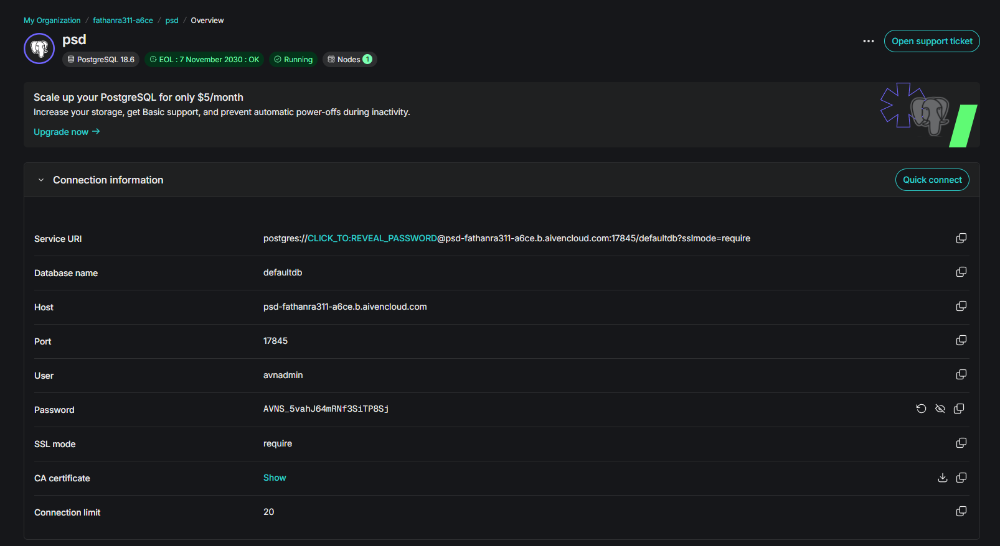
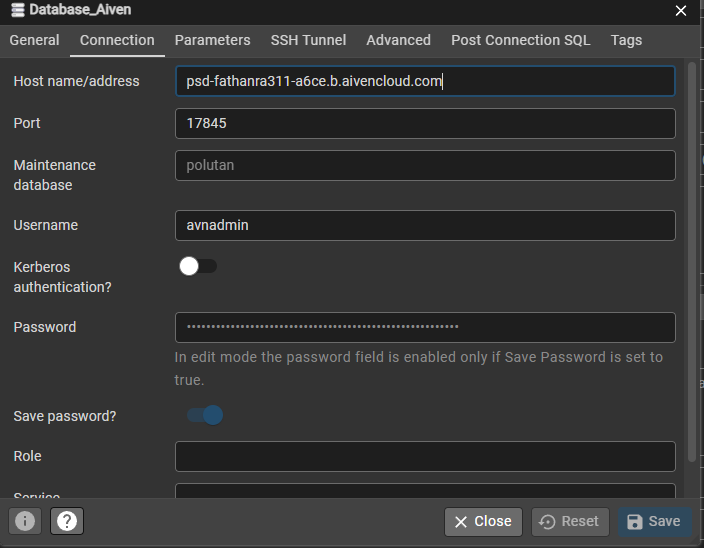
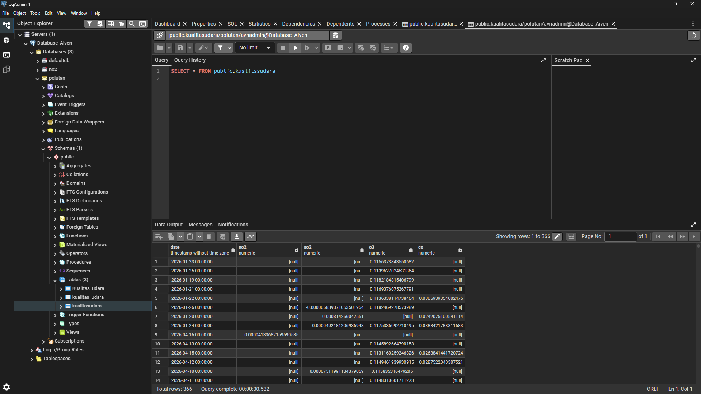
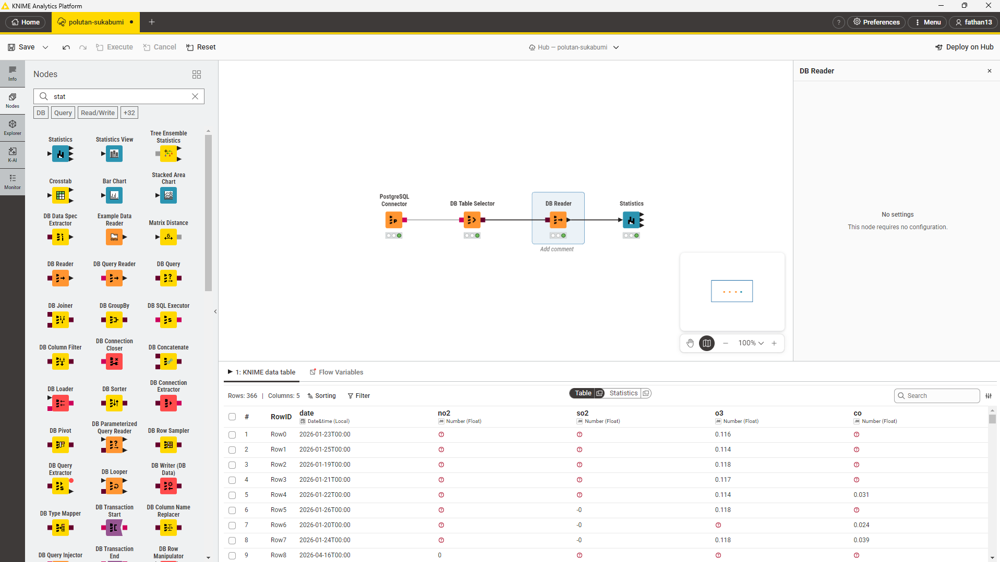
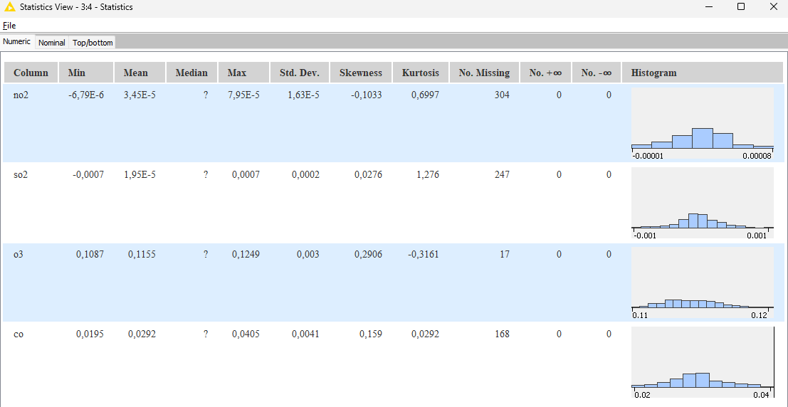

# Penjelasan Metrik Statistika Deskriptif

Dalam analisis data polusi udara deret waktu, ringkasan nilai-nilai metrik yang disajikan dalam bentuk tabel statistik dikenal sebagai **Statistika Deskriptif (*Descriptive Statistics*)**. Ringkasan ini sangat penting pada tahap **Exploratory Data Analysis (EDA)**. Tujuan utamanya adalah untuk memahami karakteristik distribusi data, tren, serta mengevaluasi kualitas data pemantauan sebelum data tersebut digunakan lebih lanjut pada tahap peramalan (*forecasting*) atau pemodelan *Machine Learning*.

Berdasarkan dataset pengamatan polutan udara Kota Sukabumi ($NO_2$, $CO$, $SO_2$, $O_3$), berikut adalah penjelasan terkait berbagai metrik statistik yang digunakan beserta metode perhitungan manualnya:

## 1. Min & Max
*   **Penjelasan:** Menunjukkan titik observasi terendah (Min) dan tertinggi (Max) di dalam kumpulan data. Metrik ini berguna untuk mengetahui seberapa lebar rentang ekstrem dari kualitas udara.
*   **Perhitungan Manual:** Mengurutkan seluruh data polutan dari konsentrasi terkecil hingga terbesar.
    *   $Min = X_1$ (Nilai observasi paling awal setelah diurutkan)
    *   $Max = X_n$ (Nilai observasi paling akhir)

## 2. Mean
*   **Penjelasan:** Rata-rata aritmatika dari seluruh observasi konsentrasi gas polutan. Nilai ini mewakili titik pusat konsentrasi rata-rata harian.
*   **Perhitungan Manual:**
    $$ \bar{x} = \frac{\sum_{i=1}^{n} x_i}{n} $$
    *(Total jumlah konsentrasi observasi dibagi dengan jumlah hari observasi yang tidak kosong/valid).*

## 3. Std. Deviation (Standar Deviasi)
*   **Penjelasan:** Menggambarkan seberapa tersebar titik data dari rata-ratanya (Mean). Standar deviasi yang kecil menunjukkan bahwa data konsentrasi polusi sangat stabil, sedangkan nilai yang besar menandakan fluktuasi harian yang sangat tinggi.
*   **Perhitungan Manual (Sampel):**
    $$ s = \sqrt{\frac{\sum_{i=1}^{n} (x_i - \bar{x})^2}{n-1}} $$

## 4. Variance (Varians)
*   **Penjelasan:** Nilai rata-rata dari kuadrat jarak setiap titik observasi terhadap Mean. Ini adalah bentuk kuadrat dari Standar Deviasi.
*   **Perhitungan Manual (Sampel):**
    $$ s^2 = \frac{\sum_{i=1}^{n} (x_i - \bar{x})^2}{n-1} $$

## 5. Skewness 
*   **Penjelasan:** Metrik yang mengukur ketidaksimetrisan dari distribusi data polutan.
    *   *Skewness = 0*: Kurva berpusat sempurna dan simetris (distribusi normal).
    *   *Skewness > 0 (Positif)*: Distribusi condong ke kiri dengan ekor panjang ke kanan. Mengindikasikan adanya lonjakan ekstrem (pencemaran tinggi) yang terjadi pada beberapa hari tertentu.
    *   *Skewness < 0 (Negatif)*: Distribusi condong ke kanan dengan ekor ke kiri.
*   **Perhitungan Manual (Fisher-Pearson):**
    $$ Skewness = \frac{n}{(n-1)(n-2)} \sum_{i=1}^{n} \left(\frac{x_i - \bar{x}}{s}\right)^3 $$

## 6. Kurtosis
*   **Penjelasan:** Menunjukkan tingkat keruncingan puncak distribusi dan ketebalan ekor data (bobot *outlier*). 
    *   *Kurtosis ≈ 0*: Normal (Mesokurtik).
    *   *Kurtosis > 0*: Puncak yang sangat runcing dan ekor tebal (Leptokurtik). Ini berarti banyak *outlier* atau lonjakan polusi ekstrem di Sukabumi.
    *   *Kurtosis < 0*: Puncak distribusi datar (Platikurtik).
*   **Perhitungan Manual (Excess Kurtosis Sampel):**
    $$ Kurtosis = \left[ \frac{n(n+1)}{(n-1)(n-2)(n-3)} \sum \left(\frac{x_i - \bar{x}}{s}\right)^4 \right] - \frac{3(n-1)^2}{(n-2)(n-3)} $$

## 7. Overall Sum
*   **Penjelasan:** Jumlah total akumulatif nilai dari seluruh pengamatan di periode tersebut.
*   **Perhitungan Manual:**
    $$ Sum = \sum_{i=1}^{n} x_i $$

## 8. Metrik Kualitas (Missing Values & Anomali)
Dalam akuisisi data satelit Sentinel-5P, metrik ini menjadi vital karena pantauan optik sering terhalang cuaca atau awan.
*   **No. missings:** Frekuensi sel data yang kosong (NaN) karena satelit gagal merekam wilayah Kota Sukabumi akibat hambatan awan tebal.
*   **Perhitungan Manual:** Mentotalkan jumlah baris observasi yang nilainya tidak terekam/kosong (NaN).

## 9. Median
*   **Penjelasan:** Nilai tengah dari deretan pengamatan yang sudah diurutkan. Median sangat kebal terhadap adanya lonjakan polusi sesaat (*outlier*).
*   **Perhitungan Manual:** Urutkan seluruh data $X_1$ hingga $X_n$.
    *   Jumlah data ($n$) ganjil: $Median = X_{(n+1)/2}$
    *   Jumlah data ($n$) genap: $Median = \frac{X_{n/2} + X_{(n/2)+1}}{2}$

---

# **Implementasi Analisis Data Polutan: Integrasi Cloud Database ke KNIME**

Bagian ini memaparkan langkah-langkah teknis untuk menghubungkan basis data PostgreSQL yang di-*hosting* pada platform cloud Aiven, mengecek ketersediaan data via pgAdmin 4, hingga melakukan ekstraksi perhitungan statistika deskriptif menggunakan perangkat lunak analitik visual KNIME Analytics Platform.

## Langkah 1: Mendapatkan Kredensial Akses Database Aiven

Sebelum melakukan koneksi melalui *client* mana pun, kita membutuhkan rincian kredensial server.
1. Masuk ke *dashboard* atau console utama **Aiven**, kemudian pilih proyek Anda.
2. Beralih ke tab **Overview** pada layanan PostgreSQL yang sedang aktif berjalan.
3. Pada segmen **Connection information**, perhatikan dan salin beberapa parameter krusial berikut:
   * **Host:** `psd-fathanra311-a6ce.b.aivencloud.com`
   * **Port:** `17845`
   * **User:** `avnadmin`
   * **Password:** (Klik ikon *copy* atau visibilitas untuk menyalin kata sandi)
   * **SSL mode:** `require`
4. Apabila aplikasi *client* membutuhkan, pastikan Anda juga mengunduh *CA certificate* (Sertifikat SSL) yang tersedia.

---

## Langkah 2: Menyiapkan Koneksi Server di pgAdmin 4

Aplikasi pgAdmin 4 difungsikan untuk memverifikasi tabel dan data secara langsung sebelum dipindahkan ke alat analitik.
1. Jalankan **pgAdmin 4**. Di panel kiri (Browser), klik kanan pada bagian **Servers** > **Register** > **Server...**
2. Di tab **General**, tuliskan nama koneksi sesuai keinginan Anda (misal: `Polutan`).
3. Berpindah ke tab **Connection**, lengkapi form sesuai dengan data dari Langkah 1:
   * **Host name/address:** Tempelkan *Host* dari Aiven.
   * **Port:** Masukkan *Port* yang sesuai.
   * **Maintenance database:** Isikan nama spesifik *database* Anda.
   * **Username:** Masukkan *User*.
   * **Password:** Tempelkan kata sandi, lalu centang **Save password?** agar tidak perlu mengetik ulang nanti.
4. Klik tombol **Save** untuk memulai koneksi ke server *cloud*.

---

## Langkah 3: Memeriksa Ketersediaan Data di pgAdmin 4

Setelah terkoneksi, langkah selanjutnya adalah meninjau data mentah untuk memastikan strukturnya sudah benar.
1. Melalui panel kiri pgAdmin, rentangkan *tree* menu server Anda menuju Databases > `polutan` > Schemas > `public` > Tables > `kualitasudara`.
2. Klik kanan pada tabel tersebut, lalu navigasikan ke **View/Edit Data** > **All Rows**.
3. Pastikan kolom-kolom penting seperti waktu pengamatan (`date`) dan nilai polutan (`no2`, `co`, `so2`, `o3`) muncul dengan benar.
4. Pada peninjauan ini, sel data yang bernilai `[null]` adalah hal yang sangat wajar. Nilai ini nantinya akan ditangani sebagai *missing values*.

---

## Langkah 4: Membangun Alur Kerja (Workflow) di KNIME Analytics Platform

Sekarang kita beralih ke KNIME untuk mengambil data dari database dan menghitung metrik statistik secara otomatis.
1. Buka **KNIME Analytics Platform** dan buatlah lembar *workflow* baru.
2. Dari panel *Node Repository*, cari dan tarik (*drag-and-drop*) *node* berikut ke area *workspace*:
   * **PostgreSQL Connector:** Untuk membuat jembatan koneksi ke server Aiven.
   * **DB Table Selector:** Untuk membidik tabel data spesifik di dalam *database*.
   * **DB Reader:** Untuk mengonversi tabel *database* ke dalam bentuk memori data internal KNIME.
   * **Statistics:** Untuk memproses perhitungan metrik matematis dari data tersebut.
3. Hubungkan setiap *node* secara berurutan sesuai daftar di atas (dari Connector hingga Statistics).
4. **Konfigurasi Node:**
   * Klik ganda **PostgreSQL Connector**, masukkan detail *Hostname*, *Port*, *Database name*, dan *Credentials* persis seperti langkah Aiven sebelumnya.
   * Klik ganda **DB Table Selector**, lalu arahkan untuk memilih skema `public` dan tabel polutan Anda.
5. Klik kanan pada node **DB Reader** dan pilih **Execute**. Lampu indikator hijau akan menyala jika data berhasil dimuat.

---

## Langkah 5: Mengeksekusi Output Statistika Deskriptif

Tahap pungkasan adalah menjalankan mesin analitik statistik di dalam KNIME.
1. Klik kanan pada node **Statistics**, lalu pilih **Execute**.
2. Setelah lampu berubah hijau, klik kanan lagi pada node **Statistics** dan pilih **Statistics View** (atau klik ikon kaca pembesar).
3. Sebuah jendela berisi tabel matriks akan terbuka. Anda dapat meninjau:
   * **Min, Max, Mean:** Rentang konsentrasi harian serta rata-ratanya.
   * **Std. deviation & Variance:** Analisis volatilitas tingkat polusi.
   * **Skewness & Kurtosis:** Deteksi asimetri kurva dan keberadaan *outlier*.
   * **No. missings:** Jumlah rekaman sensor yang bolong/gagal terekam.
   * **Histogram:** Grafik sederhana dari penyebaran nilainya.

## 3. Penjelasan Distribusi Polutan Kota Sukabumi

Berdasarkan ekstraksi dataset historis satelit terhadap langit Kota Sukabumi dari Agustus 2025 s.d. Agustus 2026 (total 366 hari), berikut narasinya:

1. **O3 (Ozon)**
   Data ozon memiliki ketersediaan paling stabil di antara polutan lain, yaitu hanya terdapat **17 *missing values***. Rata-rata (mean) paparan O3 di wilayah Sukabumi adalah sekitar 0.116. Karena persebaran distribusinya cukup stabil, standar deviasinya sangat kecil. Skewness menunjukkan asimetri positif yang sangat landai, artinya variasi harian Ozon Sukabumi relatif konsisten tanpa banyak lonjakan kejutan.

2. **CO (Karbon Monoksida)**
   Rekam data Karbon Monoksida menunjukkan **168 observasi hilang**. Rata-rata kadar CO di atmosfer Sukabumi berada pada kisaran 0.030 dengan varians yang sangat kecil. Nilai kurtosis dari observasi CO yang rendah menandakan karakteristik platikurtik, di mana frekuensi lonjakan ekstrem gas buangan pembakaran tidak terjadi terlalu signifikan di kota ini.

3. **SO2 (Sulfur Dioksida)**
   Satelit Sentinel kehilangan **247 hari** pantauan (hanya 119 hari valid) yang kemungkinan besar disebabkan tebalnya awan di atas Jawa Barat pada periode hujan. Mean dan Median untuk SO2 nyaris menyentuh angka nol, menandakan bahwa wilayah Sukabumi secara umum sangat bersih dari senyawa pembakaran fosil/batu bara, meskipun pada beberapa observasi menunjukkan sedikit *outlier* yang tecermin dari ekor distribusi.

4. **NO2 (Nitrogen Dioksida)**
   Dari total setahun kalender, NO2 kehilangan sebagian besar observasinya hingga **304 data kosong**, sehingga hanya menyisakan sekitar 62 hari data valid. Rata-rata kadar emisi kendaraan berat ini sangat kecil (mendekati 0.00004), namun dari segelintir observasi valid tersebut, terdeteksi beberapa *outlier* atas yang terkonfirmasi oleh deteksi *Isolation Forest* pada tahap sebelumnya. Ekor distribusinya (kurtosis) lebih runcing dibanding polutan lain karena adanya variasi harian mendadak.

---

### Perhitungan Manual Ozon (O3)

Sebagai rujukan matematis, berikut merupakan contoh penerapan perhitungan manual komputasi untuk kolom pengamatan $O_3$ (Ozon) di Sukabumi.

1. **Standar Deviasi**

$$ s = \sqrt{\frac{\sum_{i=1}^{n} (x_i - \bar{x})^2}{n-1}} $$

Diketahui:
- $n$ adalah jumlah baris valid (karena terdapat 17 missing values dari total 366 hari, $n = 366 - 17 = 349$)
- $\bar{x}$ (rata-rata $O_3$) $\approx 0.11548$

$$
\begin{aligned}
s &= \sqrt{\frac{\sum_{i=1}^{349} (x_i - 0.11548)^2}{349-1}}\\
\\
s &\approx 0.00296
\end{aligned}
$$

2. **Variansi**

Variansi dapat dihitung secara langsung dengan mengkuadratkan Standar Deviasi ($s$).

$$
\begin{aligned}
v &= s^2\\
v &= 0.00296^2\\
v &\approx 0.000008748 \ (8.748 \times 10^{-6})
\end{aligned}
$$

3. **Skewness**

$$ Skewness = \frac{n}{(n-1)(n-2)} \sum_{i=1}^{n} \left(\frac{x_i - \bar{x}}{s}\right)^3 $$

Rumus ini dikomposisikan dalam dua blok konstanta dan penjumlahan momen:

$$
\begin{aligned}
A &= \frac{n}{(n-1)(n-2)} = \frac{349}{(348)(347)} = \frac{349}{120756} \approx 0.002890\\
\\
B &= \sum_{i=1}^{349}\left(\frac{x_i-0.11548}{0.00296}\right)^3
\end{aligned}
$$

Berdasarkan data aktual, nilai penyimpangan dipangkat tiga ($B$) adalah $100.54$:

$$
\begin{aligned}
Skewness &= A \times B\\
Skewness &= 0.002890 \times 100.54 \approx 0.2906
\end{aligned}
$$
*(Menandakan asimetri positif).*

4. **Overall Sum**

Jumlah kumulatif dari 349 nilai pengamatan valid Ozon selama setahun pemantauan.

$$
\begin{aligned}
OS &= \sum_{i=1}^{n}x_i \\
OS &= 0.113990 + 0.118087 + 0.116691 + \dots + x_{349} \\
OS &\approx 40.304
\end{aligned}
$$

---

### Perhitungan Manual Karbon Monoksida (CO)

Langkah serupa dapat diaplikasikan pada Karbon Monoksida. Berikut adalah penjabaran perhitungannya dengan menyesuaikan jumlah sampel data CO.

1. **Standar Deviasi**
Diketahui:
- $n = 366 - 168 = 198$ data valid (168 *missing values*)
- $\bar{x}$ (rata-rata $CO$) $\approx 0.02915$

$$
\begin{aligned}
s &= \sqrt{\frac{\sum_{i=1}^{198} (x_i - 0.02915)^2}{198-1}}\\
s &\approx 0.00406
\end{aligned}
$$

2. **Variansi**
$$
\begin{aligned}
v &= s^2\\
v &= 0.00406^2\\
v &\approx 0.0000165 \ (1.65 \times 10^{-5})
\end{aligned}
$$

3. **Skewness**
$$
\begin{aligned}
A &= \frac{198}{(198-1)(198-2)} = \frac{198}{38612} \approx 0.005128\\
B &= \sum_{i=1}^{198}\left(\frac{x_i-0.02915}{0.00406}\right)^3
\end{aligned}
$$
Berdasarkan data aktual, nilai simpangan kumulatif ($B$) adalah $31.015$, maka:
$$
\begin{aligned}
Skewness &= 0.005128 \times 31.015 \approx 0.1590
\end{aligned}
$$

4. **Overall Sum**
$$
\begin{aligned}
OS &= \sum_{i=1}^{198}x_i \approx 5.772
\end{aligned}
$$

---

### Perhitungan Manual Sulfur Dioksida (SO2)

Karena SO2 di Sukabumi memiliki tingkat observasi yang banyak hilang karena tertutup awan hujan, perhitungan disesuaikan dengan data tersisa.

1. **Standar Deviasi**
Diketahui:
- $n = 366 - 247 = 119$ data valid (247 *missing values*)
- $\bar{x}$ (rata-rata $SO_2$) $\approx 0.0000195$

$$
\begin{aligned}
s &= \sqrt{\frac{\sum_{i=1}^{119} (x_i - 0.0000195)^2}{119-1}}\\
s &\approx 0.000220
\end{aligned}
$$

2. **Variansi**
$$
\begin{aligned}
v &= 0.000220^2\\
v &\approx 0.0000000482 \ (4.82 \times 10^{-8})
\end{aligned}
$$

3. **Skewness**
$$
\begin{aligned}
A &= \frac{119}{(119-1)(119-2)} = \frac{119}{13806} \approx 0.008620\\
B &= \sum_{i=1}^{119}\left(\frac{x_i - 0.0000195}{0.000220}\right)^3
\end{aligned}
$$
Berdasarkan data aktual, $B = 3.197$:
$$
\begin{aligned}
Skewness &= 0.008620 \times 3.197 \approx 0.02756
\end{aligned}
$$

4. **Overall Sum**
$$
\begin{aligned}
OS &= \sum_{i=1}^{119}x_i \approx 0.002320
\end{aligned}
$$

---

### Perhitungan Manual Nitrogen Dioksida (NO2)

Gas NO2 menjadi parameter dengan jumlah data valid paling sedikit (paling banyak terhalang selama observasi tahunan).

1. **Standar Deviasi**
Diketahui:
- $n = 366 - 304 = 62$ data valid (304 *missing values*)
- $\bar{x}$ (rata-rata $NO_2$) $\approx 0.00003447$

$$
\begin{aligned}
s &= \sqrt{\frac{\sum_{i=1}^{62} (x_i - 0.00003447)^2}{62-1}}\\
s &\approx 0.00001632
\end{aligned}
$$

2. **Variansi**
$$
\begin{aligned}
v &= 0.00001632^2\\
v &\approx 0.0000000002664 \ (2.664 \times 10^{-10})
\end{aligned}
$$

3. **Skewness**
$$
\begin{aligned}
A &= \frac{62}{(62-1)(62-2)} = \frac{62}{3660} \approx 0.01694\\
B &= \sum_{i=1}^{62}\left(\frac{x_i - 0.00003447}{0.00001632}\right)^3
\end{aligned}
$$
Berdasarkan data aktual, nilai simpangan kumulatif ($B$) adalah $B = -6.096$:
$$
\begin{aligned}
Skewness &= 0.01694 \times -6.096 \approx -0.1033
\end{aligned}
$$

4. **Overall Sum**
$$
\begin{aligned}
OS &= \sum_{i=1}^{62}x_i \approx 0.002137
\end{aligned}
$$
